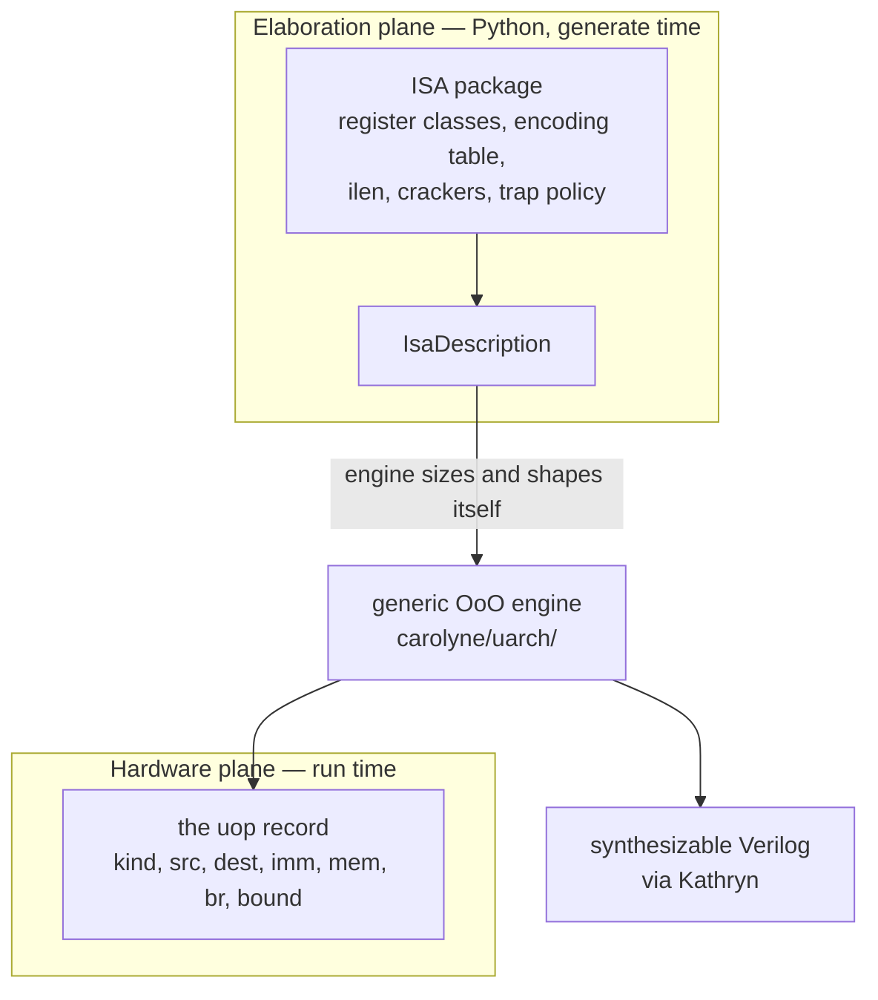
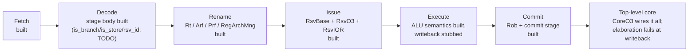

:::caution[Work in progress]
Carolyne is an active, unpublished research project. This page describes its
design direction and current implementation status — not a finished product,
and (per the note further down) not a source of measured results.
:::

**Carolyne**'s direction is a **universal microarchitecture generator**: a
hardware generator, written in Python on top of Kathryn, where both the
**ISA** and the **microarchitecture style** are user-supplied inputs rather
than fixed choices. Today it implements exactly one microarchitecture — an
ISA-agnostic **out-of-order CPU generator** — and that is the only one built
or scoped for the current publication target; the broader "any
microarchitecture, any ISA" framing is where the project is headed, not a
claim about what exists today. It is a separate project — its own repository,
its own paper target — but it is the largest thing built with Kathryn's
Rust + Python implementation, and it is the reason several Kathryn features
exist in the shape they do.

This page covers what Carolyne is trying to do and where it actually stands.
The authoritative sources are the repository itself and its normative spec,
`docs/design/uop_contract.md`.

## The idea

Carolyne separates the **ISA** from the **microarchitecture**.

The out-of-order engine — fetch, decode, rename, issue, execute, commit — is
written **once**, against a fixed *µop contract*. An ISA is supplied as a small
Python description package: register classes, an encoding table, an
instruction-length function, and crackers that lower each instruction to µops.
The engine then **adapts itself at elaboration time**: rename tables, decoder
trees, physical register files and commit logic are all *derived* from the
description rather than hand-written per ISA.

The niche is ISA research. Today, evaluating a new instruction set on
out-of-order hardware means either simulating it or building a
microarchitecture for it. Carolyne's claim is that you should get a
synthesizable out-of-order implementation of a new ISA without building the
microarchitecture at all.

That separation is also the shape the project wants to generalize beyond one
fixed engine: the ISA ↔ µarch boundary is designed so other microarchitecture
styles (an in-order core, for instance) could plug in against the same µop
contract later. Nothing beyond the out-of-order engine exists yet —
`carolyne/uarch/` today holds exactly one microarchitecture, with no second
engine style built, in progress, or sketched in a design doc — so read
"universal microarchitecture" as the direction, not a shipped capability.

Existing tools each cover part of this and stop:

| Tool | What it separates | What it does not give you |
| --- | --- | --- |
| gem5 | ISA from microarchitecture | simulation only — no RTL |
| FabScalar | generates out-of-order RTL | one fixed ISA |
| BOOM | out-of-order RTL, parameterized | RISC-V only |
| ADL flows (LISA / nML) | ISA description → RTL | in-order pipelines only |

A second, engineering-side aspect: the generated core is a **reconfigurable
component** — a clean, parameterized block with a memory port and a control
interface that drops into a larger Kathryn design, rather than a standalone
top-level CPU.

## The two planes

The whole design rests on one separation, and it is enforced structurally
rather than by convention:



- **Elaboration plane** — everything in `carolyne/isa/` is pure *template*,
  consumed at generate time. No runtime value ever lives there; it holds
  *rules* for how hardware obtains values at run time. There are no Kathryn
  imports anywhere in the ISA layer, so an ISA package contains **no hardware
  code at all** — which is what keeps the effort metric honest, since its line
  count is spec lines, not RTL lines.
- **Hardware plane** — after decode, the front end and the engine speak
  exclusively in **µop records**. The design rule is absolute: *no raw ISA bits
  ride along*. The moment an opcode field sneaks into the record, the
  separation is dead.

The dependency rule follows: `isa` never imports `uarch` or `kathryn`; `uarch`
may import the description types but must never name a specific ISA. If
bringing up an ISA forces an edit inside `uarch`, that is treated as a *contract
bug* — fixed in the contract, not patched in the engine.

### The contract's litmus test

The spec picks a deliberately awkward case to test itself against: x86 `FLAGS`
must be expressible as an ordinary register class —
`RegClass("flags", count=1, width=6, renamed=True)` — with **zero**
special-casing inside `uarch`. Partial-flag writes are handled in the cracker
by reading the old flags value as an extra source; the engine never learns that
flag subsets exist.

The same discipline produces the rest of the design: one `BR-COND` µop kind
with a small condition-kind field covers both RISC-V compare-and-branch and x86
flag-test branches; a `CustomFu(name, kinds, latency, ports)` escape hatch lets
an ISA add an instruction as a cracker entry plus at most a function-unit
declaration; and an `ilen(first_bytes) -> length` function is the *only*
variable-length mechanism the engine provides, degenerating to a constant for
fixed-length ISAs.

### What an ISA has to supply

The deliverables list is short on purpose — it is the paper's effort metric:

1. register classes
2. an encoding table (match/mask plus named field extractors)
3. `ilen` — a constant for fixed-length ISAs
4. crackers: per-instruction µop templates
5. trap policy sequences
6. *optional* custom function-unit declarations

Everything else is generated. "Lines in 1–6" versus "lines in `uarch`" is the
headline number.

## Publication target

One shared engine demonstrated with **RV32I** and a precisely scoped
**mini-x86**, reporting IPC, FPGA area and fmax for both, plus the effort
metric above. The mini-x86 scope is frozen early and deliberately narrow: a
32-bit flat memory model, roughly 20 integer instructions, ModR/M with
base+displacement, and no prefixes, segmentation, string operations or floating
point.

:::note
Carolyne is unpublished work in progress. Nothing on this page is a measured
result — the numbers above are what the evaluation is *designed to report*,
not what it has reported.
:::

## Status

As of **August 2026**: about 6,575 lines of engine and ISA description
(`carolyne/isa/` 1,273 lines, including the RV32I package; `carolyne/uarch/`
4,416 lines) with a 3,067-line pytest suite — 182 tests written, 177 passing
(5 pending an unfinished `decode_templates` helper). Every stage now has a
real body, and a new top-level `CoreO3` module (`carolyne/uarch/o3/core.py`)
wires all of them — Fetch, Decode, Dispatch, the register-architecture set,
the ROB, and one reservation-station/exec-unit pair per `RsvSpec` — from a
single config. Its structural declare phase builds cleanly; elaborating it
further currently fails at a deliberate stub (see below).



**Working, with tests:**

- The ISA description object model — register classes, ops and operands,
  atomic operands, µops, encoding field matching, execution units, and
  `ExecContext` (against which RV32I's ALU semantics are written).
- The **RV32I** description package.
- The machine configuration (`CPUO3_Config`) that carries the ISA description
  plus the numbers the description does not decide (front-end lanes, commit
  width, station sizes).
- **Fetch**, including its `pip`/`zync` handshake with decode and a simple
  memory (`EasyMem`), and the decode-stage entry table.
- The **register architecture**: `Arf` (committed architectural state per
  class), `Prf` (per-class physical register file), `Rt` (rename table),
  and `RegArchMng` grouping one of each per register class.
- **Speculation support**: `TagGen` tag allocation and `Mpft`, the
  mispredict fix table.
- **Reservation stations**: `RsvBase` plus two issue policies — `RsvO3`
  (oldest ready entry wins) and `RsvIOR` (in-order, a circular FIFO where
  position *is* age).
- The **reorder buffer** and its commit stage, retiring at instruction
  granularity via the µop record's first/last `bound` bits.
- **Decode**'s stage body (`transfer`, `carolyne/uarch/o3/decode.py`) — a
  breadth-first `pip`/`seq`/`zync` walk over crack levels that writes the
  full µop record per lane, gated by independent `zif` match guards per
  (mop, µop). It has no direct test of its own yet — `test_decode.py`'s 9
  tests cover the entry-table shape it writes into, not the walk itself —
  and it carries one open `TODO`: `is_branch`/`is_store`/`rsv_id` are written
  as constant zeros pending the real derivation rules.

`Arf`, `Prf`, `Rob`, `RsvIOR` and `RsvO3` each emit Verilog today, per block.

**Assembled, but elaboration currently fails:**

- The top-level **`CoreO3`** module (`carolyne/uarch/o3/core.py`) — its
  declare phase builds cleanly: Fetch, Decode, Dispatch, the
  register-architecture set, the ROB, and every reservation-station/exec-unit
  pair construct and wire together from one `CPUO3_Config`. No test or
  example instantiates it yet, and elaborating it further (`gen_flow()`)
  currently fails at `ExecUnitO3.wb_reg` (`exec_unit.py`), which raises
  `NotImplementedError` on purpose — the file's own comment calls these
  **"loud stubs"**: `wb_reg` (physical-register write-back plus bypass
  broadcast), `declare_mis_pred`/`declare_suc_pred` (the misprediction
  squash/resolve fan-out), and `declare_fin` (the ROB write-back report) all
  raise until their machinery lands, so a body that reaches one fails loudly
  at elaboration rather than silently building no hardware. `core.py`'s own
  comments name the remaining gap the same way: nothing yet calls the
  reservation stations' `build_issue` with the exec complexes' `exec_meta` —
  the backend-acceptance story is still open.

**Not there yet:**

- The **mini-x86** ISA package. Only `riscv/` exists, so the central
  two-ISA claim is not yet demonstrated.
- A real **memory subsystem** beyond `EasyMem`.
- The **evaluation** — no IPC, area, fmax or effort numbers have been
  measured.

The µop contract itself is at **draft v0.1**, with four open questions
recorded in its §8: per-class versus unified physical register files, whether
the address-generation µop stays separate from the load, whether crackers need
DAGs rather than linear µop sequences, and the design of the reusable-component
interface.

## Why it lives next to Kathryn

Carolyne is the load test for Kathryn's Rust + Python implementation, and
several Kathryn features were added for it directly:

- [Karray records finished at instantiation](/userbook/karray/records/) — a
  generator sizing arrays from an ISA description cannot write a class per
  width, so the class body states the shape a record usually has and the
  constructor call settles it.
- [`Karray.reset(**fields)`](/userbook/karray/basics/#resetting-a-whole-array)
  — a rename table whose valid bits must start at zero needs a whole-array
  reset; before it, a Karray had none.
- The [implicit zero fallback on wires](/userbook/core/reset-and-defaults/) —
  and the fix that moved an explicit `wire.default(v)` *below* user priority,
  where it belongs.

The [Karray](/userbook/karray/basics/) chapter is the part of the userbook
Carolyne leans on hardest: rename tables, physical register files, reorder
buffers and reservation stations are all Karrays, and their runtime indexing,
custom-fn write enables and reduce reads are exactly the age-select and
wakeup-select shapes an out-of-order machine needs.

## Source

The repository is [github.com/Tanawin1701d/Carolyne](https://github.com/Tanawin1701d/Carolyne).
It installs against Kathryn from source:

```bash
pip install -e ../Kathryn2     # or: cd ../Kathryn2 && maturin develop
pip install -e ".[dev]"
pytest tests
python examples/regfile_demo.py
```

The layout follows the dependency rule directly:

| path | contents |
| --- | --- |
| `docs/design/uop_contract.md` | the normative ISA ↔ µarch boundary spec |
| `carolyne/isa/` | description types, `ExecContext`, and per-ISA packages (`riscv/`) |
| `carolyne/uarch/` | the generic out-of-order engine — all Kathryn code lives here |
| `tests/` | pytest; the tests double as usage documentation |
| `generated/` | emitted Verilog |
