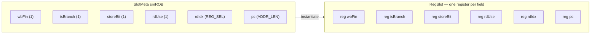

A **Slot** is the smallest **Hardware Aggregator** in Kathryn: one row of related
resources that you address by *field name* instead of by hand-wiring each
register. The abstraction has three parts — **Slot Meta**,
**Reg/Wire Slot**, and **[Table](/cppbook/aggregators/tables/)**. This page
covers the first two; the Table page covers collections of slots.

## SlotMeta: the field layout

`SlotMeta` is pure metadata — a named-field layout, mapping each field name to a
bit width. It holds no hardware. The constructor takes parallel vectors of field
names and field sizes (the layout is laid out from least- to most-significant
field):

```cpp
SlotMeta(const std::vector<std::string>& fieldNames,
         const std::vector<int>&         fieldSizes);
```

In the Kride case study, every aggregated structure begins with a `SlotMeta`
declaration. The reorder-buffer layout, for example, is written directly as
name/width pairs (from `src/example/o3/core/slotParam.h`):

```cpp
inline SlotMeta smROB{
    {"wbFin", "isBranch", "storeBit",
     "rdUse", "rdIdx"   , "pc"      },
    /////////////////////////////////////////////////
    {1      , 1         , 1         ,
     1      , REG_SEL   , ADDR_LEN  }
};
```

(Field names are strings. The case study's own `slotParam.h` writes them as
bare identifiers because its `parameter.h` defines each one as a string
constant via the `O3_PARAM_STR` macro.)

There is also a generative constructor that stamps out `numField` identically
sized fields named `{prefix}_{i}` — used for register-file-style layouts where a
field per architectural register is wanted:

```cpp
////////// | arfBusy_0 | arfBusy_1 | arfBusy_2 ..... | arfBusy_31
inline SlotMeta smARFBusy{"arfBusy", 1, REG_NUM, 0};
```

`SlotMeta` supports layout algebra — create, merge, remove:
`operator+` concatenates two layouts, `operator-` removes named fields,
and `addField` appends one. It can also be sliced by index range, by an index
list, or by a field-name range to produce a sub-layout.



## RegSlot and WireSlot: the instantiated row

A `RegSlot` instantiates one row of *registers* laid out by a `SlotMeta`; a
`WireSlot` is the combinational (wire-backed) version with the same interface.
Each field becomes its own independent hardware component — not a slice of one
packed word.

```cpp
RegSlot  busyMaster  {smARFBusy};      // register-backed row
WireSlot selectedEntry{smROB};         // wire-backed row
```

You read or drive one field by naming it through `operator()`:

```cpp
_table[idx]("wbFin")  <<= 0;           // drive the wbFin field
opr& opc = dpValue("inst")(0, 7);      // read a slice of the inst field
```

`<<=` is **Edge Assignment** (a one-edge CCO on register fields) and `=` is
**Level Assignment** (combinational), exactly as for a plain register or wire —
see [Assignments and expressions](/cppbook/core/assignments-and-expressions/).

### Partial per-field update

Because each field is its own component, you can update *just one field* and
leave the rest untouched. The store-buffer entry update touches individual
fields independently (from `src/example/o3/core/storeBuf.h`):

```cpp
_table[finPtr]("complete") <<= 0;
_table[finPtr]("mem_addr") <<= memAddr;
```

A slot can be partially updated either with a Kathryn assignment or with a
plain C++ value.

### Slot-to-slot copy with name matching

An entire slot may be copied from another slot with `<<=`. When both slots share
a `SlotMeta` this is a straight field-for-field copy; when the layouts differ,
Kathryn performs **best-effort name mapping** — only fields whose names appear in
both layouts are connected. In the ROB, one dispatch copies two differently
shaped source slots into an entry, and only the matching fields flow:

```cpp
_table[idx] <<= dpValue;    //// sBranch, rdUse, rdIdx
_table[idx] <<= dpShareVal; ///  bhr, pc
```

In the code, `SlotMeta::matchByName`
walks the source fields, keeps only those the destination also declares, and the
slot assignment path (`doBlockAsm` / `doNonBlockAsm`) drives exactly those
matched pairs.

:::note
Copies are field-name–keyed, never bit-packed. There is no way to read or write
a whole slot as a single packed vector; access always goes through a named
field.
:::

## All slot updates are CCOs

Every slot assignment is a **Cycle-Considered Operation (CCO)**: it is compatible
with every Hybrid Design Block. Slot writes may sit
inside `seq`, `par`, `zif`, and the rest, and they participate in
[Decentralized Update](/cppbook/update/decentralized-update/): each assignment
pushes an update event into the target field's pool and priorities resolve
later, just like an ordinary register write. The store buffer uses exactly this,
raising the priority of a slot-field write with `SET_ASM_PRI_TO_MANUAL` so a new
entry can override a concurrent write:

```cpp
SET_ASM_PRI_TO_MANUAL(DEFAULT_UE_PRI_USER+1);
_table[finPtr]("complete") <<= 0;
_table[finPtr]             <<= src; /// busy, spec, specTag
SET_ASM_PRI_TO_AUTO();
```

## Where to next

- [Table and Mux](/cppbook/aggregators/tables/) — collections of
  Reg Slots with indexed access and search.
- [Decentralized Update](/cppbook/update/decentralized-update/) — how the update
  events a slot write emits get prioritized and resolved.
