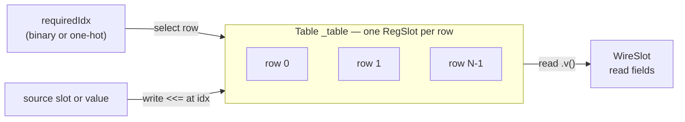
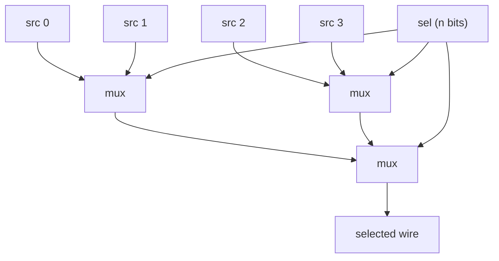

A **Table** is a collection of [Reg Slots](/cppbook/aggregators/slots/) that all
share one `SlotMeta` — the register-file / reservation-station / reorder-buffer
building block of the [Kride case study](/cppbook/kride/overview/). On
top of a plain slot array it adds **indexed access** and two **abstracted search
patterns**. This page also covers
`mux`, the low-level combinational selector the search patterns build on.

## Table: an indexed collection of slots

Construct a Table from a `SlotMeta` and a row count; internally it owns one
`RegSlot` per row:

```cpp
Table _table{smStoreBuf, STBUF_ENT_NUM};   // store-buffer table
Table _table(smROB, RRF_NUM);              // reorder buffer
```

### Indexed read and write

Indexing a Table with a runtime signal selects a row; the returned agent then
behaves like a slot. Both **binary** and **one-hot** indexing are supported —
`operator[](Operable&)` indexes by binary value, `operator[](OH)` by one-hot:

```cpp
_table[comPtr]("complete") <<= 1;        // binary index, write one field
busyTemp = rcvTabBusy[OH(misTag)].v();   // one-hot index, read whole row
```

(Field accessors take the field name as a **string**, exactly like the
[SlotMeta field names](/cppbook/aggregators/slots/); the case study's bare
identifiers are string constants defined by its `O3_PARAM_STR` macro.)

`.v()` materializes the selected row as a `WireSlot` you can read field-by-field;
`<<=` / `=` through the agent writes the selected row. A whole-row write can copy
a source slot in with best-effort name matching, exactly as for a bare slot:

```cpp
_table[idx] <<= dpValue;    //// sBranch, rdUse, rdIdx
```



### Whole-table operations

A Table also offers operations across *all* rows at once: `doCusLogic` runs a
user lambda on every `RegSlot` (used by the store buffer to invalidate matching
entries on a misprediction), and `makeColResetEvent` / `makeResetEvent` install
reset events on a column or the whole table.

```cpp
_table.doCusLogic([&](RegSlot& lhs, int rowIdx){
    zif (lhs("spec") & (lhs("specTag") == sucTag)){
        lhs("spec") <<= 0;
    }
});
_table.makeColResetEvent("busy");
```

### Search: comparator tree and ordered match

Two abstracted access patterns are available, both pure combinational
logic and both optionally one-hot:

- **Binary-search comparator tree** — `doReducBinIdx` (and its one-hot sibling
  `doReducOHIdx`) folds the rows pairwise through a user comparator, returning
  the selected row as a `WireSlot` and its index.
- **Ordered match search** — `findMBO_BIDX` treats the table as a circular queue
  (via a start pointer) and returns the newest or oldest row matching a
  predicate. The store buffer uses it to find the newest committed store to an
  address:

```cpp
auto[result, binIdx] = _table.findMBO_BIDX(true, finPtr,
    [&](RegSlot& lhs)->opr&{
    return lhs("busy") & (lhs("mem_addr") == addr);
});
```

Here `true` requests the newest match and `finPtr` is the circular-queue start
pointer; the lambda is the match predicate over each row.

## mux: the combinational selector

`mux` is the low-level primitive the search/reduction paths build on. The
two-input form selects between `x0` and `x1` on a 1-bit `sel` and returns a
wire; the vector form builds a balanced selector tree over `2^n` sources driven
by an `n`-bit `sel`:

```cpp
Operable& mux(Operable& sel, Operable& x0, Operable& x1);
Operable& mux(Operable& sel, const std::vector<Operable*>& srcs);
```

The vector form asserts that the source count is exactly `2^(width of sel)` and
reduces the sources pairwise, one `sel` bit per tree level — the same
tournament shape the Table's comparator-tree reduction uses.



## Where to next

- [SlotMeta and Slots](/cppbook/aggregators/slots/) — the row layout and slot
  copy semantics Tables are built from.
- [The Kride case study](/cppbook/kride/overview/) — the ROB,
  reservation stations, and store buffer that use these tables.
