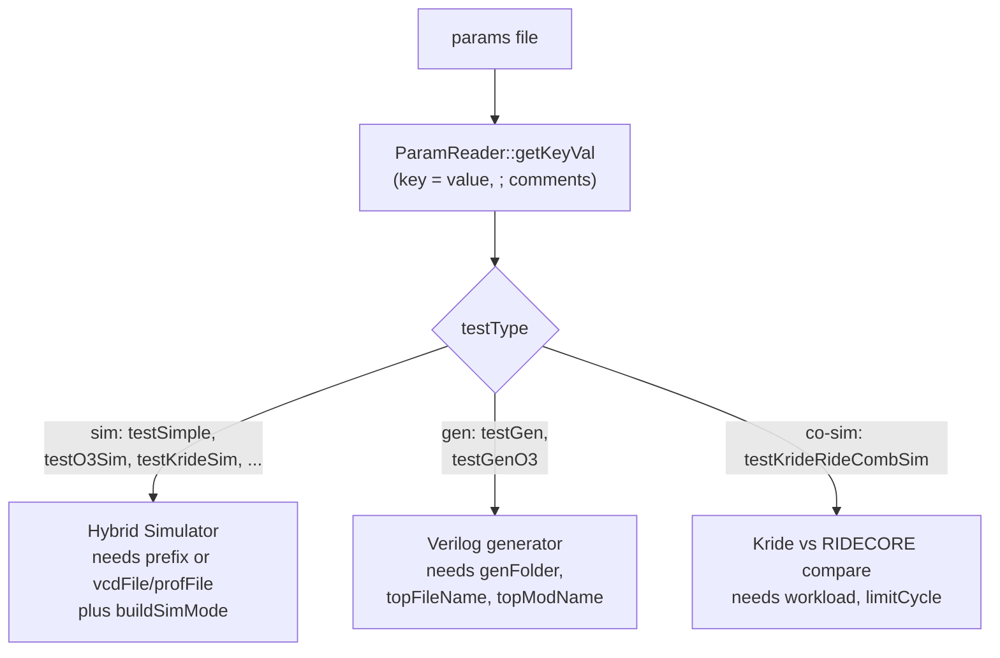

The single `Kathryn` executable takes exactly **one argument: a parameter
file** (see the `params/` directory). The parameter file selects what to run
and where output goes.

## The file format

`ParamReader::getKeyVal` (`src/frontEnd/cmd/paramReader.cpp`) parses each line
by whitespace. A line is one of:

- **A comment** — its first token is `;` (the whole line is skipped).
- **A key/value** — exactly three tokens, `key = value` (the middle token must
  literally be `=`).
- Blank lines are ignored; any other shape is a fatal error, and a duplicate
  key is a fatal error.

```text
; path to riscv result folder
prefix = /path/to/KOut/riscv/
buildSimMode = gcr
```

There are no sections and no quoting — a value is a single whitespace-delimited
token.

## Common keys

Each key below is read by real code in `src/` or appears in a shipped file in
`params/`.

| Key | Purpose |
| --- | ------- |
| `testType` | **Selects the entry point.** `cfe.cpp::start()` dispatches on this value (see the table below). |
| `prefix` | Output directory for a simulation run (read as `params["prefix"]` by the RISC-V, O3, Kride, and autoSim managers). |
| `vcdFile` | Destination path for the VCD waveform (used by `blinkSample.cpp` and `cacheSimParams`). |
| `profFile` | Destination path for the ZEP profiler report. |
| `buildSimMode` | Simulator JIT stages — `g`/`c`/`r` = generate / compile / run (see [The Hybrid Simulator](/cppbook/backends/simulator/)). |
| `genFolder` | Output folder for generated Verilog (read as `genFolder` by `GenController::initEnv`). |
| `topFileName` | Base name of the emitted top `.v` file. |
| `topModName` | Verilog module name of the top module. |
| `limitCycle` | Cycle limit for co-simulation runs (`stoull(params["limitCycle"])`). |
| `workload` | Co-sim workload set — `standard` or `cpp` (`simCtrlComb.h`). |

:::note
Other keys appear in individual files: `ioOptimize`, `extractMulFile`,
`synName` (synthesis), `slotFile`, `amt`, `reqRegTest`, and `genPath` (used by
`tutorialParams` instead of `genFolder`). Only the keys a given `testType`
consumes are required.
:::

## Mode decision

Generation keys and simulation keys are distinct, and `testType` decides which
set matters:



## Shipped params files

The `params/` directory ships one file per scenario. Their `testType` values
map to entry points via `cfe.cpp::start()`:

| File | `testType` | Purpose |
| ---- | ---------- | ------- |
| `smParams` | `testSimple` | Auto simulation regression suite (`src/test/autoSim`); the smoke test. |
| `o3Params` | `testO3Sim` | Kride out-of-order superscalar simulation. |
| `o3GenParams` | `testGenO3` | Kride out-of-order → Verilog generation (has `synName`). |
| `krideParams` | `testKrideSim` | Kride standalone simulation. |
| `krideRideParams` | `testKrideRideCombSim` | Co-simulation vs RIDECORE, `standard` workload, `limitCycle = 10000`. |
| `krideRideCxxParams` | `testKrideRideCombSim` | Co-simulation vs RIDECORE, `cpp` workload, longer `limitCycle`. |
| `rideParams` | `testRideSim` | RIDECORE via Verilator (needs `BUILD_RIDECORE=ON`). |
| `cacheSimParams` | `testSimpleCacheAcc` | Cache-accelerator simulation; sets `vcdFile`, `profFile`, and `slotFile`. |
| `genParams` | `testGen` | Small generator test cases. |
| `blinkParams` | *(none)* | Paths for the standalone `blinkSample.cpp` demo (`vcdFile` / `profFile` only). |
| `tutorialParams` | *(none)* | Single `genPath` for the tutorial generation demo. |

:::note
`blinkParams` and `tutorialParams` carry no `testType`: they feed standalone
example executables (`blinkSample.cpp` and the tutorial), not the `testType`
dispatch in `cfe.cpp`.
:::

## Where to go next

- [Building and running](/cppbook/getting-started/build-and-run/) — how to
  compile the framework and invoke it with one of these files.
- [The Hybrid Simulator](/cppbook/backends/simulator/) and
  [The Verilog generator](/cppbook/backends/verilog-generation/) — the two
  backends the keys configure.
