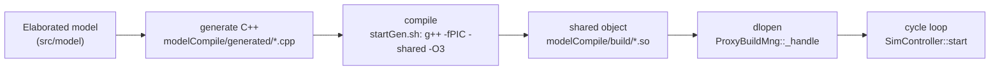
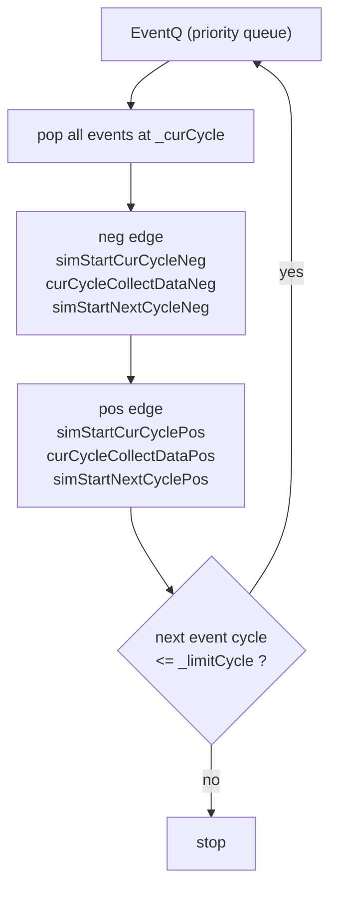

The **Hybrid Simulator** (`src/sim/`) is Kathryn's cycle-accurate,
event-driven simulator. It does not interpret the model directly. Instead it
**generates optimized C++ source from the elaborated model, compiles that
source into a shared object, `dlopen`s the `.so`, and drives a cycle loop**
through it — the same model that the [Verilog generator](/cppbook/backends/verilog-generation/)
consumes, so the design you simulate is the design you generate.

## The JIT build pipeline

`ProxyBuildMng` (`src/sim/modelSimEngine/base/proxyBuildMng.h`) owns the
generate → compile → load flow. It writes a generated `.cpp` under
`modelCompile/generated/`, invokes the shipped `modelCompile/startGen.sh`
script, and dynamically loads the resulting object:

```bash
# modelCompile/startGen.sh (the compile step)
time g++ -fPIC  -shared -o build/$SRC_PROXYEVENT_NAME.so $SRC_OPT_LEVEL -I ../src \
generated/$SRC_PROXYEVENT_NAME.cpp \
../src/sim/modelSimEngine/base/proxyEventBase.cpp \
../src/util/fileWriter/fileWriterBase.cpp \
../src/sim/simResWriter/simResWriter.cpp
```

The generated source lands in `modelCompile/generated/`, the `.so` in
`modelCompile/build/`, and the object is loaded through the `_handle` member of
`ProxyBuildMng`. The optimization level defaults to `-O3` (the `OP_FLAG`
member), and generated proxy functions can be marked
`__attribute__((always_inline)) inline` (the `INLINE_ATTR` member).



### buildSimMode — g / c / r

Which of those three stages actually run is controlled by the **`buildSimMode`**
parameter key. `getSPBM` (`src/sim/modelSimEngine/base/proxyBuildMode.cpp`)
reads the value and turns on a stage for each letter it finds in the string:

| Letter | Stage | Flag |
| ------ | ----- | ---- |
| `g` | **g**enerate the C++ proxy source | `SPB_GEN` |
| `c` | **c**ompile it to a `.so` | `SPB_COMPILE` |
| `r` | **r**un the loaded `.so` | `SPB_RUN` |

So `buildSimMode = gcr` (the value used by almost every shipped params file —
`smParams`, `o3Params`, `krideParams`) means generate, compile, and
run. Because the match is by substring, dropping a letter skips that stage —
useful, for example, to re-run a previously compiled `.so` without regenerating
it.

:::note
The letters are matched as substrings of the value (`value.find('g') != npos`),
so ordering and extra characters are tolerated; only the presence of each
letter matters.
:::

## Writing a testbench: subclassing SimInterface

The user-facing side of the simulator is a subclass of `SimInterface`
(`src/sim/interface/simInterface.h`). Its constructor takes the cycle limit and
the VCD and profiler output paths. From the `blinkSample.cpp` example:

```cpp
struct BlinkAB_sim: public SimInterface{

    explicit BlinkAB_sim(PARAM& params ):
        SimInterface(100, /// limit cycle
                     params["vcdFile"], /// des VCD file
                     params["profFile"]) /// des prof file
                     {}
};
```

The three positional constructor arguments are, in order, the **cycle limit**,
the **VCD file path**, and the **profiler file path**. `SimInterface` also
accepts a generated-file name, a `SimProxyBuildMode`, and inline / optimization
options with defaults; the default build mode is
`SPB_GEN | SPB_COMPILE | SPB_RUN`. To run a simulation, construct the subclass
and call `simStart()`:

```cpp
BlinkAB_sim simulator(params); /// build simulator
simulator.simStart();
```

Subclasses can override the `describe*` hooks (`describeDef`,
`describeModelTrigger`, `describe`, `describeCon`) to install stimulus and
triggers.

## The cycle loop

`SimController::start` (`src/sim/controller/simController.cpp`) drains a
priority event queue (`EventQ`). For each cycle it gathers all events scheduled
at the current cycle, then runs them in two edge phases — **negative edge
first, then positive edge** — each phase split into *start*, *collect data*,
and *start-next-cycle* passes:



The loop terminates when the queue is empty or the next event's cycle exceeds
`_limitCycle` (the cycle limit passed to `SimInterface`).

## Where to go next

- [Parameter files](/cppbook/backends/parameters/) — the full key reference,
  including `vcdFile`, `profFile`, and `buildSimMode`.
- [The Verilog generator](/cppbook/backends/verilog-generation/) — the other
  backend that reads the same model.
