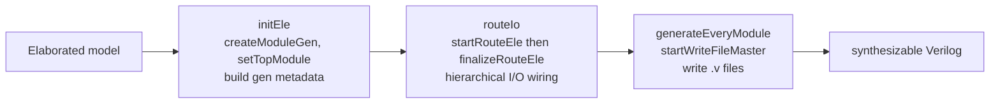

The **Verilog generator** (`src/gen/`) lowers the same elaborated model into
synthesizable Verilog. It runs as a small pipeline, auto-routes I/O across the
module hierarchy, gives every signal a systematic name, and writes each module
in a fixed pool order.

## Three passes

`GenController::start` (`src/gen/controller/genController.cpp`) drives three
passes in sequence:

```cpp
void GenController::start(){
    initEle();
    routeIo();
    generateEveryModule();
}
```

1. **`initEle`** — recruit the model and build each module's generation
   metadata (`createModuleGen`, `setTopModule`, `startInitEle`), including the
   global input and output elements.
2. **`routeIo`** — route I/O signals to the correct place across the module
   tree (`startRouteEle`, `finalizeRouteEle`).
3. **`generateEveryModule`** — dump the routed model to Verilog, one master
   file (and optionally one file per module).



## Hierarchical I/O auto-routing

When a signal in one module is read or driven from another, the generator wires
it through every intermediate module automatically. `moduleRouting.cpp`
(`src/gen/proxyHwComp/module/`) creates three kinds of auto-generated wire,
each with a fixed name prefix:

| Prefix | Kind | Role |
| ------ | ---- | ---- |
| `AIP_` | auto **i**nput **p**ort | pulls a signal down into a module as an input |
| `AOP_` | auto **o**utput **p**ort | pushes a signal up out of a module as an output |
| `ABD_` | auto **b**ri**d**ge | the connecting (inter) wire at the common ancestor |

The routing walks up to the common ancestor of the source and destination
modules, creates one `ABD_` bridge there, then descends generating `AIP_` /
`AOP_` wires along each side. In the emitted `tutorial.v`, the top module's
sub-module connection looks like this:

```verilog
////input of submodule
wire  [0: 0] WIRE78_AIP_0_rstWire_SYS;
////bridgeVec
wire  [0: 0] WIRE77_ABD_1_rstWire_SYS;
...
assign WIRE78_AIP_0_rstWire_SYS = WIRE77_ABD_1_rstWire_SYS;
assign WIRE77_ABD_1_rstWire_SYS = WIRE1_rstWire_SYS;
```

## Systematic signal names

Every emitted signal carries a type prefix, its global id number, and its
source name, e.g. `REG13_d` or `SR_ST4_startNode`. The prefixes seen in the
real `tutorial.v`:

| Prefix | Component |
| ------ | --------- |
| `REG`   | register |
| `WIRE`  | wire |
| `EXPR`  | expression (continuous `assign`) |
| `VAL`   | constant value / literal |
| `SR_ST` | flow-block state register |
| `MODULE` | sub-module instance |

`MEM_BLOCK` and `MEM_BLOCK_INDEXER` are the corresponding prefixes for memory
blocks and their indexers (there are none in this example). Output is
**pool-ordered, not source-ordered**: the layout follows the component pools,
not the order you wrote the design.

## Where to go next

- [Parameter files](/cppbook/backends/parameters/) — `genFolder`,
  `topFileName`, `topModName`, and the `testType` values that trigger
  generation.
- [The Hybrid Simulator](/cppbook/backends/simulator/) — the other backend that
  reads the same model.
