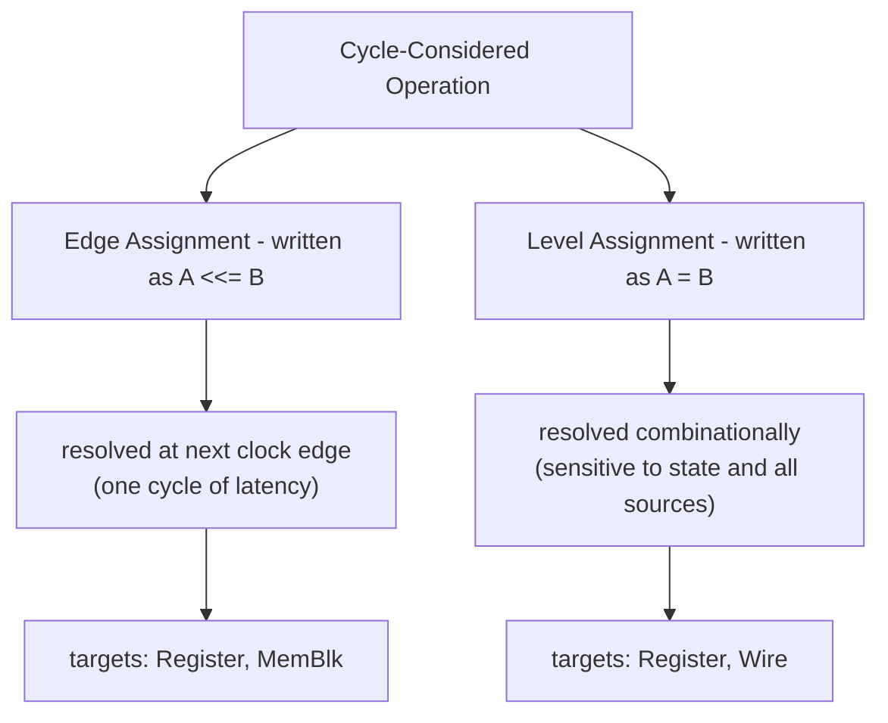

Every value update to a **hardware resource** in Kathryn goes through a
**Cycle-Considered Operation (CCO)** — the assignment operator that drives the
resource. Only hardware resources count: assignments to plain C++ primitive
variables, or to the intermediate `expression&` results that operators build,
are not CCOs. Because CCOs are user-defined operators and Hybrid Design Blocks
are composed from them, designers describe cycle-accurate control flow at the
user level. There are two:

- **Edge Assignment** — written **`<<=`**, resolved at the next clock edge.
- **Level Assignment** — written **`=`**, resolved combinationally.

## Edge Assignment `<<=`

An Edge Assignment schedules its right-hand value to land on the target at the
**next clock edge**. It is the operator that makes time visible: each `<<=` in a
sequential block is one cycle of latency.

```cpp
a <<= a + 1;
c <<= c + 1;
```

Edge Assignment is sensitive to the next pos/neg edge; its supported hardware
resources are **Register** and **MemBlk**. In
the code, `Reg::doBlockAsm` and `MemBlockEleHolder::doBlockAsm` implement it,
while `Wire`, `expression`, and `Val` reject `<<=` (their `doBlockAsm` asserts).

## Level Assignment `=`

A Level Assignment drives its target **combinationally** — sensitive to state
and all of its sources. It carries no clock latency of its own.

```cpp
par{
    a = 0;
    b = 0;
    c = 0;
    d = 0;
}
```

Level Assignment's supported resources are **Register** and **Wire**. In the
code the level path is `doNonBlockAsm`, reached through each type's
`operator=`; `Reg`, `Wire`, `expression`, and `MemBlockEleHolder` define it,
while `Val` and `PmVal` reject it (they are read-only constants).

On a **Register**, `=` is equivalent to having issued the same Edge Assignment
(`<<=`) one clock cycle earlier: the register already carries the right-hand
value in the current cycle.

:::note
This register form of Level Assignment is specific to the C++ implementation —
the Rust + Python rewrite dropped it.
:::

:::note
Both operators are wired through the shared `AssignOpr` template in
`src/model/hwComponent/abstract/assignable.h`: `operator<<=` calls
`doBlockAsm`, and `operatorEq` (invoked by each type's `operator=`) calls
`doNonBlockAsm`. Which resource accepts which is decided by whether that
type's `doBlockAsm` / `doNonBlockAsm` is a real implementation or an assertion.
:::

The two CCOs and where they apply:



## Building expressions

Reading a signal and combining it with an operator produces an `expression` — a
combinational result you can nest, slice, or assign. The overloaded operators
live on `Operable` (`src/model/hwComponent/abstract/`) and each returns an
`expression&`. Kathryn provides the usual bitwise, shift, comparison,
signed-comparison, arithmetic, and bit-extension operators, applicable to all
resource types. The right-hand side may be another Kathryn signal or a plain
C++ integer:

```cpp
a <<= a + 1;                       // arithmetic
d <<= c + d;
return (freenum + commitReqSize) >= (req2.uext(2) + 1);   // comparison + extend
```

Bit-extension helpers appear on the results too — `sext(width)` for signed and
`uext(width)` for unsigned extension:

```cpp
result = g(instr(25, 32), instr(21, 25), instr(20)).sext(DATA_LEN);
```

Here `g(...)` concatenates instruction slices into a Nest and `sext` widens the
concatenation. Slices such as `instr(25, 32)` are themselves readable operands,
so expressions compose freely.

:::note
For the complete operator table — every bitwise, shift, comparison, and
arithmetic operator — plus the width rules for Logical/Unsigned Extension (LUE)
and Logical/Signed Extension (LSE), see the
[Operators reference](/cppbook/reference/operators/).
:::

## Nests: `g` and `gr`

The `g(...)` and `gr(...)` accessors build a **Nest** — a composite that
concatenates several signals (or slices) and inherits their update
constraints. The difference is direction:

- **`g(...)`** — read *and* write (`makeNest`). The concatenation can appear on
  the left of an assignment.
- **`gr(...)`** — read-only (`makeNestReadOnly`).

From `src/example/o3/core/immGen.h`, a nest concatenates instruction slices and
sign-extends the result:

```cpp
zcase(IMM_I) {result = g(instr(25, 32), instr(21, 25), instr(20)).sext(DATA_LEN);}
```

## Where next

- [Supported operators](/cppbook/reference/operators/) — every operator, one
  by one: semantics, result widths, integer operands, and the LUE/LSE rules.
- [Hardware resources](/cppbook/core/hardware-resources/) — the resource types
  these assignments target.
- [Decentralized Update](/cppbook/update/decentralized-update/) — how multiple
  blocks may assign the same resource, resolved by priority.
