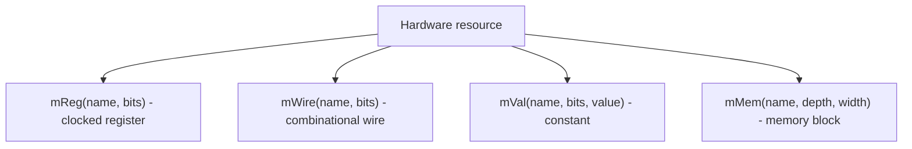

Kathryn provides a small set of hardware resource types, most mirroring their
Verilog counterparts. Each is declared as a module field with an `m…` macro
from `src/model/hwComponent/abstract/makeComponent.h`. Every macro takes the
signal name first, then its parameters.

## The resource kinds



## `mReg` — clocked register

```cpp
mReg(a, 1);   // 1-bit register named a
mReg(freenum, RRF_SEL + 1);
```

`mReg(name, bits)` builds a `Reg` — a flip-flop-backed register. It is the
canonical CCO target: an Edge Assignment `<<=` updates it on the next clock
edge, and a Level Assignment `=` drives it combinationally. Registers can be
given a reset value with `.makeResetEvent(value)`
(`src/model/hwComponent/register/register.h`).

## `mWire` — combinational wire

```cpp
mWire(renameReqSize, 2);
```

`mWire(name, bits)` builds a `Wire`. A Wire is relaxed relative to Verilog: it
may be assigned within any procedural block. It carries a value
combinationally (its input-value trigger is "All Source Change") and has no
clocked storage.

## `mVal` — constants

```cpp
mVal(hf1, 8, 36);          // 8-bit constant, value 36
mVal(RRF_ENTRIES, RRF_SEL + 1, RRF_NUM);
```

`mVal(name, bits, value)` builds a read-only `Val` constant. A `Val` cannot be
an assignment destination — both `<<=` and `=` assert
(`src/model/hwComponent/value/value.h`).

## `mMem` — memory block

```cpp
mMem(name, depth, width);
```

`mMem(name, depth, width)` builds a `MemBlock` — addressable storage of `depth`
entries, each `width` bits (`src/model/hwComponent/memBlock/MemBlock.h`:
`MemBlock(ull depth, int width)`). A `MemBlock` is not read or written directly;
you index it with `operator[]` to obtain a `MemBlockEleHolder` access element:

- `mem[index]` used as a value is a **read** element.
- `mem[index] <<= data` is a **clocked write** — memory writes are
  edge-triggered (the update trigger is the pos/neg clock edge).

## Bit widths and value size

Widths are plain bit counts. Values up to 64 bits use a fast `ull` path; `Val`
additionally stores wider constants exactly as an LSB-first vector of `ull`
words (`_rawValueWide` in `src/model/hwComponent/value/value.h`), so constants
wider than 64 bits are represented losslessly.

## Bit slicing

Signals are sliced by calling them like a function. From
`src/example/o3/core/immGen.h`:

```cpp
instr(25, 32)   // half-open slice, bits [25, 32)
instr(20)       // single bit 20
```

`reg(start, stop)` selects a bit range and `reg(idx)` selects one bit
(`src/model/hwComponent/register/register.h`). A slice can be an assignment
destination or a read source.

## Where next

- [Assignments and expressions](/cppbook/core/assignments-and-expressions/) —
  which resources accept `<<=` versus `=`, and building expressions.
- [Modules and flow](/cppbook/core/modules-and-flow/) — how these fields live
  inside a `Module`.
