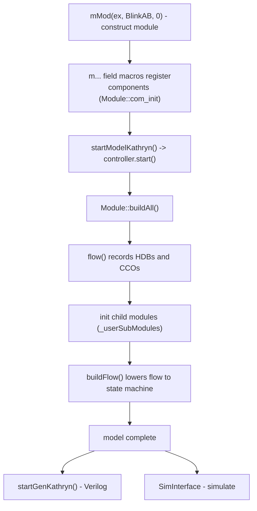

A Kathryn design is a **C++ `struct` or `class` that inherits from `Module`**.
Each module supplies a constructor and overrides `void flow()`, which describes
the module's control flow. Everything a module contains — registers, wires,
child modules — is declared as a field with one of the `m…` macros, so the
model is built simply by constructing the object.

Here is the complete blink sample (`blinkSample.cpp`):

```cpp
struct BlinkAB: public Module{
    mReg(a, 1); //// register name a 1 bit
    mReg(b, 1); //// register name b 1 bit

    BlinkAB(int x): Module(){}

    void flow() override{
        cwhile(true){ ///// loop forever
            seq{
                par{a <<= 1; b <<= 0;} ///// a is on <-> b is off
                syWait(100); //// wait 100 cycle
                par{a <<= 0; b <<= 1;}
                syWait(100);
            }
        }
    }
};
```

## `flow()` — describing behavior

`flow()` is where the control flow lives. Its body is ordinary C++ that, when
run, records Hybrid Design Blocks (HDBs) and Cycle-Considered Operations (CCOs)
into the model. You never call `flow()` yourself; the framework calls it during
elaboration (see below). Because it is plain C++, the loops, parameters, and
conditionals you write around the HDBs act as a *generator*, stamping out
hardware structure at build time.

## Declaring the pieces of a module

Fields inside a `Module` are declared with the component macros from
`src/model/hwComponent/abstract/makeComponent.h`. The ones that build structure:

- `mReg`, `mWire`, `mVal`, `mMem` — hardware
  resources, covered in [Hardware resources](/cppbook/core/hardware-resources/).
- **`mMod(name, TypeName, ...)`** — instantiate a **child module**. The trailing
  arguments are forwarded to the child's constructor:

  ```cpp
  mMod(smBank, SimpleBank, _svParam.kvParam, SUFFIX_BIT, idx);
  mMod(ingr,   SimpleIngress, _svParam, _bankInputItfs);
  ```

  The child becomes part of this module's model. The top-level design is itself
  instantiated with `mMod` in `main()` (`mMod(ex, BlinkAB, 0);` in the blink
  sample).

## The elaboration lifecycle

Building the model is **pure elaboration** — no simulation or code generation
happens yet. From `blinkSample.cpp`, the driver is:

```cpp
mMod(ex, BlinkAB, 0); /// build module
startModelKathryn();  /// start modeling
```

1. `mMod(ex, BlinkAB, 0)` constructs the module. Construction runs the
   `m…`-macro fields, which register each component with the controller
   (`Module::com_init` → `on_module_init_components`).
2. `startModelKathryn()` (in `src/kathryn.cpp`) calls
   `getControllerPtr()->start()`. The controller finalizes the module and then
   drives `buildAll()` on it (`src/model/hwComponent/module/module.cpp`).
3. `Module::buildAll()` calls **`flow()`** to record the HDBs and CCOs, then
   recursively initializes each child module in `_userSubModules`, and finally
   calls `buildFlow()` to lower the recorded flow blocks into the state machine.

After `startModelKathryn()` returns, the in-memory model is complete and ready
for either backend (`startGenKathryn()` for Verilog, or a `SimInterface` for
simulation), and `resetKathryn()` tears it down.



:::note
The entry-point names above (`startModelKathryn`, `startGenKathryn`,
`resetKathryn`) are the real public functions declared in `src/kathryn.h`.
There is no separate "elaborate" call — `startModelKathryn()` is the single
model-build trigger.
:::

## Where next

- [Hardware resources](/cppbook/core/hardware-resources/) — what each `m…`
  macro declares.
- [Assignments and expressions](/cppbook/core/assignments-and-expressions/) —
  Edge Assignment (`<<=`) versus Level Assignment (`=`).
