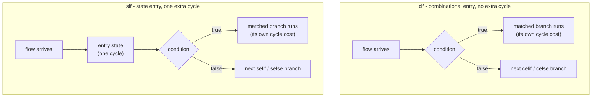

Kathryn has two conditional [HDBs](/cppbook/flow/hdb-overview/) — `cif` and
`sif` — that select which block of
[CCOs](/cppbook/core/assignments-and-expressions/) **and sub-HDBs** runs based
on a condition. Both chain with `celif` and `celse`, and in
**both** the matched block executes in the manner of the enclosing master
block — a branch body may take as many cycles as its contents need. The
prefix letter is about the **condition entry itself**:

- **`cif` — c for combinational.** The condition is resolved combinationally
  (the block's entry node is a `PseudoNode` in the model). Deciding which
  branch runs costs **no cycle**: the conditional's total cost is exactly the
  matched branch's own cost.
- **`sif` — s for state.** The conditional is entered through a clocked
  **`StateNode`** — it spends one cycle in that entry state, so the total
  cost is the matched branch's cost **plus one cycle**
  (`FlowBlockIf::buildHwComponent` sets the block's cycle count to
  `cycleUsed + 1` for `SIF`, and to plain `cycleUsed` for `CIF`).



Both expand from the same `FlowBlockIf`, distinguished only by the mode flag
(`src/model/flowBlock/cond/if.h`):

```cpp
#define cif(expr) for(auto kathrynBlock = new FlowBlockIf(expr, CIF); kathrynBlock->doPrePostFunction(); kathrynBlock->step())
#define sif(expr) for(auto kathrynBlock = new FlowBlockIf(expr, SIF); kathrynBlock->doPrePostFunction(); kathrynBlock->step())
```

## Chaining with celif and celse

`celif` adds another guarded branch and `celse` the fall-through. This real
example (from autoSim `simAutoTest10`) mixes both forms — a `sif` chain with a
nested `cif` inside one branch:

```cpp
seq {
    sif(a > b){
        result <<= resultCNA;
    }
    selif(a < b){
        cif(innerA > innerB){
            result <<= resultCNB;
        }celse{
            result <<= resultCNB2;
        }
    }
    selse{
        result <<= resultCNC;
    }
}
```

Branches are checked in order and exactly one runs: the first true condition
wins, `celse` catches the rest. `selif` / `selse` are literally the **same
`FlowBlockElif` macros** as `celif` / `celse` (`cond/elif.h`) — the `s`
spelling is a convention to match an `sif` head. Only the head (`cif` or
`sif`) decides the entry timing of the whole chain.

## Choosing cif or sif

- **`cif`** — the usual choice: branch selection is free, and the conditional
  adds no cycles beyond what the matched branch itself needs.
- **`sif`** — when the conditional should occupy a registered step of its
  own: the decision is taken from a state, adding one cycle.
- For a conditional whose matched branch must resolve **within a single
  cycle** (combinational bodies only), use the structural
  [`zif`](/cppbook/flow/structural-rtl/) instead.

Conditionals nest inside and around every other HDB — see
[`seq` and `par`](/cppbook/flow/seq-and-par/), [loops](/cppbook/flow/loops/),
and the zero-time structural [z-blocks](/cppbook/flow/structural-rtl/).
