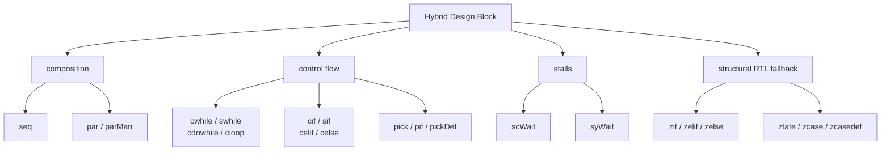

A **Hybrid Design Block (HDB)** is Kathryn's core control-flow abstraction. Each
HDB is a hybrid RTL/behavioral, **cycle-accurate** description of control flow:
it orchestrates [Cycle-Considered Operations](/cppbook/core/assignments-and-expressions/)
(CCOs — the `<<=` and `=` assignments) and nested HDBs according to its own
semantics. Because CCOs are user-defined operators and HDBs are composed from
them, you specify cycle-accurate control flow entirely at the user level.

Every HDB elaborates to a graph of [State Nodes](/cppbook/reference/nodes/) and
their supporting nodes. The State Node is the atomic element of the HDF state
machine; each HDB instantiates its own State Nodes to orchestrate the internal
nodes and define their execution conditions and connections. Writing an HDB is
therefore not writing an FSM by hand — it is describing intent, which the model
lowers to a predictable, per-cycle state machine.

## The HDB family

The blocks below make up the control-flow HDB family. Each links to its
detail page.

| Block | Semantics |
| ----- | -------------------------------------- |
| [`seq`](/cppbook/flow/seq-and-par/) | All CCOs and sub-HDBs execute sequentially. |
| [`par` / `parMan`](/cppbook/flow/seq-and-par/) | All CCOs and sub-HDBs execute in parallel. |
| [`cwhile` / `swhile` / `cdowhile`](/cppbook/flow/loops/) | Body repeats in the manner of the `*while` master block. |
| [`cloop`](/cppbook/flow/loops/) | Fixed-count loop with a hardware counter and a loop variable. |
| [`cif` / `sif` / `celif` / `celse`](/cppbook/flow/conditionals/) | The matched conditional block executes in the manner of the `*if` master block. |
| [`pick` / `pif` / `pickDef`](/cppbook/flow/pick/) | Matched `pif` blocks execute; the block does not wait for all branches to complete. |
| [`scWait` / `syWait`](/cppbook/flow/waits/) | Stall execution until a condition holds, or for a fixed number of cycles. |
| [`sbreak`](/cppbook/flow/loops/) | Exit the enclosing loop from inside its body. |
| [`zif` / `zelif` / `zelse`, `ztate` / `zcase` / `zcasedef`](/cppbook/flow/structural-rtl/) | Zero-time, combinationally-resolved **structural RTL** fallback. |

Pipelines (`pip` / `zync`) are the most flexible members of the family and get
their own chapter — see [Pipelines](/cppbook/pipelines/pip-and-zync/).

## Where to go next

Start with [`seq` and `par`](/cppbook/flow/seq-and-par/) for composition, then
[conditionals](/cppbook/flow/conditionals/), [loops](/cppbook/flow/loops/), and
[waits](/cppbook/flow/waits/). For the structural-RTL escape hatch see
[z-blocks](/cppbook/flow/structural-rtl/), and for the node vocabulary every
block shares see [Nodes](/cppbook/reference/nodes/).
