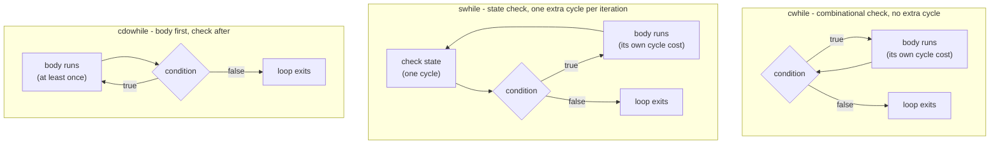

Kathryn's loop [HDBs](/cppbook/flow/hdb-overview/) re-launch their body until an
exit condition is met. Every iteration is real hardware: the loop variable is a
register or counter in your design, and each iteration takes clock cycles.

## The while family

Three related blocks share a while-style body, distinguished by *when* the
condition is checked:

```cpp
#define cwhile(expr) for(auto kathrynBlock = new FlowBlockWhile(expr, CWHILE); kathrynBlock->doPrePostFunction(); kathrynBlock->step())
#define swhile(expr) for(auto kathrynBlock = new FlowBlockWhile(expr, SWHILE); kathrynBlock->doPrePostFunction(); kathrynBlock->step())
#define cdowhile(expr) for(auto kathrynBlock = new FlowBlockDowhile(expr, DOWHILE); kathrynBlock->doPrePostFunction(); kathrynBlock->step())
```

- **`cwhile(cond)`** — **c for combinational**: checks `cond` combinationally
  *before* each iteration (its condition node is a `PseudoNode`), so the check
  costs **no cycle** — each iteration costs only the body.
- **`swhile(cond)`** — **s for state**: the check happens from a clocked
  **`StateNode`**, spending **one extra cycle per iteration** but seeing the
  settled value.
- **`cdowhile(cond)`** — runs the body first, then checks `cond`
  combinationally *after* each iteration, so the body always runs at least
  once and the check costs no cycle.



Over `LC` iterations of a body that costs two sequential cycles,
`cwhile`/`cdowhile` spend `2*LC` cycles but `swhile` spends `3*LC` — the
state check adds its cycle every time around.

A `cdowhile`, from the repository `Readme.md`:

```cpp
seq{
    a <<= i;
    par{
        cdowhile(a < 8){ a <<= a + 1; c <<= c + 1; }
        cdowhile(b < 8){ b <<= b + 1; d <<= d + 1; }
    }
    d <<= c + d;
}
```

## `cloop` — fixed-count loop with a loop variable

`cloop` runs its body a fixed number of times using a generated hardware
counter, and exposes the count as a readable loop variable. Its macro takes
**two** arguments — the loop-variable name and the count:

```cpp
#define cloop(kathrynLoopName, loopNumber) \
    for(auto kathrynBlock = new FlowBlockLoop(loopNumber); ...) \
        for (Operable& kathrynLoopName = kathrynBlock->getLoopId(); ...)
```

From autoSim `simAutoTest71`, where `bid` is the loop variable:

```cpp
seq{
    cloop(bid, 10){
        syWait(_cyclesPerBit - 1);
        zif (bid != 9){
            shiftReg <<= g(one, (shiftReg)(1, 10));
        }
    }
}
```

## Exiting with sbreak

To leave a loop from inside its body, use `sbreak` — the HDB-aware break. A
native C++ `break` does not describe hardware control flow and must not be
used inside an HDB body.

```cpp
#define sbreak for(auto kathrynBlock = new FlowBlockSCBreak(); kathrynBlock->doPrePostFunction(); kathrynBlock->step()){}
```

:::note
`sbreak` exists only in this C++ implementation — the Rust + Python rewrite
dropped it.
:::

From autoSim `simAutoTest19`, `sbreak` fires from inside a `cif` when a count is
reached:

```cpp
cwhile(a <= 48) {
    seq{
        b <<= 5;
        a <<= a + 1;
        cif(a == 16) {
            par{
                sbreak;
                seq{ b <<= 15; }
            }
        }
    }
}
```

:::caution[sbreakCon is legacy]
The conditional break `sbreakCon` is **not** available — the `FlowBlockSCBreak`
conditional constructor is marked legacy and its macro is commented out in
`loop/cbreak.h`. Guard `sbreak` with a [conditional](/cppbook/flow/conditionals/)
(as above) instead of passing a condition to the break itself.
:::

## Choosing a loop

- Fixed, build-time count with an index you want to read → `cloop(name, n)`.
- Data-dependent count, speed matters → `cwhile`.
- Data-dependent count, exit must see the settled value → `swhile`.
- Body must run at least once → `cdowhile`.

Loop bodies nest freely with [`par`](/cppbook/flow/seq-and-par/),
[conditionals](/cppbook/flow/conditionals/),
[waits](/cppbook/flow/waits/), and further loops.
