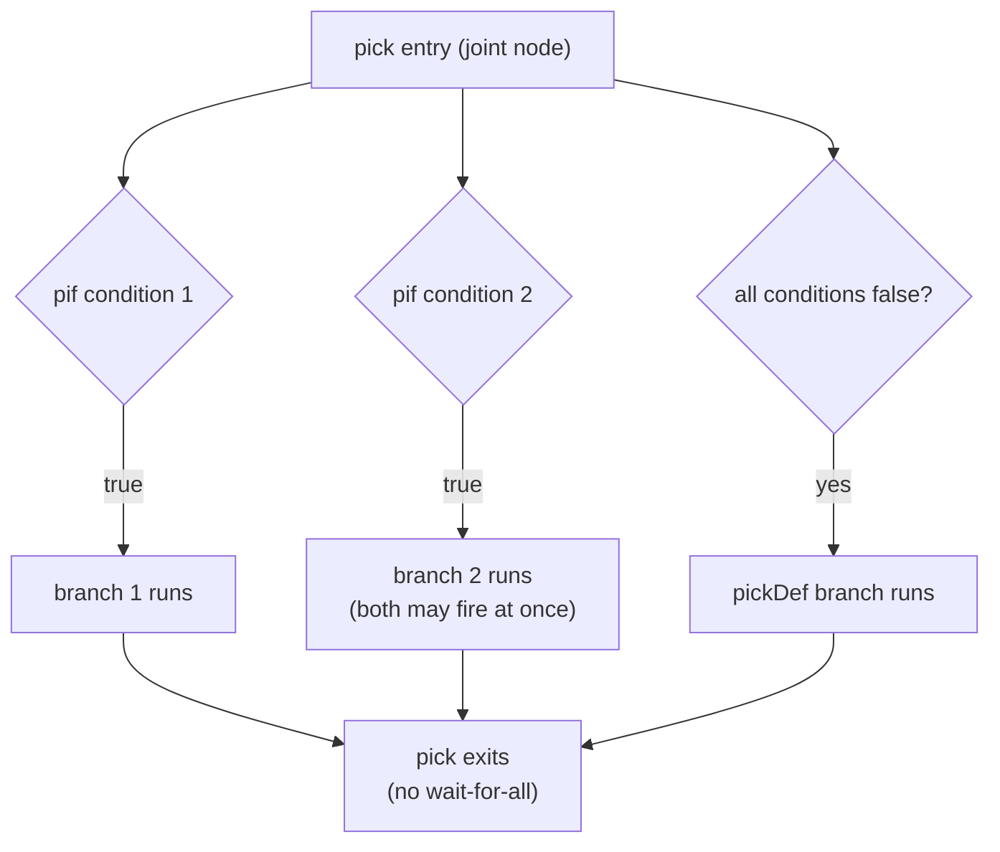

`pick` is the [HDB](/cppbook/flow/hdb-overview/) for **condition-guarded
parallel branches**. Unlike a [conditional](/cppbook/flow/conditionals/),
`pick` does **not** select one branch — it is **all-match**: every `pif(cond)`
block whose condition holds runs, as siblings. And `pick` **does not wait for
all branches to complete** before exiting — it exits as branches resolve.
`pickDef` provides a default for the case where no condition matched.

```cpp
#define pick for(auto kathrynBlock = new FlowBlockPick(); kathrynBlock->doPrePostFunction(); kathrynBlock->step())
#define pickDef kathrynBlock->setReqAutoExit();
#define pif(expr) for(auto kathrynBlock = new FlowBlockPickCond(expr); kathrynBlock->doPrePostFunction(); kathrynBlock->step())
```

From autoSim `simAutoTest38`, a `pick` inside a `cwhile`:

```cpp
seq{
    cwhile(r1 < 20){
        r1 = r1 + 1;
        pick{
            pif(r1 == 8){
                a <<= 48;
            }
            pif(r1 == 16){
                a <<= 24;
            }
            pickDef
        }
    }
    rend <<= 48;
}
```

## All-match semantics

Each `pif` branch is joined to the `pick`'s entry through a node gated by *that
branch's own condition* (`pick.cpp` gives every `pif` sub-block a dependency on
the shared joint node, qualified by its condition). So every `pif` whose
condition is true launches — several branches may fire at once. Matched
branches run as siblings, in the manner of the `pick` master block, and the
`pick` exits as they resolve rather than waiting for all of them. If you need
strict one-of-N behavior, write mutually exclusive `pif` conditions yourself —
or use a `cif`/`sif` chain.



:::note[pickDef and setReqAutoExit]
`pickDef` is not a block — it calls `setReqAutoExit()` on the current `pick`.
That builds an auto-exit node whose condition is the AND of the negations of
every `pif` condition, so it triggers exactly when **none** of the branches
matched, giving the `pick` a clean exit in the no-match case.
:::

## When to use pick

Use `pick` when zero or more independent conditions may each trigger their own
work in the same step, and you do not want the block to stall until every
branch finishes. For strictly one-of-N selection where later branches must not
fire once an earlier one matches, prefer a [`cif`/`sif`
chain](/cppbook/flow/conditionals/) or the structural
[`ztate`/`zcase`](/cppbook/flow/structural-rtl/) selector.
