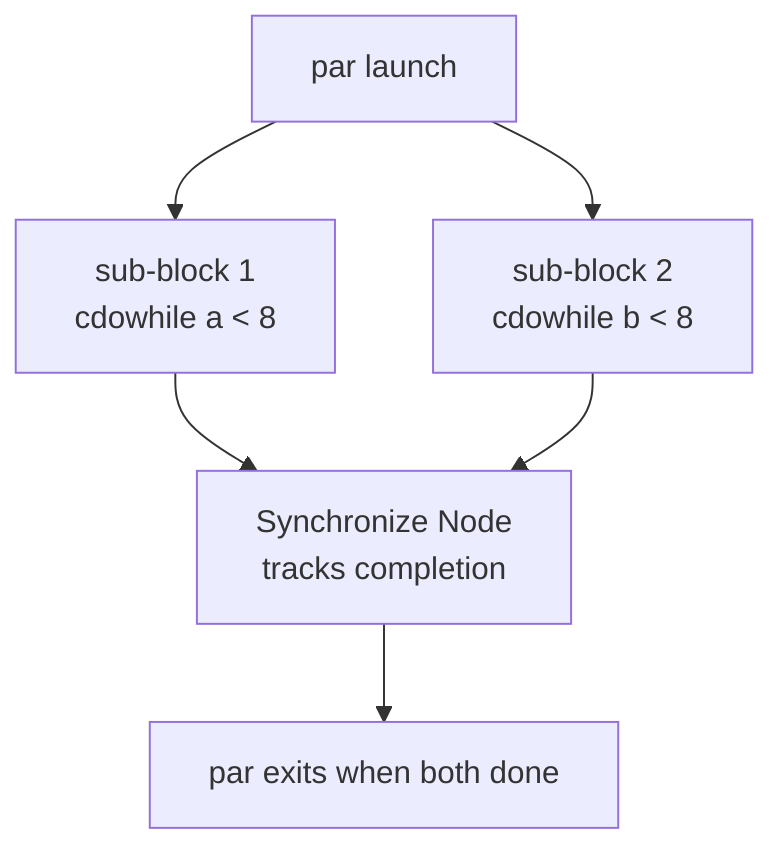

`seq` and `par` are the two composition [HDBs](/cppbook/flow/hdb-overview/).
They differ only in *when* their contents run: `seq` runs its CCOs and sub-HDBs
one after another; `par` runs them all at once.

## `seq` — sequential composition

Inside a `seq` block, every [CCO](/cppbook/core/assignments-and-expressions/)
and nested HDB executes sequentially — the second statement's State Node
depends on the first's completion, and so on down the block. This is the
default reading order you expect from top-to-bottom code, made cycle-accurate.

```cpp
seq{ /// all sub element run [seq]uentialy
    a <<= i;
    par{ /// all sub element run parallelly
        cdowhile(a < 8){ a <<= a + 1; c <<= c + 1; }
        cdowhile(b < 8){ b <<= b + 1; d <<= d + 1; }
    }
    d <<= c + d;
}
```

Here `a <<= i` completes, then the `par` block runs, and only when the `par`
finishes does `d <<= c + d` fire.

## `par` — parallel composition

Inside `par`, all sub-blocks launch on the same cycle and run concurrently.
Each of the two `cdowhile` loops above advances its own registers in lockstep,
independently of the other.



### The Synchronize Node

When a `par`'s sub-blocks all have a statically known cycle count, the block
knows in advance when they all finish. But when a sub-block's cycle usage
**cannot be statically determined** — for example a data-dependent loop like the
`cdowhile` above — `par` inserts a [Synchronize Node](/cppbook/reference/nodes/).
The Synchronize Node adds auxiliary hardware that tracks each sub-block's
completion and joins them without spending extra cycles, so the `par` exits in
the exact cycle its slowest branch finishes.

The default `par` builds this join automatically:

```cpp
#define par    for(auto kathrynBlock = new FlowBlockParAuto();   kathrynBlock->doPrePostFunction(); kathrynBlock->step())
#define parMan for(auto kathrynBlock = new FlowBlockParNoSync(); kathrynBlock->doPrePostFunction(); kathrynBlock->step())
```

## `parMan` — parallel without a synchronizer

`parMan` (`FlowBlockParNoSync`) launches its sub-blocks in parallel exactly like
`par`, but does **not** build a Synchronize Node. Use it when you will manage
completion yourself — for instance when the surrounding structure already
provides the join, or when the branches are known to finish together and the
automatic synchronizer would be redundant hardware.

:::note
Prefer plain `par` unless you have a specific reason to drop the synchronizer.
With `par` the framework guarantees the block exits when its slowest branch
completes; with `parMan` that responsibility is yours.
:::

## Nesting

`seq` and `par` nest freely and mix with every other HDB. The example above puts
a `par` inside a `seq`, and each `par` branch is itself a
[loop](/cppbook/flow/loops/). Any block may contain
[conditionals](/cppbook/flow/conditionals/),
[waits](/cppbook/flow/waits/), or further `seq`/`par` composition.
