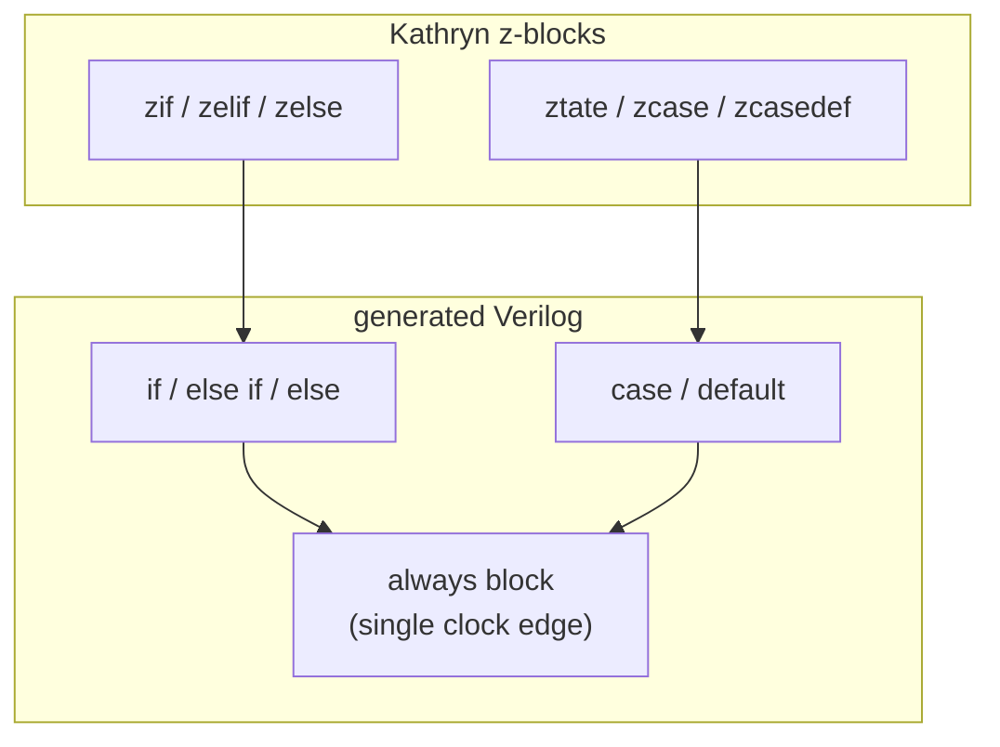

The [HDBs](/cppbook/flow/hdb-overview/) express a broad range of control flow,
but not everything expressible in Verilog. For the rest, Kathryn provides a
**structural RTL** (Verilog-style) fallback built from `z`-prefixed blocks.
These are zero-time, combinationally-resolved blocks: they describe the logic
that drives a resource within a single evaluation, and they integrate with the
higher-level HDBs so structural RTL and cycle-accurate control flow coexist in
one model.

## zif / zelif / zelse

`zif` is the combinational conditional; `zelif` and `zelse` chain onto it (from
`cond/zif.h` and `cond/zelif.h`):

```cpp
#define zif(expr)   for(auto kathrynBlock = new FlowBlockZIF(expr);   kathrynBlock->doPrePostFunction(); kathrynBlock->step())
#define zelif(expr) for(auto kathrynBlock = new FlowBlockZELIF(expr); kathrynBlock->doPrePostFunction(); kathrynBlock->step())
#define zelse       for(auto kathrynBlock = new FlowBlockZELIF();     kathrynBlock->doPrePostFunction(); kathrynBlock->step())
```

From autoSim `simAutoTest11`, `zif`/`zelif`/`zelse` nesting inside a `cwhile`:

```cpp
cwhile(cond){
    zif(a > b){
        a <<= a + one;
    }
    zelif(a < b){
        a <<= a + two;
        zif(a > b){
            b <<= b - one;
        }zelse{
            b <<= b - two;
        }
    }
}
```

## ztate / zcase / zcasedef

`ztate(sel)` is the structural selector — a Verilog `case` — with `zcase(v)`
branches and a `zcasedef` default (from `state/ztate.h` and `state/zcase.h`):

```cpp
#define ztate(identState) for(auto kathrynBlock = new FlowBlockZtate(identState); kathrynBlock->doPrePostFunction(); kathrynBlock->step())
#define zcase(caseValue)  for(auto kathrynBlock = new FlowBlockZCase(caseValue);  kathrynBlock->doPrePostFunction(); kathrynBlock->step())
#define zcasedef          for(auto kathrynBlock = new FlowBlockZCase();           kathrynBlock->doPrePostFunction(); kathrynBlock->step())
```

From autoSim `simAutoTest62`, a `ztate` selecting on `switchVal`, with a nested
`zif` inside a case:

```cpp
ztate(switchVal){
    zcase(0b100){
        a <<=  9;
        b <<= 24;
        zif(subCheck){ b <<= 48; }
    }
    zcase(0b001){
        a <<= 10;
        b <<= 107;
    }
    zcasedef{
        b <<= 404;
    }
}
```



## Intentional constraints

The structural-RTL fallback is deliberately restricted. Three constraints
favor modeling simplicity and simulation performance:

1. A resource is sensitive to a **single clock edge** (registers, memory) or to
   all dependent sources (wires).
2. Clock-edge-sensitive elements use **non-blocking** semantics.
3. Advanced constructs — **multiple clock domains, latches, and tri-state
   ports** — are unsupported.

:::note[Why these limits]
These are design decisions, not accidental gaps: constraining structural RTL to
a single edge, non-blocking updates, and no latches / tri-state / multi-clock
keeps every model synthesizable-by-construction and fast to simulate. Kathryn
defaults to a positive-edge clock; negative-edge behavior is set explicitly.
:::

:::caution[zsync is not a z-block in this sense]
The structural-RTL fallback comprises `zif`, `zelif`, `zelse`,
`ztate`, `zcase` — explicitly **excluding** `zync`. `zync` is a pipeline
construct, not a combinational block; see
[Pipelines](/cppbook/pipelines/pip-and-zync/).
:::

Use z-blocks when you need exact Verilog-style structure or zero cycle cost for
a piece of combinational logic, and keep the cycle-accurate control flow in the
[HDBs](/cppbook/flow/hdb-overview/) around them.
