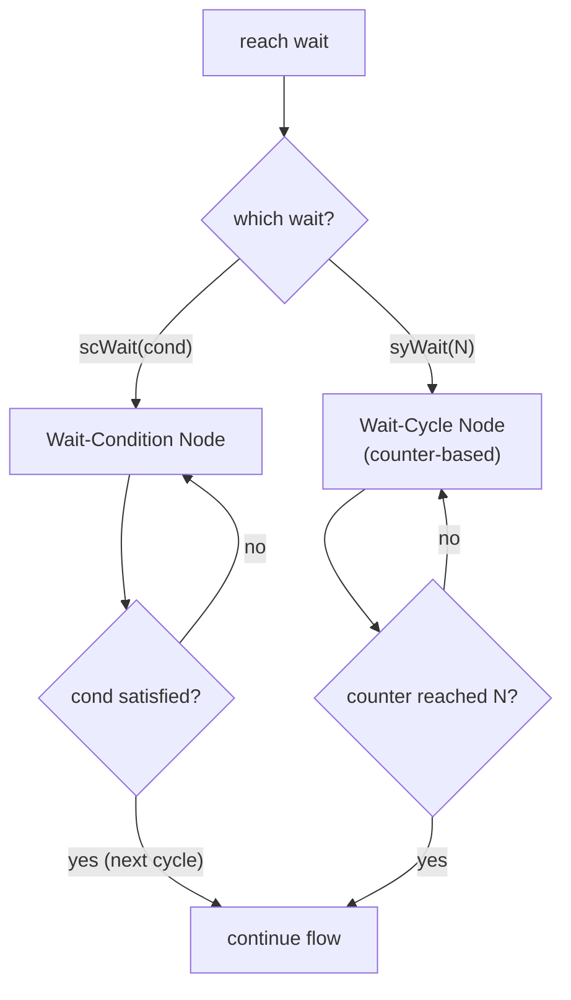

Two [HDBs](/cppbook/flow/hdb-overview/) stall the flow: `scWait` waits for a
condition, and `syWait` waits for a number of cycles. Both are single-statement
blocks that hold the enclosing flow in place until their wait is satisfied.

```cpp
#define scWait( cond) for(auto kathrynBlock = new FlowBlockCondWait(cond)  ; kathrynBlock->doPrePostFunction(); kathrynBlock->step()){};
#define syWait(cycle) for(auto kathrynBlock = new FlowBlockCycleWait(cycle); kathrynBlock->doPrePostFunction(); kathrynBlock->step()){};
```

## `scWait(cond)` — wait for a condition

`scWait(cond)` elaborates to a [Wait-Condition Node](/cppbook/reference/nodes/),
which stalls execution until `cond` is satisfied. `cond` is any readable Kathryn
signal or expression. From autoSim `simAutoTest20`, one `par` branch waits for a
counter driven by the other branch:

```cpp
seq {
    par{
        seq {
            scWait(a == 48);
            result = 1;
        }
        cwhile(a <= 50){
            a <<= a + 1;
        }
    }
}
```

The `scWait(a == 48)` holds its branch until the parallel loop has counted `a`
up to 48; `result = 1` then runs on the **next cycle** after the condition is
met (the wait node is clocked — it releases the flow on the following clock
edge, not in the same cycle the condition becomes true). This is the natural
way to synchronize one flow against another's progress.

## `syWait(N)` — wait for a fixed cycle count

`syWait(N)` elaborates to a [Wait-Cycle Node](/cppbook/reference/nodes/), which
uses a counter and control logic to stall for a fixed number of cycles. The
count may be a constant or a readable signal. From autoSim `simAutoTest21`,
where the stall length comes from register `a`:

```cpp
seq {
    a <<= 16;
    syWait(a);
    result = 1;
}
```

Here `a <<= 16` runs, then `syWait(a)` stalls for the counted number of cycles
before `result = 1` fires.



## Choosing a wait

- Use **`scWait`** to synchronize against a data condition — another flow's
  progress, an external ready signal, or any computed predicate.
- Use **`syWait`** for a deterministic delay of a known (or signal-driven)
  number of cycles, such as a bit period in a serial protocol.

Both waits nest inside any block; the `simAutoTest71` UART loop in
[Loops](/cppbook/flow/loops/) uses `syWait` for its per-bit timing. For the
underlying node mechanism see [Nodes](/cppbook/reference/nodes/).
