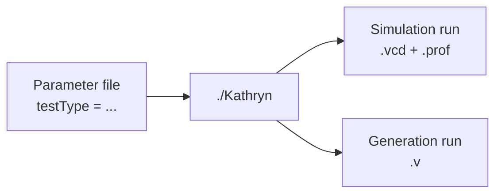

The C++ Kathryn builds with **CMake** into a single executable, `Kathryn`.
You run it by handing it one argument — the path to a **parameter file** — and
the front end decides what to do from a key inside that file. This page covers
the build, the `testType` values you can use, and where output lands.

## Build with CMake

From the repository root, the `Readme.md` build recipe is:

```bash
mkdir build && cd build
cmake -DBUILD_RIDECORE=OFF ..
make -j
```

`CMakeLists.txt` declares the project as C++17 and globs the source tree into a
single `Kathryn` executable target — `main.cpp`, `src/kathryn.cpp`, and every
`.cpp` under `src/abstract`, `src/application`, `src/frontEnd`, `src/model`,
`src/sim`, `src/gen`, `src/test`, `src/util`, `src/example`, `src/params`, and
`src/lib`:

```text
add_executable(Kathryn
        main.cpp
        src/kathryn.cpp
        ${SRC_ABS} ${SRC_APP} ${SRC_FED} ${SRC_MODEL}
        ${SRC_SIM} ${SRC_GEN} ${SRC_TEST} ${SRC_UTIL}
        ${SRC_EXAMPLE} ${SRC_PARAM} ${SRC_LIB}
        ${SRC_MODEL_COMPILE}
        ${SRC_RIDE_SIM}
)
```

The build also injects `KATHRYN_PROJ_FOLD_PATH` (the source directory) as a
compile definition, so the tool can locate project-relative paths at runtime.

:::note
`CMakeLists.txt` keeps several optimization lines commented out (for example
`add_compile_options(-O3)` and `CMAKE_INTERPROCEDURAL_OPTIMIZATION`). The
default build is therefore an unoptimized build; enable those in
`CMakeLists.txt` yourself if you want a faster tool.
:::

## Run: one executable, one parameter file

`main.cpp` is deliberately small. It reads the parameter file named by the
first command-line argument, then calls `start(params)`:

```cpp
int main(int argc, char* argv[]) {
    if (argc < 2){
        std::cout << "there is no argument value" << std::endl;
    }
    auto params = readParamKathryn(argv[1]);
    /***** model and simulation start here*/
    start(params);
}
```

So a run looks like:

```bash
./Kathryn ../params/smParams
```

See [Parameters](/cppbook/backends/parameters/) for the full parameter-file
format; every path key expects a trailing `/`, per the sample files.

## Which `testType` values you can use

The parameter file's **`testType`** key selects the built-in scenario. These
are the accepted values:

| `testType`            | What it runs                                                       |
| --------------------- | ------------------------------------------------------------------ |
| `testSimple`          | The auto-simulation suite (what the `smParams` sample uses)         |
| `testO3Sim`           | The out-of-order (O3) example simulation                            |
| `testKrideSim`        | The Kride CPU simulation                                            |
| `testRideSim`         | The reference RIDECORE simulation — needs `BUILD_RIDECORE=ON`       |
| `testKrideRideCombSim`| The Kride-versus-RIDECORE co-simulation — needs `BUILD_RIDECORE=ON` |
| `testGen`             | Verilog generation for the built-in generation example              |
| `testGenO3`           | Verilog generation for the O3 design                                |

Any other value prints `there is no command to test system` and exits.



Simulation scenarios write a **`.vcd`** waveform and a **`.prof`** ZEP
profiler report; generation scenarios write a **`.v`** Verilog file. In the
shipped params files everything lands under the repository's `KOut/`
directory. These are the keys that control those output files:

| Key                    | Scenario   | Effect                                                       |
| ---------------------- | ---------- | ------------------------------------------------------------ |
| `prefix`               | simulation | Output directory the run writes its `.vcd`/`.prof` results into |
| `vcdFile` / `profFile` | simulation | Explicit destination paths for the waveform and profiler report |
| `buildSimMode`         | simulation | Which simulator JIT stages run — `g`/`c`/`r` = generate / compile / run |
| `genFolder`            | generation | Output folder for the generated Verilog                      |
| `topFileName`          | generation | Base name of the emitted top `.v` file                       |
| `topModName`           | generation | Verilog module name of the top module                        |

:::caution[VCD and profiler recording are compile-time switches]
The keys above only choose the output *paths*. What the simulator actually
records is fixed at **compile time** in `src/params/simParam.cpp`:

- `PARAM_VCD_REC_POL` selects which signals are recorded into the VCD —
  `MDE_REC_ONLY_USER`, `MDE_REC_ONLY_INTERNAL`, `MDE_REC_BOTH`, or
  `MDE_REC_SKIP`.
- `PARAM_PERF_REC_POL` gates ZEP profiler collection — `MFP_ON` or `MFP_OFF`.

As shipped, they default to `MDE_REC_SKIP` and `MFP_OFF` — VCD signal
recording and profiler collection are **off**. Edit `simParam.cpp` and
rebuild to get real waveform and profiler content.
:::

See [Parameters](/cppbook/backends/parameters/) for the full key reference and
the catalog of shipped params files.

The two RIDECORE scenarios only work when the tool was built with
`cmake -DBUILD_RIDECORE=ON` (requires **Verilator** and the populated
`extSim/ridecore` submodule); otherwise they print
`RIDE simulation is not enabled. Please build with BUILD_RIDECORE=ON`.

## Where next

- [Quickstart: the blink sample](/cppbook/getting-started/quickstart-blink/) —
  the smallest complete design plus simulation, walked through line by line.
- [Parameters](/cppbook/backends/parameters/) — the full parameter-file format
  and every key the front end reads.
