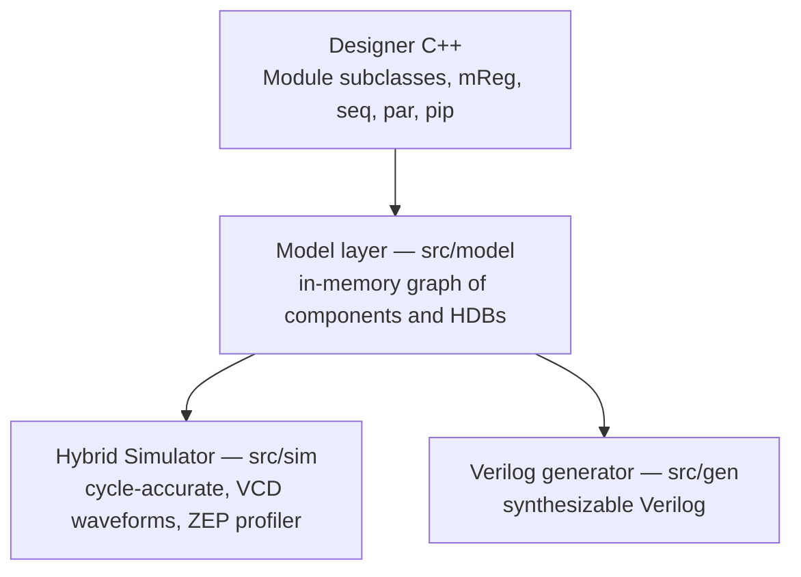

Kathryn is a **framework-assisted HDL embedded in C++** — conceptually in the
same family as Chisel, PyMTL, and PyRTL, *not* an HLS tool and *not* SystemC.
You write ordinary C++ classes; the framework records the hardware you describe
into an in-memory **model**, which is then driven down two independent
backends: a cycle-accurate simulator and a synthesizable-Verilog generator.
Everything you write is cycle-accurate at user level and synthesizable by
construction.

:::note[Which Kathryn?]
This book documents the **original C++ implementation** of Kathryn — the
implementation evaluated in the Kathryn paper. The
[Userbook](/userbook/getting-started/introduction/) and
[Devbook](/devbook/architecture/overview/) document the newer Rust + Python
rewrite.
:::

Here is a real Kathryn module (from the repository's `Readme.md`):

```cpp
class ExampleModule: public Module{
public:
    mWire(i, 32);
    mReg(a, 32);mReg(b, 32);
    mReg(c, 32);mReg(d, 32);

    ExampleModule(int x): Module(){ i.asInputGlob(); d.asOutputGlob();}

    void flow() override{
        seq{ /// all sub element run [seq]uentialy
            a <<= i;
            par{ /// all sub element run parallelly
                cdowhile(a < 8){ /// do loop
                    a <<= a + 1;
                    c <<= c + 1;
                }
                cdowhile(b < 8){ /// do loop
                    b <<= b + 1;
                    d <<= d + 1;
                }
            }
            d <<= c + d;
        }
    }
};
```

Nothing here is inferred. Each `mReg` is one register; each `<<=` is an
**Edge Assignment** — a Cycle-Considered Operation (CCO) that takes exactly one
clock edge; `seq`, `par`, and `cdowhile` are **Hybrid Design Blocks (HDBs)**
that compose those operations into a state machine with fully predictable
per-cycle behavior.

## The three abstractions

Kathryn is a **Framework-Assisted Approach (FAA)** that bridges the usual gap
between control-flow abstraction and cycle-accurate control. Three abstractions
carry that promise, and this book is organized around them:

- **[Hybrid Design Flow (HDF)](/cppbook/flow/hdb-overview/)** — the
  control-flow abstraction methodology. Individual constructs (`seq`, `par`,
  `cwhile`, `cif`/`zif`, `pip`/`zync`, `ztate`, `scWait`/`syWait`) are Hybrid
  Design Blocks; they abstract control logic and parallelism while staying
  cycle-accurate in userland.
- **[Decentralized Update](/cppbook/update/decentralized-update/)** — any block
  may update a resource. Assignments do not mutate state directly; each one
  pushes an update event into the target's pool, and the framework resolves
  priorities later. No central FSM has to own a register's writes.
- **Hardware Aggregator** — feature-rich management of *groups* of resources:
  [Slots](/cppbook/aggregators/slots/) (`SlotMeta`, `RegSlot`/`WireSlot`) and
  [Tables](/cppbook/aggregators/tables/) (`Table`). These carry the
  bulk of the Kride case study — reservation stations, the ROB, and the
  register files.

## One model, two backends

The implementation keeps three concerns in deliberately separate layers: the
model, and two backends that consume it.



1. **The model layer** (`src/model/`) is the C++-embedded DSL itself — macros
   like `mReg` and `mWire`, blocks like `seq`, `par`, `zif`, `pip`. Building a
   model is pure elaboration: it constructs an in-memory graph of hardware
   components and control-flow blocks, with no simulation or code generation
   involved.
2. **The [Hybrid Simulator](/cppbook/backends/simulator/)** (`src/sim/`) is a
   cycle-accurate, event-driven simulator. It generates C++ from the model,
   compiles it to a shared object, and loads it to run the simulation — and
   it produces VCD waveforms plus the ZEP (Zero Effort cycle-spent Profiler)
   report along the way.
3. **The [Verilog generator](/cppbook/backends/verilog-generation/)**
   (`src/gen/`) lowers the same model to synthesizable Verilog.

Because both backends read the same model, the design you simulate is exactly
the design you generate.

## Where this book goes next

- [Building and running](/cppbook/getting-started/build-and-run/) — compile the
  framework and drive it with a parameter file.
- [Quickstart: the blink sample](/cppbook/getting-started/quickstart-blink/) —
  the smallest complete design-plus-simulation, line by line.
- [Modules and flow](/cppbook/core/modules-and-flow/) and
  [Assignments and expressions](/cppbook/core/assignments-and-expressions/) —
  the core model: Edge Assignment (`<<=`) versus Level Assignment (`=`), and
  how `flow()` describes behavior.
- The [Kride case study](/cppbook/kride/overview/) — the RISC-V out-of-order
  superscalar CPU case study.
