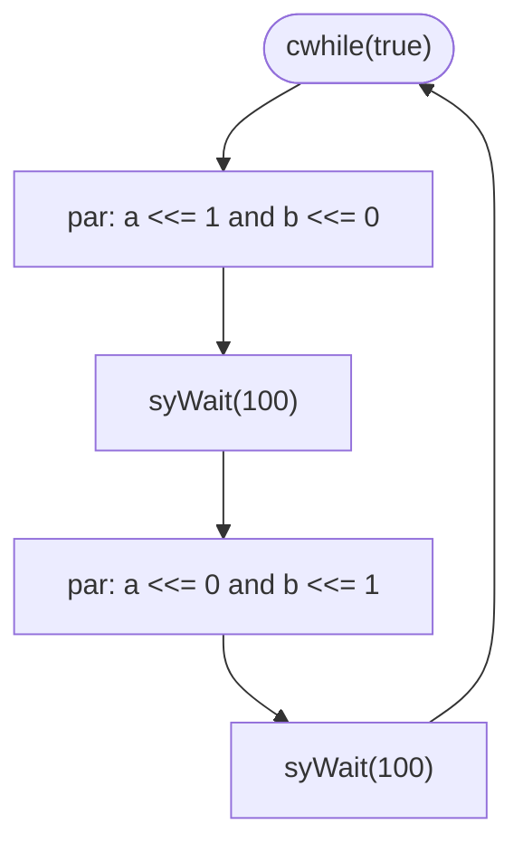

`blinkSample.cpp` in the repository root is the smallest complete Kathryn
program: one module that toggles two one-bit registers back and forth, plus a
minimal simulator to run it. This page walks through every part of that file.

## The module

The design is a `Module` subclass. It declares two one-bit registers with
`mReg`, and describes behavior in an overridden `flow()`:

```cpp
////// MODEL
struct BlinkAB: public Module{
    //////// swap blink A and B
    mReg(a, 1); //// register name a 1 bit
    mReg(b, 1); //// register name b 1 bit

    BlinkAB(int x): Module(){}

    void flow() override{
        cwhile(true){ ///// loop forever
            seq{
                par{a <<= 1; b <<= 0;} ///// a is on <-> b is off
                syWait(100); //// wait 100 cycle
                par{a <<= 0; b <<= 1;}
                syWait(100);
            }
        }
    }
};
```

Each piece maps to a Kathryn abstraction:

- **`mReg(a, 1)` / `mReg(b, 1)`** declare two registers, each 1 bit wide. The
  first macro argument is the register's name, the second is its bit width.
- **`cwhile(true)`** is a Hybrid Design Block (HDB): a loop whose condition is
  re-evaluated in hardware. Here the condition is constant `true`, so the body
  repeats forever.
- **`seq{ ... }`** runs its sub-blocks **sequentially** — one after another in
  cycle order.
- **`par{a <<= 1; b <<= 0;}`** runs its sub-elements **in parallel** in the
  same cycle, so `a` and `b` are updated together.
- **`<<=`** is the **Edge Assignment** — a Cycle-Considered Operation (CCO)
  that takes exactly one clock edge.
- **`syWait(100)`** holds for 100 cycles before the flow advances.

So the behavior is: set `a=1, b=0`, wait 100 cycles, set `a=0, b=1`, wait 100
cycles, and repeat forever.



## The simulator

To simulate the design, `blinkSample.cpp` subclasses `SimInterface`. The
constructor forwards a cycle limit and two output paths taken from the
parameter file:

```cpp
/////// SIMULATOR
struct BlinkAB_sim: public SimInterface{

    explicit BlinkAB_sim(PARAM& params ):
        SimInterface(100, /// limit cycle
                     params["vcdFile"], /// des VCD file
                     params["profFile"]) /// des prof file
                     {}
};
```

`SimInterface`'s constructor takes the limit cycle first, then the VCD file
path and the profiler file path — so this simulator runs for 100 cycles,
writes its waveform to `params["vcdFile"]`, and its ZEP profile to
`params["profFile"]`.

## `main()` — model, then simulate or generate

Unlike the main `Kathryn` executable (which dispatches on
[`testType`](/cppbook/getting-started/build-and-run/)), `blinkSample.cpp`
carries its own `main()` that asks interactively whether to simulate or
generate:

```cpp
int main(int argc, char* argv[]){
    auto params = readParamKathryn(argv[1]);
    int mode;
    std::cout << "simulate press 0 <-> generate press 1" << std::endl;
    std::cin >> mode;
    mMod(ex, BlinkAB, 0); /// build module
    startModelKathryn(); /// start modeling
    if (mode == 1){
        startGenKathryn(params); /// start generate
    }else if (mode == 0){
        BlinkAB_sim simulator(params); /// build simulator
        simulator.simStart();
    }
    resetKathryn();
}
```

Reading top to bottom:

1. `readParamKathryn(argv[1])` loads the parameter file (the same format used
   by the main executable).
2. `mMod(ex, BlinkAB, 0)` instantiates the module named `ex` of type
   `BlinkAB`, passing `0` as the constructor argument (the `int x` the module
   ignores).
3. `startModelKathryn()` elaborates the in-memory model from the declared
   module.
4. Depending on the entered mode, it either runs `startGenKathryn(params)` to
   emit Verilog, or builds `BlinkAB_sim` and calls `simulator.simStart()` to
   simulate.
5. `resetKathryn()` tears the model down at the end.

## Build and run it

`blinkSample.cpp` is **not** part of the default `Kathryn` executable — in
`CMakeLists.txt` it is listed commented-out in `add_executable`. The
repository's `Readme.md` gives the blink recipe:

```bash
# 1. uncomment blinkSample.cpp in add_executable in CMakeLists.txt
# 2. make the build directory
mkdir build && cd build
# 3. build the system
cmake -DBUILD_RIDECORE=OFF ..
make -j
# 4. set vcdFile / profFile paths in params/blinkParams
# 5. run
./kathryn ../params/blinkParams
```

:::note
The `Readme.md` recipe replaces `main.cpp` with `blinkSample.cpp` in the
executable, so the tool built this way runs the blink `main()` above rather
than the `testType` dispatch. Set the two output paths in `params/blinkParams`
(`vcdFile` and `profFile`) before running — both keys are placeholders in the
sample.
:::

The `params/blinkParams` file supplies exactly the two keys the simulator
reads:

```text
vcdFile = <your vcd file path>/
profFile = <your profiler file path>/
```

## Where next

- [Modules and flow](/cppbook/core/modules-and-flow/) — how `Module`,
  `flow()`, and the HDBs (`seq`, `par`, `cwhile`) fit together in depth.
- [HDB overview](/cppbook/flow/hdb-overview/) — the full catalogue of Hybrid
  Design Blocks the blink sample only samples from.
