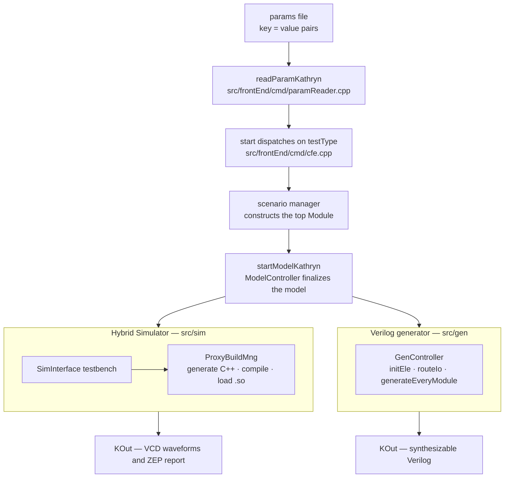
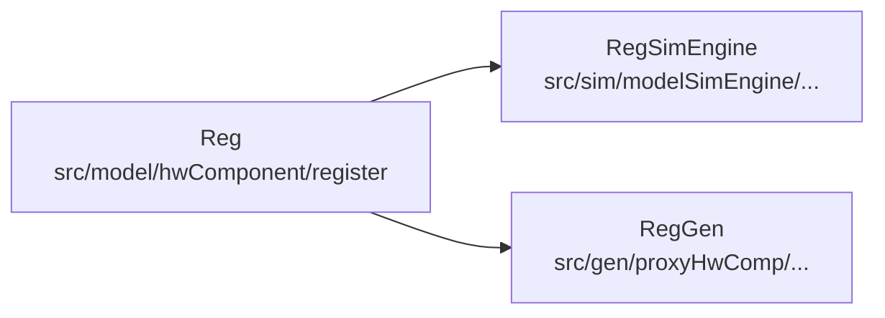

Kathryn's C++ implementation is one executable built from three deliberately
separated layers: the **model** (`src/model/`), which is the embedded language
itself and does nothing but elaborate an in-memory graph of hardware; the
**Hybrid Simulator** (`src/sim/`); and the **Verilog generator** (`src/gen/`).
The two backends consume the same finished model — neither one redesigns it.
This page is the map for the Developer Guide: where each layer lives, how a run
travels through them, and where the artifacts land. It is the C++ sibling of
the Rust devbook's [Architecture Overview](/devbook/architecture/overview/).



## Three layers, one model

1. **The model layer** (`src/model/`) is what the designer's C++ actually
   drives: the component macros (`mReg`, `mWire`, `mMod`, ... in
   `src/model/hwComponent/abstract/makeComponent.h`), the hardware primitives
   under `src/model/hwComponent/`, the Hybrid Design Blocks under
   `src/model/flowBlock/`, and the aggregators under `src/model/hwCollection/`.
   Elaboration is orchestrated by the `ModelController`
   (`src/model/controller/controller.h`): it keeps a module stack, a box stack,
   and per-type flow-block stacks, and every construct reports into it through
   `on_*` callbacks (`on_reg_init`, `on_wire_update`, `on_attach_flowBlock`,
   ...). Building a model is pure elaboration — no simulation, no file output.
2. **The Hybrid Simulator** (`src/sim/`) executes the model cycle-accurately.
   The `SimController` (`src/sim/controller/simController.h`) owns the event
   queue and cycle counter; the user-facing testbench base class is
   `SimInterface` (`src/sim/interface/simInterface.h`), covered in
   [The Hybrid Simulator](/cppbook/backends/simulator/).
3. **The Verilog generator** (`src/gen/`) lowers the same model to
   synthesizable Verilog under the `GenController`
   (`src/gen/controller/genController.h`), covered in
   [Verilog generation](/cppbook/backends/verilog-generation/).

Because both backends read one model, the design you simulate is exactly the
design you generate — the property the Kride verification leans on.

## The mirror rule

The backends never store their state inside model objects' logic: each backend
wraps every hardware primitive in its own **proxy** class. Simulator proxies
live under `src/sim/modelSimEngine/` (deriving from `LogicSimEngine`);
generator proxies live under `src/gen/proxyHwComp/` (deriving from
`LogicGenBase` or `AssignGenBase`). The three trees mirror each other
component-for-component:

| Model primitive | Simulator proxy | Generator proxy |
| --- | --- | --- |
| `Reg` — `src/model/hwComponent/register/register.h` | `RegSimEngine` — `src/sim/modelSimEngine/hwComponent/register/registerSim.h` | `RegGen` — `src/gen/proxyHwComp/register/regGen.h` |
| `Wire` — `src/model/hwComponent/wire/wire.h` | `WireSimEngine` — `.../hwComponent/wire/wireSim.h` | `WireGen` — `.../proxyHwComp/wire/wireGen.h` |
| `expression` — `src/model/hwComponent/expression/expression.h` | `expressionSimEngine` — `.../hwComponent/expression/expressionSim.h` | `ExprGen` — `.../proxyHwComp/expression/exprGen.h` |
| `MemBlock` — `src/model/hwComponent/memBlock/MemBlock.h` | `MemSimEngine` — `.../hwComponent/memBlk/memSim.h` | `MemGen` — `.../proxyHwComp/memBlock/memGen.h` |
| `Module` — `src/model/hwComponent/module/module.h` | `ModuleSimEngine` — `.../hwComponent/module/moduleSim.h` | `ModuleGen` — `.../proxyHwComp/module/moduleGen.h` |



The practical consequence for contributors: **changing a primitive or an HDB
means touching all three trees.** Adding a feature in
`src/model/hwComponent/...` without its `*Sim` and `*Gen` counterparts
silently breaks simulation or generation.

## Program lifecycle

`main.cpp` is tiny: it reads the single command-line argument (a params file
path) with `readParamKathryn(argv[1])` and hands the resulting `PARAM` map (a
`std::map<std::string, std::string>` parsed by
`src/frontEnd/cmd/paramReader.cpp`) to `start()` in
`src/frontEnd/cmd/cfe.cpp`. `start()` dispatches on the `testType` key to a
scenario manager — `testSimple` runs the `src/test/autoSim/` regression suite,
`testO3Sim`/`testKrideSim` run the Kride out-of-order CPU simulations,
`testGenO3` generates its Verilog, `testRiscv`/`testGenRiscv` drive the
in-order RISC-V example, and so on (see
[Building and running](/cppbook/getting-started/build-and-run/) for the full
table).

Every manager then follows the same shape, built from the lifecycle trio
declared in `src/kathryn.h`: `startModelKathryn()`, `startGenKathryn()`, and
`resetKathryn()`. The Kride generation manager
(`src/example/o3/generation/O3_gen.cpp`) is the canonical example:

```cpp
void O3_GEN_MNG::startGen(PARAM& params){

    mMod(o3GenTop, Core, 0);
    startModelKathryn();
    GenController* genCtrl = getGenController();
    assert(genCtrl != nullptr);
    genCtrl->initEnv(params);
    genCtrl->start();
    //genCtrl->startSynthesis();
    resetKathryn();
}
```

- **Build** — `mMod(...)` constructs the top module; its constructor and
  `flow()` elaborate the whole design through the `ModelController`.
- **Finalize** — `startModelKathryn()` (`src/kathryn.cpp`) calls
  `getControllerPtr()->start()`, which closes out the global module's
  component and design-flow phases. The model is now complete and read-only
  as far as the backends are concerned.
- **Consume** — for generation, `GenController::start()` runs
  `initEle()` → `routeIo()` → `generateEveryModule()` (proxy creation,
  hierarchical IO routing, then file emission); `startSynthesis()` can
  optionally hand the result to `synthesisRunner/launchVivado.sh`. For
  simulation, a `SimInterface` subclass calls `simStart()`, and its
  `ProxyBuildMng` (`src/sim/modelSimEngine/base/proxyBuildMng.h`) generates
  one optimized C++ translation unit from the proxies, compiles it via
  `modelCompile/startGen.sh`, and dynamically loads the resulting `.so`.
- **Reset** — `resetKathryn()` clears the global IO pool and resets the
  model, sim, and gen controllers, so the auto-test manager
  (`src/test/autoSim/simMng.cpp`) can run many designs in one process.

## Where artifacts land

- **`KOut/<scenario>/`** — all generated output, one subdirectory per
  scenario, addressed from the params file: simulation runs point `prefix` at
  it (VCD waveforms, ZEP profiler report), generation runs point `genFolder`
  at it (`<topFileName>.v`). Example: `params/o3GenParams` sets
  `genFolder = .../KOut/o3Gen`.
- **`modelCompile/`** — the simulator's scratch build area: generated C++ in
  `modelCompile/generated/`, the compiled shared object in
  `modelCompile/build/`, driven by `modelCompile/startGen.sh`. The
  `buildSimMode` params key (e.g. `gcr`) selects which of the
  **g**enerate / **c**ompile / **r**un steps execute, mapping to the
  `SPB_GEN` / `SPB_COMPILE` / `SPB_RUN` flags in
  `src/sim/modelSimEngine/base/proxyBuildMode.h`.

Both path roots are anchored on the `KATHRYN_PROJECT_DIR` build definition, so
runs work from the `build/` directory. Never hand-edit either tree — they are
regenerated on every run. Params keys are cataloged in
[Parameter files](/cppbook/backends/parameters/).

## Where this guide goes next

- [The model controller](/cppbook/internals/model-controller/) — the
  elaboration stacks and `on_*` callback protocol in detail.
- [The simulator JIT](/cppbook/internals/sim-jit/) — how `ProxyBuildMng`
  turns proxies into a compiled `.so`.
- [Generator passes](/cppbook/internals/gen-passes/) — `initEle`, IO routing,
  and module writing inside `src/gen/`.
