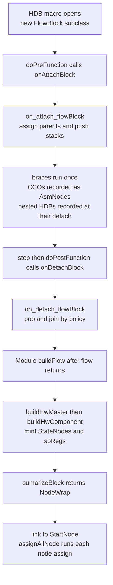

Every [Hybrid Design Block](/cppbook/flow/hdb-overview/) a designer writes is,
under the hood, one subclass of `FlowBlockBase` living in
`src/model/flowBlock/`. The user-level semantics of the resulting nodes are the
[node reference's](/cppbook/reference/nodes/) story; this page covers the
**construction machinery**: how a macro turns a pair of braces into a recorded
block, what the block remembers, and how the model lowers it into nodes and
special control registers.

## The `LoopStMacro` for-loop trick

Every HDB macro expands to a C++ `for` statement over a freshly allocated
block. The trick that brackets your braces with framework code is
`LoopStMacro` (`src/model/flowBlock/abstract/loopStMacro.h`): the loop's
condition is `doPrePostFunction()`, which on the first evaluation calls
`doPreFunction()` and returns `true`, and on the second calls
`doPostFunction()` and returns `false`. The increment expression `step()`
flips the stage bit in between. So the macro's condition runs **twice**, your
braces run **exactly once** — after the pre-hook and before the post-hook.

In every concrete block, `doPreFunction()` calls `onAttachBlock()` →
`ctrl->on_attach_flowBlock(this)` and `doPostFunction()` calls
`onDetachBlock()` → `ctrl->on_detach_flowBlock(this)`. What attach and detach
do on the controller side — parent assignment, the four flow stacks, join
policies, lazy delete — is covered in
[ModelController and Elaboration](/cppbook/internals/model-controller/).

This mechanism is also *why* native `return`, `break`, or `continue` inside an
HDB body is forbidden: leaving the braces early skips `step()` and the second
condition evaluation, so `doPostFunction()` never runs and the block is never
detached — the flow stacks are left corrupted.

The most elaborate expansion is `cloop` (`src/model/flowBlock/loop/loop.h`),
which nests a second `for` purely to bind the loop variable:

```cpp
#define cloop(kathrynLoopName, loopNumber) \
    for(auto kathrynBlock = new FlowBlockLoop(loopNumber); kathrynBlock->doPrePostFunction(); kathrynBlock->step()) \
        for (Operable& kathrynLoopName = kathrynBlock->getLoopId(); !kathrynBlock->isGottenLoopVar(); kathrynBlock->setGetLoopVar())
```

Because every expansion names its block `kathrynBlock`, the small macros at the
top of `flowBlock_Base.h` — `intrReset`, `intrStart`, `holdBlk`, `exposeBlk`,
`track`, `markJoinMaster` — resolve against the innermost enclosing HDB, which
is why they are only legal inside a block body.

## What `FlowBlockBase` owns

`FlowBlockBase` (`src/model/flowBlock/abstract/flowBlock_Base.h`) inherits
`NodeExtractable`, `FlowIdentifiable` (parent module / parent block tracking,
`flowIdentifiable.h`), `ModelDebuggable`, and `FlowSimEngineInterface`. Its
constructor takes a `FLOW_BLOCK_TYPE` — the enum of all 26 block type ids in
`abstract/flowBlockRegister.h` (a registry header, not a class) — and a
`FB_CTRL_COM_META`, the block's contract with the controller: which flow
stacks it pushes onto (`_selFlowStack`), its `FLOW_BLOCK_JOIN_POLICY`
(`_joinPolicy`), and whether attaching it should first purify a lazy-deleted
predecessor (`reqPurify`).

During the body's single execution the block records, each with an input-order
index so ordering survives lowering: `_basicNodes` (the `AsmNode`s the
controller routes in via `addElementInFlowBlock`), `_subBlocks` and
`_conBlocks` (nested and consecutive blocks joined at detach), plus interrupt
and hold signals (`intSignals`, `holdSignals`) collected by the `intr*` /
`holdBlk` macros. `NodeExtractable::extract()` — the escape hatch behind the
`FLOW_JO_EXT_FLOW` join policy — asserts by default and is overridden only by
`FlowBlockPseudo`, `FlowBlockZIF`, and `FlowBlockZtate`, the blocks whose
contents dissolve into plain `AsmNode`s.

Three pure-virtual hooks define a block's life: `onAttachBlock()` /
`onDetachBlock()` at elaboration, `buildHwComponent()` at build, and
`sumarizeBlock()`, which returns the block's `NodeWrap` to whoever composes it.

## Build: from recorded blocks to a linked graph

Nothing is lowered while the macros run. After `flow()` finishes,
`Module::buildFlow()` (`src/model/hwComponent/module/module.cpp`) walks the
module's recorded top-level blocks: `FLOW_JO_EXT_FLOW` blocks have their
extracted `AsmNode`s `dryAssign()`ed directly, and every `FLOW_JO_SUB_FLOW`
block gets `buildHwMaster()` (`abstract/flowBlock_Base.cpp`), which pushes
interrupt-reset and hold signals down to children (`fillIntRstSignalToChild`,
`fillHoldSignalToChild`), recursively builds sub- and consecutive blocks
(`buildSubHwComponent`), generates the summed interrupt/hold `OprNode`s
(`genIntNode`, `genHoldNode`), and finally runs the block's own
`buildHwComponent()`.

`buildHwComponent()` is where nodes are minted. `FlowBlockSeq`
(`seq/seq.cpp`) is the model case: each recorded element was wrapped at
elaboration in a `SequenceEle` (`seq/seqEle.h` — `SequenceEleBasic` for a bare
`AsmNode`, `SequenceEleFlowBlock` for a nested block's `NodeWrap`); build
generates a `StateNode` per basic element, chains neighbours with
`assignDependDent`, and packs the first elements' entrance nodes and the last
element's finish node into a fresh `NodeWrap`.

The `NodeWrap` (`abstract/nodeWrap.h`) is the universal composition currency:
`entranceNodes`, one `exitNode`, an optional `forceExitNode` (how `sbreak`
propagates), and `cycleUsed` — `-1` (`IN_CONSIST_CYCLE_USED`) when the count is
not statically consistent, as decided by the `NodeWrapCycleDet` helper in the
same header. Back in `buildFlow()`, each top-level wrap is tied to the global
`StartNode` (the `startNode` singleton in
`src/model/hwComponent/globalComponent/globalComponent.cpp`) via
`addDependNodeToAllNode`, and `assignAllNode()` finally calls each node's
`assign()` — per the protocol documented in `node.h`, dependencies and
conditions may be added in any order, but `assign()` must come last.



## Nodes and their special control registers

The node classes live under `abstract/nodes/`: `Node` itself plus the
`NodeSrcEdge` dependency struct in `node.h`; `StartNode` (`startNode.h`);
`StateNode` and `SynNode` (`stateNode.h`); `PseudoNode`, `DummyNode`, and
`OprNode` (`logicNode.h`); `AsmNode` (`asmNode.h`); `CounterNode`
(`cntNode.h`); `WaitCondNode` and `WaitCycleNode` (`waitNode.h`). Each edge is
a `(dependNode, condition)` pair, and each node carries optional
interrupt-reset and hold pointers that `getExitOpr()` folds into its exit
expression.

Every stateful node owns a special register from `abstract/spReg/`:
`CtrlFlowRegBase` (`ctrlFlowRegBase.h`) extends `Reg` with the four operations
node lowering needs — `addDependState`, `makeUnSetStateEvent`,
`makeUserRstEvent`, and `generateEndExpr`. Its concrete children are
`StateReg` (`stateReg.h`), `SyncReg` (`syncReg.h`), `CondWaitStateReg` and
`CycleWaitStateReg` (`waitReg.h`), and `CounterReg` (`cntReg.h`). When a node's
`assign()` runs, it translates its edges into update events on its register —
entering the [Decentralized Update](/cppbook/internals/update-events/)
machinery like any user CCO.

## Directory tour: the ten HDB families

- **`cond/`** — `FlowBlockIf` (`if.h`) implements `cif`/`sif` and sits on the
  head-cond stack; `FlowBlockElif` (`elif.h`) implements
  `celif`/`selif`/`celse`/`selse` with `FLOW_JO_CON_FLOW` so detach chains it
  onto the preceding `if`. `FlowBlockZIF` (`zif.h`) implements `zif` with
  `FLOW_JO_EXT_FLOW`, rewriting assignment conditions through `ZifClassAsm`
  (`zifClassAsm.h`); `FlowBlockZELIF` (`zelif.h`) chains `zelif`/`zelse`.
- **`loop/`** — `FlowBlockWhile` (`whileBase.h`) implements `cwhile`/`swhile`;
  `FlowBlockDowhile` (`doWhileBase.h`) implements `cdowhile`; `FlowBlockLoop`
  (`loop.h`) implements `cloop` with a `CounterNode`; `FlowBlockSCBreak`
  (`cbreak.h`) implements `sbreak` by publishing a force-exit node (a
  conditional `sbreakCon` exists only as commented-out legacy).
- **`par/`** — `FlowBlockPar` (`par.h`) with two concrete policies:
  `FlowBlockParAuto` (`par`) builds a `SynNode` to join branches, while
  `FlowBlockParNoSync` (`parMan`) deliberately builds none.
- **`pick/`** — `FlowBlockPick` (`pick.h`) implements `pick`; `pickDef` is not
  a block at all but a statement macro flagging auto-exit on the enclosing
  `kathrynBlock`. The `pif` condition arm is `FlowBlockPickCond`, implemented
  in `pickIf.cpp` — the file name says "pickIf" but the user macro is `pif`.
- **`pipeline/`** — `FlowBlockPipeBase` (`pipe.h`) implements `pip(zyncMeta)`,
  and `FlowBlockZyncBase` (`zync.h`) implements `zync`/`zyncc`; both also push
  the dedicated pipeline stack. `SyncMeta` (`syncMeta.h`, made by `mZync`)
  carries the master/slave ready, finish, and kill/hold wires the two sides
  handshake through.
- **`pipeStream/`** — `FlowBlockPipeStream` (`pipeStream.h`) implements
  `pipStream`, wrapping each stage in a `StreamEle` (`streamEle.h`) that adds
  per-stage wait/accept/ready nodes around a reused `SequenceEle`.
- **`pseudo/`** — `FlowBlockPseudo` (`pseudo.h`) is the invisible member: the
  controller wraps a bare CCO written outside any block in one, and its
  `FLOW_JO_EXT_FLOW` policy hands the `AsmNode` back out at detach.
- **`seq/`** — `FlowBlockSeq` (`seq.h`), the sequential backbone described
  above; also on the pattern stack, like `par`.
- **`state/`** — `FlowBlockZtate` (`ztate.h`) implements `ztate` with
  `FLOW_JO_EXT_FLOW`; `FlowBlockZCase` (`zcase.h`) implements
  `zcase`/`zcasedef`, contributing `ClassAssignMeta`s that the enclosing
  `ztate` merges via `ZStateClassAsm` (`ztateClassAsm.h`).
- **`time/`** — `FlowBlockCondWait` and `FlowBlockCycleWait` (`wait.h`)
  implement `scWait` and `syWait`, each owning the matching wait node.

## Where next

- [ModelController and Elaboration](/cppbook/internals/model-controller/) —
  the stacks and join policies attach/detach talk to.
- [Nodes and the State Node model](/cppbook/reference/nodes/) — what the
  constructed graph *means*, cycle by cycle.
- [Decentralized Update internals](/cppbook/internals/update-events/) — where
  the spRegs' update events go after `assign()`.
