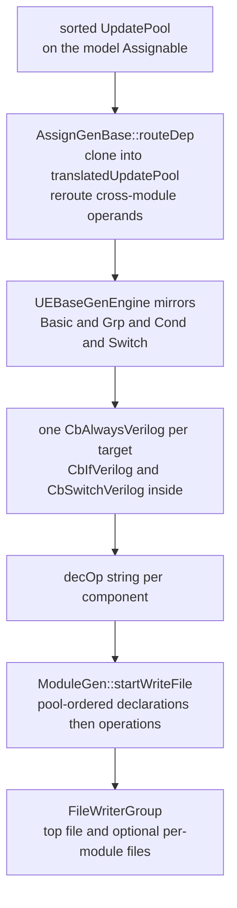

[UpdateEvents and the UpdatePool](/cppbook/internals/update-events/) ended at
the hand-off: the gen engine clones the pool, reroutes, and emits. This page
follows that clone into the `.v` file. The user-level picture — the three
`GenController` passes, routing wires, prefix cheat-sheet — is
[The Verilog generator](/cppbook/backends/verilog-generation/); here we read
the code that prints it.

## Clone and reroute

Every value-carrying gen proxy derives from `AssignGenBase`
(`src/gen/proxyHwComp/abstract/AssignGen.h`), which owns a private
`UpdatePool translatedUpdatePool`. `routeDep()` fills it (`AssignGen.cpp`):

```cpp
_asb->sortUpEventByPriority();
/** copy the translatedUpdatePool*/
translatedUpdatePool = _asb->getUpdateMeta().clone();
/** try to reroute the update Event*/
for(UpdateEventBase* ueb: translatedUpdatePool.events){
    UEBaseGenEngine* genEngine = ueb->createGenEngine();
    genEngine->reroute(_mdGenMaster);
    delete genEngine;
}
```

The sort happens on the *model* pool, so the clone is already in ascending
`(priority, subPriority)` order — emission just walks it, and the
highest-priority event prints last, winning under the `always` block's
last-write-wins semantics. `reroute` rewrites every operand living in another
module: `UEBaseGenEngine::rerouteBase` hands each source `Operable*` to
`ModuleGen::routeSrcOprToThisModule`, the machinery that mints the
`AIP_`/`AOP_`/`ABD_` wires ([Gen passes and I/O routing](/cppbook/internals/gen-passes/)).
The model pool is never touched. One event class skips the clone:
`WireAuto::connectTo(opr, true)` (`src/model/hwComponent/wire/wireAuto.h`)
pushes a fresh clock-free connection event straight into
`translatedUpdatePool` via `addDirectUpdateEvent` — routing wires are born
during generation, so there is no model pool to copy from.

Emission starts at `assignOpBase()` → `assignOpWithSoleCondition()`. An empty
pool returns an empty string (the module writer's `writeGenVec` drops
empties); otherwise `getClockSenInfo()` maps the pool's consistent clock mode
to `(VLST_POSEDGE, "clk")`, `(VLST_NEGEDGE, "clk")`, or `(VLST_ALWAYS, "*")`,
one `CbAlwaysVerilog` is built with it, and every event prints into that
single block. **One target, one pool, one `always` block** is the whole
layout rule. Registers take the ambient clock mode
(`Reg::getCurAssignClkMode` returns `GET_CLOCK_MODE()`) while `Wire` and
`expression` hard-wire `CM_CLK_FREE` — which is why registers land in
`always @(posedge clk)` and wires in `always @(*)`.

## Lowering the four event shapes

Each model event's `createGenEngine()` factory mints a mirror from
`src/gen/proxyHwComp/abstract/updateEvent.h` — a `master` back-pointer plus
the virtuals `reroute(ModuleGen*)` and
`genAss(CbBaseVerilog&, AssignGenBase*)` (field-by-field event reference:
[Driven Logic Structure](/cppbook/reference/driven-logic-structure/)):

- **`UEBasicGenEngine`** — the leaf. `genAss` asserts
  `validateAssignSensivity()` (only `CM_POSEDGE`, `CM_NEGEDGE`, `CM_CLK_FREE`
  survive) and emits one `assignmentLine`: destination `getOpr(desSlice)`,
  `<=` when clock-sensitive and `=` when clock-free, and a right-hand side
  through `getOprStrFromOprAndShinkMsb`, which appends `[N-1: 0]` when the
  source is wider than the destination slice — the model's "shrink the MSB"
  policy replayed in text.
- **`UECondGenEngine`** — walks the parallel `conditions`/`subStmts` arrays;
  the first pair becomes `cbVer.addIf(condStr)`, later pairs chain with
  `addElif`, and a `nullptr` condition prints as `1'b1`. A whole
  `zif`/`zelif`/`zelse` chain — one cond event per pool — collapses to one
  `if`/`else if` ladder.
- **`UEGrpGenEngine`** — no syntax of its own: it flattens, calling `genAss`
  on each grouped sub-event into the same enclosing block, in order.
- **`UESwitchGenEngine`** — `addSwitch` on the rerouted state identifier,
  one `addCase(matchIdx)` per branch; match index `-1` prints as `default`
  (and `CbSwitchVerilog` asserts there is only one).

The odd man out is `genBasicConnect`, which prints a continuous
`assign lhs = rhs;` outside any `always`. `WireGen::decOp` uses it for
module-port wires (`WMT_INPUT_MD`/`WMT_OUTPUT_MD`), whose pool holds exactly
one unconditional event — `UECondGenEngine::genBasicConnect` asserts as much
before delegating to the leaf.



## The combinator layer

The builders live in `src/util/fileWriter/codeWriter/verilogWriter.h` — the
Verilog sibling of the `CbBaseCxx` family the
[simulator JIT](/cppbook/internals/sim-jit/) prints with. The shared base
`CbBase` (`codeBaseWriter.h`) records statements (`addSt` appends the `;`)
and nested sub-blocks under one running order counter, and `toString` replays
them interleaved — emitted order is exactly call order. `CbBaseVerilog` adds
the factories `addIf`, `addAlways`, `addSwitch`, and `addSubBlock`, each
nesting level indenting by `Verilog_IDENT = 4`. `CbAlwaysVerilog` wraps its
children in `always @(posedge clk)`, `negedge`, or `@(*)`; `CbIfVerilog`
prints the `if` and renders `addElif` chains as `else if(cond)` — or bare
`else` when the condition string is empty; `CbSwitchVerilog` prints
`case`/`endcase`, and statements can only enter it through `addCase`, because
it overrides the other factories with `assert(false)`. Impossible nestings
are ruled out the same way — `CbIfVerilog::addAlways` asserts, so an `always`
can never appear inside an `if`.

## Systematic names

The names the writers print are decided at *model* construction, not during
generation. The `Identifiable` constructor
(`src/model/hwComponent/abstract/identifiable.h`) stamps
`_globalName = GLOBAL_PREFIX[type] + std::to_string(_globalId)` from the
process-wide id counter, and appends `_SYS` to the variable name of every
component the user did not name. `LogicGenBase::getOpr()`
(`src/gen/proxyHwComp/abstract/logicGenBase.cpp`) joins the two halves —
`REG10` + `_a` = `REG10_a` — and `getOpr(Slice)` adds `[msb: lsb]` for
partial-slice writes (`SR_ST49_parSynNode_15[0: 0]` in `tutorial.v`). The
full `GLOBAL_PREFIX` table, indexed by `HW_COMPONENT_TYPE`:

| Prefix | Component |
| ------ | --------- |
| `REG` / `CNT_REG` | register / counter register |
| `SR_ST` | flow-block state register |
| `SR_CDWT` / `SR_CYWT` | condition-wait / cycle-wait state register |
| `WIRE` | wire |
| `EXPR` / `NEST` | expression / nest |
| `MODULE` | module |
| `VAL` / `PMVAL` | constant value / parameter value |
| `MEM_BLOCK` / `MEM_BLOCK_INDEXER` | memory block / memory port |
| `BOX` / `ITF` | box / interface |

## The pool-ordered module file

`GenController::generateEveryModule` opens the top writer —
`_writerGroup.createNewFile(topFileName + ".v")`, rooted at `genFolder` via
`FileWriterGroup::setPrefixFolder` — and calls
`ModuleGen::startWriteFileMaster`
(`src/gen/proxyHwComp/module/moduleWrite.cpp`), which writes this module and
recurses over `_subModulePool`; in multi-file mode each non-top module gets
its own `getOpr() + ".v"` from the group, otherwise everything appends to the
one top file. All output funnels through `FileWriterBase::addData` into a
256 MB buffer (`FILE_WRITE_BUF_SIZE = 1 << 28`) flushed at the end.

:::caution
Multi-file mode is currently unreachable through its documented key:
`GenController::initEnv` (`src/gen/controller/genController.cpp`) sets
`_extractMulFile = (param[_desVerilogTopModNameParamPrefix] == "true")` — it
tests the **`topModName`** parameter, and the declared `extractMulFile` key
is never read. In practice you always get one pool-ordered top file.
:::

`startWriteFile` itself is a fixed script: the `module` header (`getIoDec()`
lists user-marked inputs, user-marked outputs, then the auto-ports, with
`input wire clk` appended last), every declaration pool under its banner
comment — `////regDecVar`, `////wireDecVar`, `////_exprPool`, `////_nestPool`,
`////_valPool`, the two memory pools, sub-module inputs and outputs,
`////bridgeVec` — then the operation pools in the mirrored order from
`///regOp` down to `///bridgeVecOp`, and finally the sub-module
instantiations from `getSubModuleDec` (module type and instance name are both
the sub-module's `getOpr()`, plus a `#( ... )` list when `_pmValPool` is
non-empty). Output order is pool order, never source order. Two visible
consequences: `///_valPoolOp` is always empty, because `ValueGen` folds the
constant into its declaration (`wire [31: 0]VAL20_optUserAutoVal_SYS = 1;`)
and returns `""` from `decOp`; and a non-port Kathryn wire is declared as a
Verilog `reg`, because `WireGen::decVariable` must make it drivable from an
`@(*)` block.

From the emitted `KOut/genExample/tutorial.v` (module `top`), one clocked and
one clock-free target back to back — one `always` per pool, one guarded
branch per event, the higher-priority reset event printed last so it wins:

```verilog
///regOp
always @(posedge clk) begin
     if ( SR_ST4_startNode) begin
         SR_ST4_startNode <= VAL6_stateRegDownFull_SYS;
     end
     if ( WIRE1_rstWire_SYS) begin
         SR_ST4_startNode <= VAL5_stateRegUpFull_SYS;
     end
end

///_wirePoolOp
always @(*) begin
     if (  1 ) begin
         WIRE1_rstWire_SYS <= rst;
     end
end
```

:::note
`tutorial.v` was emitted in mid-2024, before the writer layer was
restructured into the `CbBaseVerilog` combinators and `UEBaseGenEngine`
mirrors described above (late 2025). The skeleton — banner comments, pool
order, one guarded `always` per target — matches today's `moduleWrite.cpp`
verbatim, but micro-formatting differs: the current combinators print
`if(cond)begin`, spell an absent guard as `1'b1` rather than `1`, and emit a
blocking `=` for clock-free events where this file shows `<=`.
:::

## Where next

- [The Verilog generator](/cppbook/backends/verilog-generation/) — the user
  view: three passes, prefix cheat-sheet, routing-wire naming.
- [Gen passes and I/O routing](/cppbook/internals/gen-passes/) — how
  `routeSrcOprToThisModule` builds the `AIP_`/`AOP_`/`ABD_` chains this page
  takes as given.
- [UpdateEvents and the UpdatePool](/cppbook/internals/update-events/) — how
  the pools emitted here were built and sorted.
- [Driven Logic Structure](/cppbook/reference/driven-logic-structure/) — the
  field-by-field reference for the four event shapes.
