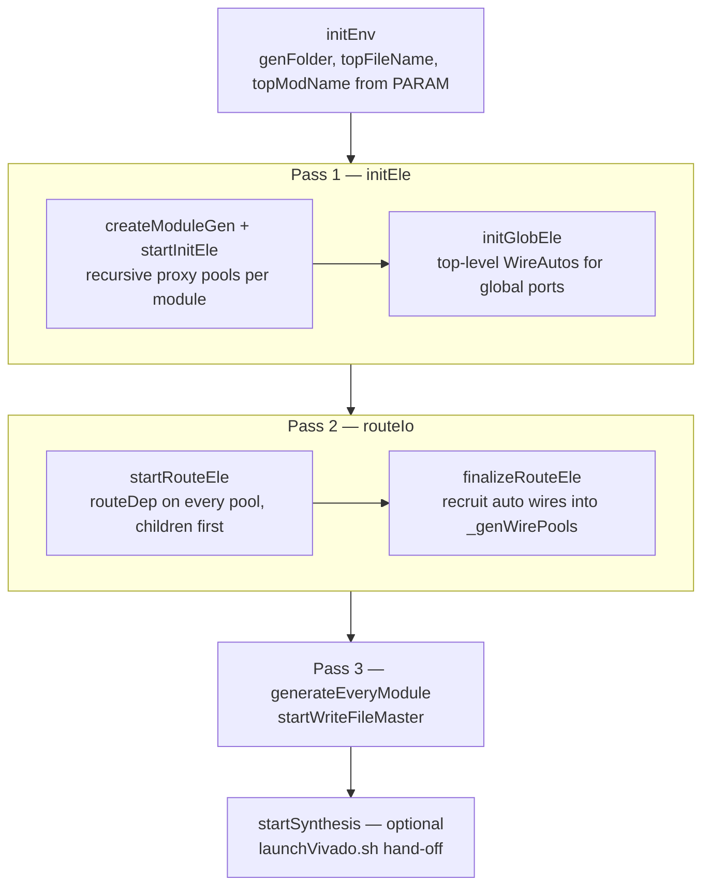
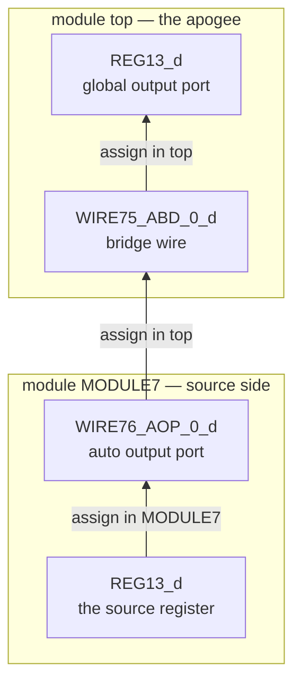

[Verilog generation](/cppbook/backends/verilog-generation/) gives the user view
of `src/gen/`: three passes, the `AIP_`/`AOP_`/`ABD_` prefixes, and the
pool-ordered output. This page is the internals view — which classes each pass
touches and how a signal that crosses N module boundaries acquires its chain of
auto-generated wires. The [Architecture Overview](/cppbook/internals/architecture/)
already placed `GenController` in the program lifecycle and the `*Gen` proxies
in the mirror rule; here we follow both into the passes.

## The controller

`GenController` (`src/gen/controller/genController.h`) is a `MainControlable`
singleton reached through `getGenController()`, which lazily allocates it. A
manager first calls `initEnv(PARAM&)` — it reads `genFolder`, `topFileName`,
`topModName`, and `synName` from the params map, points the `FileWriterGroup`
at the destination folder, and caches the global module via
`getGlobalModulePtr()`. `start()` then runs `initEle()` → `routeIo()` →
`generateEveryModule()` — the three-line body quoted on the user page.

The doc comment above `start()` still lists *five* major steps: the missing
two — `genCefAll()` and `recruitModToGenSystem()`, a module-compare system
meant to deduplicate identical sub-modules — are marked abandoned, and
`genStructure.h` (`src/gen/controller/`) survives only as a commented-out
`ModuleChecker`/`GenStructure` sketch, so every module instance is emitted as
its own `module` definition.



## Pass 1 — initEle: build the proxy mirror

`initEle()` calls `createModuleGen()` and `setTopModule()` on the master
module, then `ModuleGen::startInitEle()` (`src/gen/proxyHwComp/module/moduleGen.cpp`)
recurses: each module records `depthFromGlobalModule` (parent depth + 1, 0 at
the top), descends into `getUserSubModules()` first, then fills its typed
pools through `createAndRecruitLogicGenBase` — calling every component's
`createLogicGen()` and collecting the resulting proxy. The pools are
`_regPool` (the special flow-block registers for each `SP_REG_TYPE` first,
then user registers), `_exprPool`, `_nestPool`, `_valPool`, `_pmValPool`,
`_memBlockPool`, and `_memBlockElePool` (one entry per `MemBlock` agent).
Wires are split three ways by marker: `WMT_INPUT_MD` and `WMT_OUTPUT_MD`
module-port wires go to `_wirePoolWithInputMarker` /
`_wirePoolWithOutputMarker`, everything else to `_wirePool`.

The proxies themselves come in two tiers under
`src/gen/proxyHwComp/abstract/`. `LogicGenBase` (`logicGenBase.h`) holds the
`ModuleGen*` master plus the model's `Assignable`/`Identifiable` faces and
declares the `routeDep()` / `decIo()` / `decVariable()` / `decOp()` virtuals.
`AssignGenBase` (`AssignGen.h`) extends it with a `translatedUpdatePool` — the
generator-side copy of the component's update events — for everything that is
*written to*: `RegGen`, `WireGen`, `WireAutoGen`, and `MemEleholderGen`.
Read-only proxies derive from `LogicGenBase` directly: `ExprGen`, `NestGen`,
`ValueGen`, `ParamValGen`, and `MemGen`.

`initEle()` ends with `initGlobEle(true)` / `initGlobEle(false)`
(`genController.cpp`): every `WireMarker` in the global pool (`getGlobPool`,
`src/model/hwComponent/abstract/globPool.h`) becomes a `WireAuto` built by the
`makeOprIoWire` macro (`makeComponent.h`), parented onto the top module with
`buildHierarchy`, typed `WIRE_AUTO_GEN_GLOB_INPUT` or
`WIRE_AUTO_GEN_GLOB_OUTPUT` (`wireSubType.h`), and stored in the top
`ModuleGen::_genWires`. For an **input**, a
`CM_CLK_FREE` `UpdateEventBasic` is pushed onto the *marked signal's* model
update pool, so the port drives the signal; for an **output**, the port
instead calls `connectTo(originOpr, false)` — `false` meaning the connection
goes into the model-side pool and still needs routing, since the origin may
sit modules deep. These become the `rst` / `WIRE8_i` / `REG13_d` ports of
`tutorial.v`'s `top`.

## Pass 2 — routeIo: reroute every operand

`routeIo()` is `startRouteEle()` then `finalizeRouteEle()`
(`src/gen/proxyHwComp/module/moduleRouting.cpp`). `startRouteEle` first routes
the global-port wires at the top module, then recurses into `_subModulePool`
*before* routing its own pools, and finally calls `routeDepAll()` on every
pool. What `routeDep()` does depends on the tier:

- `ValueGen`, `ParamValGen`, and `MemGen` override it as empty — constants and
  memory declarations reference nothing.
- `ExprGen` routes its two operands through
  `routeSrcOprToThisModule` into `_routedOprA` / `_routedOprB`.
- `AssignGenBase::routeDep` sorts the model's update events by priority,
  **clones** the whole `UpdatePool` into `translatedUpdatePool`, and reroutes
  each cloned event through its `UEBaseGenEngine`
  (`src/gen/proxyHwComp/abstract/updateEvent.cpp`): the basic engine reroutes
  its value operand, the conditional engine also reroutes every condition, the
  switch engine its state identifier, and the compound engines recurse. The
  clone is what keeps the mirror rule honest — the model's own events are
  never rewritten.
- `WireGen` special-cases module-port wires (input/output marker): they assert
  exactly one update event and clone it verbatim; normal wires fall through to
  `AssignGenBase`.

Routing *creates* wires in modules all over the tree, so recruitment is
deferred: only after the whole tree has routed does `finalizeRouteEle` sweep
it again and mirror each module's accumulated `_genWires[type]` (model
`WireAuto*`) into `_genWirePools[type]` (proxy `LogicGenBase*`), ready for
emission.

## Inside routeSrcOprToThisModule

`ModuleGen::routeSrcOprToThisModule(Operable*)` is where the chains come from.
Two fast paths return the operand untouched: the source already lives in this
module, or it is a `WMT_OUTPUT_MD` user wire of a *direct* child (the port
already exists). Otherwise the destination and source `ModuleGen`s climb
toward each other by comparing `getDept()` — the deeper side pushes itself
onto `useInputAsModuleGen` / `useOutputAsModuleGen` and steps to its parent —
until both reach the common ancestor, which the code names the **apogee**.
Then `genAutoWireBase` builds the chain:

- one `ABD_` bridge wire at the apogee,
- one `AIP_` wire per module descending the destination side,
- one `AOP_` wire per module ascending the source side,

finally connecting bridge to the source-side chain. Each segment is created
with `connectTo(..., true)` — `directAdded = true` drops the connection
straight into the proxy's `translatedUpdatePool` via `addDirectUpdateEvent`,
because its operand is already module-correct and must not be routed again.
Every module memoizes its segments in `_genWireMaps[type]`, keyed by the exact
source `Operable`, so a second consumer of the same signal reuses the existing
chain instead of growing a parallel one. The generated name is
`prefix + index + "_" + source identifier` — read `WIRE77_ABD_1_rstWire_SYS`
as the second (`_1`) bridge of its module, sourced from `rstWire_SYS`. If the
requested operand was a *slice* of
the source, the whole signal travels and the slice is re-applied to the
arriving `AIP_` wire at the destination.



The user page shows a global *input* descending; here is the reverse
direction in the emitted `KOut/genExample/tutorial.v` — `REG13_d` traveling up
out of `MODULE7` to the top-level output port created by `initGlobEle`:

```verilog
// module MODULE7 — the source side
output wire[31: 0] WIRE76_AOP_0_d,
// ...
assign WIRE76_AOP_0_d = REG13_d;

// module top — bridge at the apogee, then the global port
wire  [31: 0] WIRE75_ABD_0_d;
// ...
assign WIRE75_ABD_0_d = WIRE76_AOP_0_d;
assign REG13_d = WIRE75_ABD_0_d;
```

Note the split responsibility, spelled out in a comment table in
`moduleWrite.cpp`: an `AIP_`/`AOP_` wire is a **port** in its own module's
header but is *declared and assigned in the parent*, while a bridge is
declared and assigned in the module it lives in.

## Pass 3 hand-off, and the Vivado escape

`generateEveryModule()` opens `<topFileName>.v` in the writer group and calls
`startWriteFileMaster(_extractMulFile, ...)` on the top `ModuleGen`: the top
module writes into the master file under the explicit `topModName`, and each
sub-module recurses — opening its own `.v` file only when the multi-file flag
is set. Everything from there (pool order, the `Cb*Verilog` writer
combinators, `genAss`) is the subject of
[Emitting Verilog](/cppbook/internals/gen-emission/); how the update-event
records being rerouted here were built in the first place is
[UpdateEvents and the UpdatePool](/cppbook/internals/update-events/).

`startSynthesis()` is the optional fourth step (commented out in the Kride
manager `O3_gen.cpp`): it asserts `synName` is set, flushes all writers,
asserts the multi-file flag, and `system()`-calls
`synthesisRunner/launchVivado.sh <synName> <genFolder>/<topFileName>`. The
script `sed`-substitutes `PROJECT_NAME` and `VERILOG_PATH` into a copy of
`tclBase.tcl` under `generatedTcl/`, sources the Vivado 2024.1
`settings64.sh`, and runs `vivado -mode batch` on it.

:::caution
Two verified quirks in `genController.cpp`. `initEnv` parses `_extractMulFile`
from the **`topModName`** key (`param[_desVerilogTopModNameParamPrefix] ==
"true"`) — the declared `extractMulFile` params key is never read, so
multi-file emission only switches on if `topModName` is literally `true`. And
since `startSynthesis()` asserts that same flag, the Vivado hand-off is
unreachable under a normal top-module name.
:::

## Where next

- [Verilog generation](/cppbook/backends/verilog-generation/) — the user view:
  prefixes, pool order, and a full routing excerpt.
- [Emitting Verilog](/cppbook/internals/gen-emission/) — pass 3 in depth:
  `startWriteFile`, `getIoDec`, and the Verilog writer combinators.
- [UpdateEvents and the UpdatePool](/cppbook/internals/update-events/) — the
  event records that `routeDep` clones and `genAss` prints.
