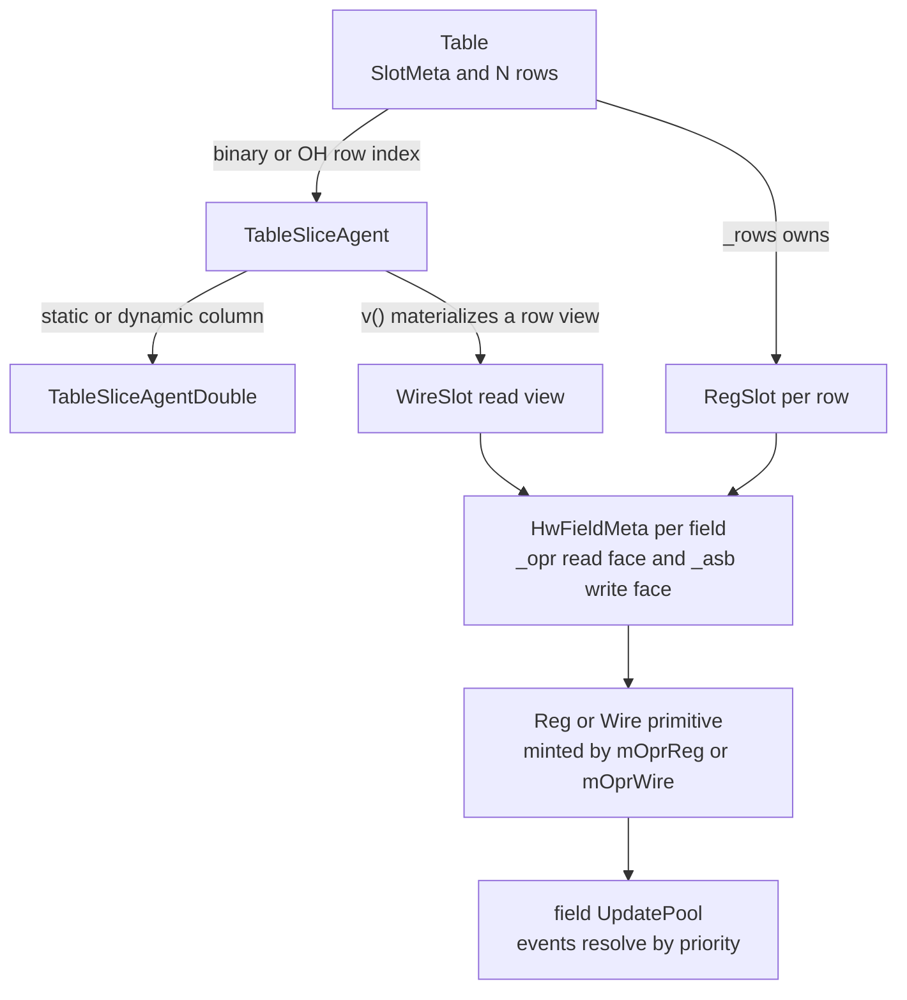

The [Slot](/cppbook/aggregators/slots/) and [Table](/cppbook/aggregators/tables/)
pages show what the **Hardware Aggregator** does; this page shows how it is
put together, under `src/model/hwCollection/dataStructure/`. None of it
introduces new primitive hardware: an aggregator is *composition* — plain
`Reg` and `Wire` [components](/cppbook/internals/hw-components/) plus update
events, arranged by metadata.

## Layout description vs instantiated hardware

The split runs through `src/model/hwCollection/dataStructure/slot/`:

- **`FieldMeta`** (`slotMeta.h`) is one field's description: `_name` and
  `_size`, nothing else.
- **`SlotMeta`** is a `std::vector<FieldMeta>` with the layout algebra the user
  pages describe (`operator+`, `operator-`, `addField`, index/name/range
  slicing) and `matchByName`, which computes the matched source/destination
  index pairs that best-effort slot copy runs on. It holds **no hardware**.
- **`Slot`** (`slot.h`) is the base class that pairs a `SlotMeta _meta` with a
  `std::vector<HwFieldMeta> _hwFieldMetas`. `HwFieldMeta` is the instantiated
  side of one field — the read face and the write face of whatever component
  backs it:

```cpp
struct HwFieldMeta{
    Operable* _opr   = nullptr;
    Assignable* _asb = nullptr;
};
```

`Slot` itself is backing-agnostic: its `genAssignMeta*` / `genGrpAsmNode`
helpers build `AssignMeta`s and `AsmNode`s purely against those two faces, and
the virtual `doGlobAsm` overloads are what subclasses override to decide where
a finished `AsmNode` goes.

## RegSlot and WireSlot: minting the primitives

`RegSlot::initHwStructure` (`regSlot.cpp`) creates one `Reg` per field with the
`mOprReg` maker — the runtime-named sibling of `mReg`, so each field still
passes through `_make<>` and registers with the
[ModelController](/cppbook/internals/model-controller/) like any user
component. The register's name is stamped from the layout
(`prefix + "colIdx_" + idx + "_" + fieldName`), and the same pointer is stored
as both `_opr` and `_asb`. `WireSlot::initHwStructure` (`wireSlot.cpp`) does
the same with `mOprWire` and `prefix + "_" + fieldName`.

Their `doGlobAsm(AsmNode*)` overrides reveal why *all slot updates are CCOs*:
`RegSlot` hands the node to `ctrl->on_reg_update(asmNode, nullptr)` and
`WireSlot` to `ctrl->on_wire_update(...)` — the exact controller entry points a
bare `reg <<=` uses, so the node is recorded into the current flow block and
each field write becomes an [update event](/cppbook/internals/update-events/)
in that field's pool. (`WireSlot` rejects `<<=` with an `mfAssert` — wires have
no edge to assign on.)

There is a second, controller-free route: `AsmNode::dryAssign()` — commented
"assign with no flow block related" in `asmNode.h` — pushes each `AssignMeta`
straight into the destination pool as an unconditioned event. The aggregator
plumbing uses it for *structural* wiring that must exist regardless of flow
position: the `mux` builders, dynamic-read views, the `WireSlot(const Slot&)`
copy constructor, and `WireSlot::addWire(name, opr)`, which grafts an extra
driven field onto an existing view.

## Dynamic slicing: SlotDynSliceAgent and OH

`slot[idx]` returns a `SlotDynSliceAgent` subclass (`RegSlotDynSliceAgent` /
`WireSlotDynSliceAgent`) holding the master slot, the index operable, and an
`_isOH` flag. `OH` (`dataStructure/indexing/index.h`) is just a marker struct
wrapping an `Operable&`; passing it flips the per-field match condition from a
binary compare (`requiredIdx == i`) to a one-bit slice of the index
(`requiredIdx.sl(i)`), turning the decoder into direct one-hot enables.

The write path builds one `AssignMeta` per field plus that per-field
precondition (`Slot::genGrpAsmNode`), then goes through the controller route
above. The read path `v()` builds a fresh wire named `slotSlice` at the slot's
`getMaxBitWidth()` and adds one update event per field to its pool via
`createUEHelper`: the first eligible field is the unconditioned default at
`DEFAULT_UE_PRI_MIN`, later fields are condition-guarded at
`DEFAULT_UE_PRI_USER`.

:::caution
`SlotDynSliceAgent::v()` skips any field whose width differs from the slot's
maximum (`if (fieldMeta._size != targetWidth) continue;`) — a dynamic slot
*read* only muxes the max-width fields. The dynamic *write* path has no such
filter.
:::

## Table: rows, agents, and the reduction tree

`Table` (`table.h`) is a `SlotMeta` plus `std::vector<RegSlot*> _rows`, built
by `buildRows` as one `RegSlot` per row named `prefix_i`. An `_isMasterTable`
flag records ownership: row/column slices and `operator=` produce views that
share the same `RegSlot*` pointers with the flag cleared, so only the
originating table deletes rows.



`table[idx]` returns a **`TableSliceAgent`** (row selected); its `v()` calls
`genDynWireSlotBase`, which emits per-row `AssignMeta`s guarded by
`createIdxMatchCond` (binary compare or one-hot bit slice) and `dryAssign`s
them into a fresh `WireSlot`. Writes through the agent instead route
`Table::doGlobAsm`'s pooled `AsmNode` to `ctrl->on_reg_update` — again a CCO.
Indexing the agent once more yields a **`TableSliceAgentDouble`** — "double"
meaning *both* dimensions are selected: `operator()(int / name)` fixes the
column statically, `operator[](Operable&)` selects it dynamically, and `v()`
correspondingly picks a field from the row view or dynamic-slices it.

:::caution
The dynamic row-and-column *write* path is tangled as written:
`TableSliceAgentDouble::operator<<=` passes `_requiredColIdx` as **both** the
row and column operands of `Table::doGlobAsm(srcOpr, rowIdx, colIdx, ...)`,
and that overload builds its row-match condition from `colIdx` while using
`rowIdx` only in a sufficiency assert. Static-column writes are unaffected.
:::

The search machinery is a tournament fold. `ReducNode` pairs a `WireSlot*`
with an optional index `Operable*`; `doReduceBase` pops nodes pairwise from a
queue, asks the user comparator for a single-bit `selectLeft`, and `createMux`
merges the pair field-by-field with `AssignMeta::mux` — muxing the carried
indices the same way — until one node remains. `doReducBinIdx` /
`doReducOHIdx` seed the queue with `Val` constants (`i` or `1 << i`) so the
winning row's index falls out of the tree. Ordered search (`findMBO_BIDX` /
`findMBO_OHIDX`) first calls `augmentForOrderedSearch` to graft two wire
fields onto each row view — `userValidCompare` (the user predicate) and
`systemInOldestSec` (`oldestStartIndex <= rowIdx`) — then reduces with a fixed
newest/oldest comparator and slices the augmentation back off the result. The
standalone `mux` builders (`dataStructure/mux/mux.h`) are the same shape in
miniature: conditioned `AssignMeta`s on a fresh wire, `dryAssign`ed, folded
one `sel` bit per tree level.

:::caution
The two ordered-search variants strip differently: `findMBO_BIDX` returns
`result(0, getMeta().getNumField())` — exactly the two augmented fields removed
— while `findMBO_OHIDX` returns `result(0, getMeta().getNumField()-2)`,
dropping the last two real columns as well.
:::

## MemTable: memory-backed columns

`MemTable` (`dataStructure/memTable/`) swaps the row dimension into memory:
instead of N `RegSlot` rows it keeps one `MemBlock` **per column**
(`std::vector<MemBlock*> _memStorages`), with depth inside each block.
`genDynWireSlot` wires a `WireSlot` view from `(*_memStorages[col])[*index]`
per column, and `doGlobAsm` writes name-matched fields through each
`MemBlockEleHolder` — both via `dryAssign`. There is no reduction or search
machinery: rows are no longer individually visible in parallel.

:::caution
`MemTable` is visibly work-in-progress: its three-argument constructor is
declared in `memTable.h` but has no definition anywhere in the sources, and
`MemTableSliceAgent` (`memTableSliceAgent.h`) declares all of its members —
constructor included — without a `public:` label, so it cannot be constructed
from outside as written.
:::

## Sim-side probers

The simulator observes aggregates through `SlotSimProbe`
(`src/sim/modelSimEngine/hwCollection/dataStructure/slot/slotProber.h`) and
`TableSimProbe` (`.../table/tableProber.h`). A probe reads each field's
current 64-bit value through `HwFieldMeta::_opr`, diffs it against a
`prevValues` snapshot, and reports `FieldSimInfo64` records —
`TableSimProbe::detectRowChange` promotes any changed field to its whole row.
The Kride case study's sim recorders (`src/example/o3/simulation/`) are their
consumers; how simulation itself executes update events is the
[sim engine](/cppbook/internals/sim-jit/) story.

## Where next

- [SlotMeta and Slots](/cppbook/aggregators/slots/) /
  [Table and Mux](/cppbook/aggregators/tables/) — the user-level
  view of these structures.
- [Hardware components](/cppbook/internals/hw-components/) — the `Reg`, `Wire`,
  and `MemBlock` primitives every field resolves to.
- [Update events](/cppbook/internals/update-events/) — how the pooled events a
  slot write emits are prioritized and resolved.
