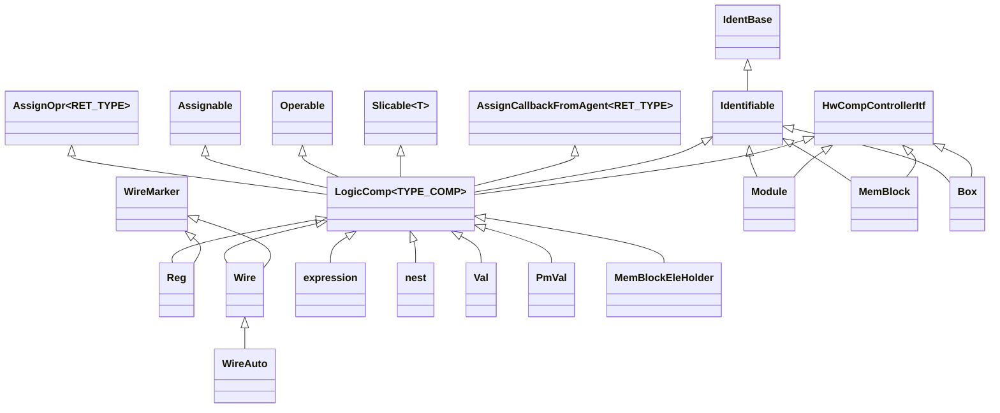

Every `mReg`, `mWire`, and `mExpr` on the
[hardware resources](/cppbook/core/hardware-resources/) page is a thin macro
over a class hierarchy in `src/model/hwComponent/`. That page covers what the
resources *do*; this one covers how they are built: three abstract bases in
`src/model/hwComponent/abstract/` each grant one ability — being named, being
a CCO assignment target, and appearing in expressions — and one template
class, `LogicComp`, fuses them for every signal-like component.

## Three capabilities, three bases

**`Identifiable` — naming and hierarchy** (`abstract/identifiable.h`, on top
of `IdentBase` from `src/model/abstract/identBase/identBase.h`, which supplies
the auto-incremented `_globalId`, `_globalName`, and the `_inheritName` path
built by `buildInheritName()`). Its constructor takes one of 15
`HW_COMPONENT_TYPE`s (`TYPE_REG`, `TYPE_WIRE`, `TYPE_EXPRESSION`, ...) and
prefixes the global name from the matching `GLOBAL_PREFIX` entry (`"REG"`,
`"WIRE"`, `"EXPR"`, ...). The C++ variable name arrives out-of-band: the maker
macro stashes a `VarMeta` via `setRetrieveVarMeta`, the constructor collects it
with `retrieveVarMeta()`, and non-user components get a `_SYS` name suffix.
`Identifiable` also holds the owning `Module*` (`_parent`), set by the
controller's `on_*_init` handlers.

**`Assignable` — the CCO assignment surface** (`abstract/assignable.h`). Pure
virtuals `doBlockAsm` / `doNonBlockAsm` (plus meta-collecting overloads and
`doGlobalAsm`) define what an assignment *means* per component;
`getAssignSlice()` and `getCurAssignClkMode()` say where and on which clock
edge. Note the internal naming: `doBlockAsm` backs the Edge Assignment `<<=`,
`doNonBlockAsm` the Level Assignment `=`. Each `Assignable` owns an
`UpdatePool` (`abstract/updateEvent.h`) — the priority-sorted update events
that [Decentralized Update](/cppbook/update/decentralized-update/) resolves;
`generateAssignMeta` / `generateBasicNode` turn one assignment into an
`UpdateEventBasic` wrapped in an `AssignMeta` / `AsmNode`. The operators live
in the companion template `AssignOpr`: `operator <<=` and the named
`operatorEq` — C++ does not inherit `operator =`, so every concrete class
re-declares it as a one-line wrapper around `operatorEq`. Integer right-hand
sides are converted by `getMatchAssignOperable(value, size)`
(`abstract/assignable.cpp`), which mints a system `Val` via `makeVal`.

**`Operable` — expression building** (`abstract/operable.h`, plus
`#define opr Operable`). A table of virtual operator overloads — bitwise
`& | ^ ~ << >>`, logical `&& || !`, relational `== != < <= > >=` plus `slt` /
`sgt`, arithmetic `+ - * / %`, and the extenders `extB` / `uext` / `sext` —
each returning an `expression&` tagged with a `LOGIC_OP` opcode
(`abstract/operation.h`). The implementations (`abstract/operable.cpp`)
balance operand widths with `uextToBalanceSize` and then `new` an anonymous
`expression`; the `ull` overloads (`abstract/operableConOv.cpp`) first convert
the constant with `getMatchOperable` — again a system `Val`.

## `LogicComp` — the junction

`LogicComp<TYPE_COMP>` (`abstract/logicComp.h`) is where the capabilities
meet: it inherits `AssignOpr<TYPE_COMP>`, `Assignable`, `Operable`,
`Slicable<TYPE_COMP>`, `AssignCallbackFromAgent<TYPE_COMP>`, `Identifiable`,
and `HwCompControllerItf` — plus, omitted from the diagram, `ModelDebuggable`
and the sim/gen interfaces whose `_simEngine` / `_genEngine` pointers proxy
the component into the simulator and the Verilog generator. Each concrete
signal type derives from `LogicComp` of *itself* —
`class Reg : public LogicComp<Reg>` — so `AssignOpr` and `Slicable` return the
correctly typed reference from `operator <<=` and `operator ()`.



## The concrete roster

- **`Reg`** (`register/register.h`) — `LogicComp<Reg>` + `WireMarker`. Routes
  `<<=` as `ASM_DIRECT` and `=` as `ASM_EQ_DEPNODE` through `on_reg_update`;
  its clock mode is the ambient `GET_CLOCK_MODE()`; `makeResetEvent` /
  `makeDefEvent` add reset and default events. The constructor's `hwType`
  parameter is how the flow-block machinery's `CtrlFlowRegBase` state, wait,
  and counter registers (`src/model/flowBlock/abstract/spReg/`) reuse `Reg`.
- **`Wire`** (`wire/wire.h`) — same shape but clock-free (`CM_CLK_FREE`).
  **`WireAuto`** (`wire/wireAuto.h`) extends it for internal routing only,
  tagged with a `WIRE_AUTO_GEN_TYPE` (`wire/wireSubType.h`).
- **`expression`** and **`nest`** (`expression/`) — both lowercase in the
  source. An `expression` stores one `LOGIC_OP` and operands `_a` / `_b`; it
  rejects `<<=` and allows `=` exactly once (`doNonBlockAsmMulAssCheck`). A
  `nest` is the concatenation aggregate behind `g` / `gr` / `gMan`: a vector
  of `NestMeta` pairs (an `Operable*` to read, an `Assignable*` to write)
  whose `doNestGlobalAsm` scatters one assignment across the members.
- **`Val`** and **`PmVal`** (`value/`) — read-only constants; every assignment
  path asserts. `Val` keeps a fast 64-bit `_rawValue` plus LSB-first
  `_rawValueWide` words; `PmVal` is the 64-bit-max parameter with `setParameter`.
- **`MemBlock`** and **`MemBlockEleHolder`** (`memBlock/MemBlock.h`,
  `memBlock/MemBlockAgent.h`) — the memory itself is *not* a `LogicComp`: it
  derives `Identifiable` + `HwCompControllerItf` (plus sim/gen interfaces)
  directly, so it is neither operable nor assignable. Access goes through
  `operator[]`, which mints a `MemBlockEleHolder` — a full
  `LogicComp<MemBlockEleHolder>` carrying the master pointer, the indexer
  `Operable*`, and a read/write mode flag.
- **`Module`** and **`Box`** (`module/module.h`, `box/box.h`) — structural,
  also not `LogicComp`. `Module` owns the per-kind vectors the controller
  fills (`_userRegs`, `_userWires`, ..., `_userBoxs`, `_userItfs`) plus the
  special registers and flow blocks. `Box` records its fields as `NestMeta`s
  and sub-boxes so whole-box `=` / `<<=` fan out field-wise.
  `globalComponent/globalComponent.h` adds the process-wide `rstWire` and
  `startNode` behind `getResetSignal()`.

## Slicing and I/O marking

`Slice` (`abstract/Slice.h`) is a half-open `{start, stop}` bit range.
`Slicable<T>` (`abstract/slicable.h`) stores a component's absolute slice and
declares the `operator ()` overloads; calling one returns a `SliceAgent<T>` —
itself `Assignable` + `Operable`, but forwarding every assignment to its
master through the `AssignCallbackFromAgent` hooks, so a sliced `Reg` still
registers updates on the real register.

`WireMarker` (`abstract/WireMarker.h`) is the I/O facet mixed into `Reg` and
`Wire`: `asInput` / `asOutput` / `asInputGlob` / `asOutputGlob` stamp a
`WIRE_MARKER_TYPE` and register the component in the **glob pool**
(`abstract/globPool.h`) — free-function registries (`addToGlobPool`,
`getGlobPool`, `getMdIoPool`) the generator later walks to emit ports.

## `makeComponent.h` — the component mint

All maker macros live in `abstract/makeComponent.h`, in matched families: the
user set (`mMod`, `mReg`, `mWire`, `mIn` / `mOut`, `mExpr`, `mVal`, `mPmVal`,
`mMem`, `mBox`, and the nest builders `g` / `gr` / `gMan`), programmatic
variants taking a runtime name string (`mOprReg`, `mOprWire`, `mOprMod`,
`mOprVal`), and internal equivalents that mark the component as
framework-owned (`makeMod` / `makeReg` / `makeWire` / `makeVal` / `makeMem` /
`makeBox`, `makeOprReg` / `makeOprWire` / `makeOprWireWoDef` / `makeOprVal` /
`makeOprMem` / `makeOprProxyExpr` / `makeOprIoWire`, `gManInternal`). The file
also defines the `box(tn)` / `initBox(tn)` declaration pair and `var` (an
alias for `auto&`). Every macro expands to the same template:

```cpp
template<typename T, typename... Args>
T& _make(const std::string& typeName, const std::string& name, bool isUserDec, Args&&... args){
    unlockAlloc();
    setRetrieveVarMeta(typeName, name, isUserDec);
    auto objPtr = new T(std::forward<Args>(args)...);
    objPtr->com_final(); /* typically it is used only module and box */
    return *objPtr;
}
```

Name capture, construction, finalization. `com_init()` is *not* called here —
each component's own constructor invokes it to register with the controller
(`Reg::com_init()` is `ctrl->on_reg_init(this)`), while `com_final()` is a
no-op everywhere except `Module` and `Box`. `mIn` / `mOut` go through
`_makeIo`, which runs `_make` and then `asInput()` / `asOutput()`. The
`unlockAlloc()` handshake with `HwCompControllerItf` — the lock that stops
components being `new`-ed outside a macro — is covered in
[ModelController and elaboration](/cppbook/internals/model-controller/); the
one sanctioned bypass is `expression`, whose constructors pass
`requiredAllocCheck = false` so `Operable`'s operators can `new` anonymous
expressions mid-formula without tripping the lock.

## Where next

- [Hardware resources](/cppbook/core/hardware-resources/) — the user-facing
  view of these classes.
- [Assignments and expressions](/cppbook/core/assignments-and-expressions/) —
  the CCO semantics the `Assignable` surface implements.
- [Update events](/cppbook/internals/update-events/) — what happens to the
  `UpdatePool` each `Assignable` accumulates.
- [ModelController and elaboration](/cppbook/internals/model-controller/) —
  the controller every `com_init()` reports to.
