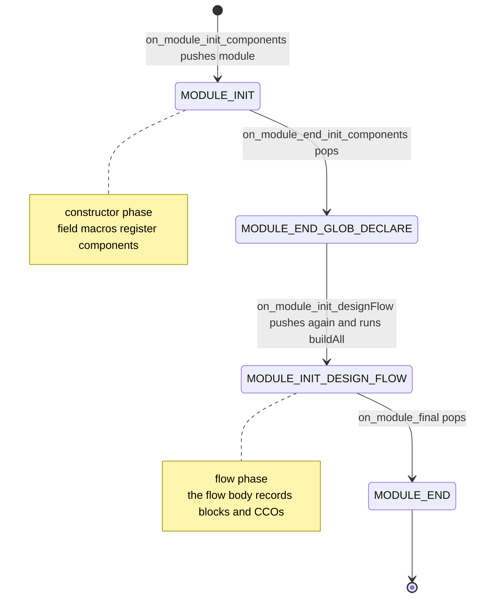

Building a Kathryn model executes no simulation and emits no Verilog — it is
**pure elaboration**, and all of it is coordinated by one object:
`ModelController` (`src/model/controller/controller.h`), which implements the
`MainControlable` interface (`src/abstract/mainControlable.h`: `start` /
`reset` / `clean` — the same interface the sim and gen controllers implement).
A file-local `centralControllerPtr` in `src/model/controller/controller.cpp`
holds the singleton; `getControllerPtr()` lazily constructs it on first use, so
the very first `mMod` in `main()` is enough to bring the whole machinery up.
Every maker macro, component constructor, assignment operator, and flow-block
macro ultimately calls back into this one object — the controller is how a
plain C++ constructor run turns into a hardware model.

## Three kinds of stacks

Because elaboration *is* C++ execution, "where am I?" is always a question
about what is currently on a stack. `ModelController` keeps three:

- **Module stack** — `std::stack<Module_Stack_Element>`, where each element
  pairs a `Module*` with a `MODULE_BUILDING_STATE` (`MODULE_INIT`,
  `MODULE_END_GLOB_DECLARE`, `MODULE_INIT_DESIGN_FLOW`, `MODULE_END`, plus the
  `MODULE_INIT_AUX` / `MODULE_FINAL_AUX` pair used by the simulator).
  `getTopModulePtr()` answers "which module owns the component being declared
  right now".
- **Box stack** — `std::stack<Box*>`. While a [box](/cppbook/core/modules-and-flow/)
  is under construction, `on_box_tryAddToBox` routes every user-declared
  component into the top box instead of only the module.
- **Flow-block stacks** — `std::stack<FlowBlockBase*> flowBlockStacks[FLOW_ST_CNT]`,
  four parallel stacks indexed by `FLOW_STACK_TYPE`
  (`src/model/flowBlock/abstract/flowBlock_Base.h`): `FLOW_ST_BASE_STACK` for
  every block, `FLOW_ST_PATTERN_STACK` for `seq`/`par`, `FLOW_ST_HEAD_COND_STACK`
  for `if` heads, and `FLOW_ST_PIP_BLK` for pipelines. Each block declares
  which stacks it lives on via `getSelFbStack()`, and `pushFlowBlock` /
  `popFlowBlock` (`src/model/controller/flowController.cpp`) keep them in
  lockstep.

(`getCurModelStack()` pretty-prints the module and base flow stacks — the
controller's own debugging aid.)

## The `_make<>` allocation lock

The controller field `hwCompAllocLock` starts `true`. The `_make<>` template
behind every maker macro (`src/model/hwComponent/abstract/makeComponent.h`)
calls `unlockAlloc()` — which forwards to `unlockAllocation()` — immediately
before `new T(...)`. Every hardware component derives from
`HwCompControllerItf` (`src/model/controller/conInterf/controllerItf.h`),
whose constructor does the other half:

```cpp
HwCompControllerItf::HwCompControllerItf(bool requiredAllocCheck): ctrl(getControllerPtr()) {
    if (requiredAllocCheck) {
        assert(!ctrl->isAllocationLock());
        ctrl->lockAllocation();
    }
}
```

Unlock, construct one component, re-lock. The effect: you cannot `new Reg(...)`
by hand — only `mReg`, `mMod`, `mBox`, and friends can mint components, which
guarantees each one passes through `_make<>`'s bookkeeping (name capture via
`setRetrieveVarMeta`, then `com_final()`) before anything else touches it.

## Registration callbacks: `on_*_init` and `on_*_update`

Components introduce themselves through `com_init()` — `Reg::com_init()` is
literally `ctrl->on_reg_init(this)` — and the controller's handlers live in
`src/model/controller/hwCompController.cpp` in two families.

The **init family** runs during construction: `on_reg_init`, `on_wire_init`,
`on_expression_init`, `on_value_init`, `on_pmValue_init`, `on_memBlk_init`,
`on_nest_init`, `on_itf_init`, `on_box_init`/`on_box_end_init` (which push and
pop the box stack), and `on_sp_reg_init` for the framework's own state,
sync, and wait registers. They all follow one shape: fetch the top module,
add the component to the right per-module list (`addUserReg`, `addUserWires`,
...), `setParent`, and `buildInheritName` so the component's hierarchical name
is fixed at declaration.

The **update family** runs when an assignment executes inside `flow()`:
`on_reg_update`, `on_wire_update`, `on_memBlkEleHolder_update`,
`on_nest_update`, `on_box_update`. Each receives the freshly built `AsmNode`
and asks `isTopFbBelongToTopModule()`: if an enclosing flow block of the
current module is on the stack, the node is attached to it with
`addElementInFlowBlock`; otherwise it is wrapped in a `FlowBlockPseudo`
(`src/model/flowBlock/pseudo/pseudo.cpp`) so bare assignments outside any
block still enter the model. How these nodes become hardware is the
[flow-block internals](/cppbook/internals/flow-blocks/) story.

## Flow-block attach and detach

Flow-block macros expand to `for` statements — `seq` in
`src/model/flowBlock/seq/seq.h` constructs a `FlowBlockSeq` whose attach hook
calls `ctrl->on_attach_flowBlock(this)` and whose detach hook calls
`ctrl->on_detach_flowBlock(this)` when the braces close. Attach assigns the
block's module and flow-block parents (`assignFlowBlockParent`) and pushes it
onto its selected stacks. Detach pops it and joins it upward according to its
`FLOW_BLOCK_JOIN_POLICY`: `FLOW_JO_SUB_FLOW` nests it as a sub-block,
`FLOW_JO_CON_FLOW` chains it as a consecutive block (`elif`/`else`), and
`FLOW_JO_EXT_FLOW` extracts its `AsmNode`s into the enclosing block. A block
with no enclosing block lands directly in the module via `addFlowBlock`.
Blocks flagged lazy-delete stay on the stack until `tryPurifyFlowStack()`
evicts them — which is why every update handler calls it first.

## A module's elaboration lifecycle

Walking the [blink sample](/cppbook/core/modules-and-flow/) through the
controller (`src/model/controller/hwCompController.cpp`):

1. Constructing `ModelController` itself runs
   `on_globalModule_init_component()`: it builds a hidden `Module` named
   `globeMod` and pushes it with state `MODULE_INIT`, so user code always has
   a top module to report to.
2. `mMod(ex, BlinkAB, 0)` → `Module::com_init` → `on_module_init_components`:
   the new module is added to its parent's `_userSubModules` and pushed with
   `MODULE_INIT`. Every field macro inside it now registers against *this*
   stack top. When `_make<>` finishes, `com_final` →
   `on_module_end_init_components` marks the stage `MODEL_GLOB_INITED`, sets
   the state to `MODULE_END_GLOB_DECLARE`, and pops.
3. `startModelKathryn()` (`src/kathryn.cpp`) calls `ModelController::start()`,
   which finalizes the global module's declarations and runs
   `on_globalModule_init_designFlow()` — pushing `globeMod` back with
   `MODULE_INIT_DESIGN_FLOW` and calling `buildAll()`.
4. `Module::buildAll()` (`src/model/hwComponent/module/module.cpp`) runs
   `flow()`, purifies the flow stacks, then for each child calls
   `on_module_init_designFlow(sub)` (push, recurse into the child's
   `buildAll()`) followed by `on_module_final(sub)` (assert the flow stacks
   are clear of this module, set `MODULE_END`, pop) — and finally lowers its
   own recorded blocks with `buildFlow()`.



The simulator's `SimInterface` (`src/sim/interface/simInterface.cpp`) later
reopens `globeMod` with the `on_globalModule_init_auxilaryComponent` /
`on_globalModule_final_auxilaryComponent` pair to add read-only trigger logic
— the same stack discipline, in the `MODULE_INIT_AUX` state.

## `clockMode` and `asmMode`: ambient elaboration contexts

Two small files beside the controller scope *how* assignments are recorded,
without touching the stacks:

- `src/model/controller/clockMode.h` holds a global `CLOCK_MODE`
  (`CM_POSEDGE` default, `CM_NEGEDGE`, `CM_CLK_FREE`, `CM_CLK_UNUSED`) set by
  `SET_CLK_MODE2NEG_EDGE()` / `SET_CLK_MODE2DEF()`. `Reg` and `MemBlockAgent`
  read it back through `getCurAssignClkMode()`, so every assignment elaborated
  while a mode is active captures that clock edge.
- `src/model/controller/asmMode.h` holds the assignment-priority context:
  `SET_ASM_PRI_TO_MANUAL(p)` / `SET_ASM_PRI_TO_AUTO()` (default
  `DEFAULT_UE_PRI_USER`, 10). `createUEHelper`
  (`src/model/hwComponent/abstract/updateEvent.cpp`) stamps
  `GET_ASM_PRI_VAL()` onto each auto-priority update event — this is the
  mechanism beneath [Decentralized Update](/cppbook/update/decentralized-update/)
  priority scoping.

Both are set/restore contexts: bracket a region of `flow()` with the setter
and the default restorer, and only the CCOs elaborated in between are
affected.

## Where next

- [Architecture](/cppbook/internals/architecture/) — where the model
  controller sits relative to the sim and gen controllers.
- [Hardware components](/cppbook/internals/hw-components/) — what the
  registered components themselves look like.
- [Flow-block internals](/cppbook/internals/flow-blocks/) — what happens to a
  block after `on_detach_flowBlock` hands it to its parent.
