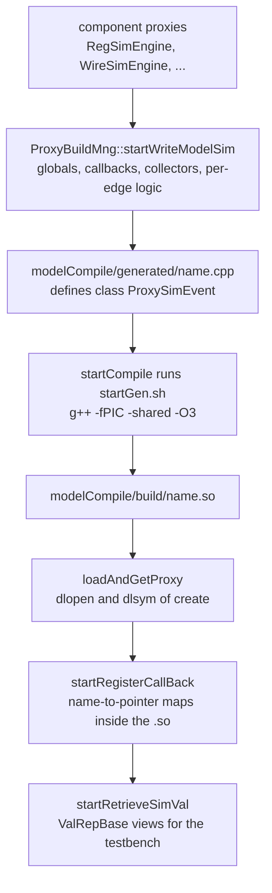

[The Hybrid Simulator](/cppbook/backends/simulator/) gives the user view of the
JIT: `buildSimMode = gcr`, `startGen.sh`, and where the files land. This page
is the internals view — what `ProxyBuildMng`
(`src/sim/modelSimEngine/base/proxyBuildMng.h`) actually writes, in what
order, and how the compiled object is wired back into the process. The
[Architecture Overview](/cppbook/internals/architecture/) already placed the
simulator proxies in the mirror rule; here we follow them into generated code.

## The proxy layer: build face and retrieve face

Every simulator proxy implements two small interfaces from
`src/sim/modelSimEngine/base/modelProxy.h`:

- **`ModelProxyBuild`** is the *code-generation* face: `proxyBuildInit()`,
  `getDep()`, a `ValR` name, a clock mode, and the `create*` family —
  `createGlobalVariable`, `createLocalVariable`, `createOp`,
  `createOpEndCycle`, `createOpEndCycle2`, `createUserMarkValue` — each
  printing C++ into a `CbBaseCxx` builder.
- **`ModelProxyRetrieve`** is the *read-back* face: after the `.so` is loaded,
  `proxyRetInit(ProxySimEventBase*)` binds a `ValRepBase` view onto the live
  variable inside the shared object.

`LogicSimEngine`
(`src/sim/modelSimEngine/hwComponent/abstract/logicSimEngine.h`) implements
both for every value-carrying component; its subclasses are the mirror tree:
`RegSimEngine`, `WireSimEngine`, `expressionSimEngine` (lower-case, matching
the model's `expression`), `NestSimEngine`, `ValSimEngine`, `PmValSimEngine`,
and `MemEleHolderSimEngine` for memory ports. `MemSimEngine`
(`.../hwComponent/memBlk/memSim.h`) derives from the two interfaces directly.
`ModuleSimEngine` (`.../hwComponent/module/moduleSim.h`) is not a proxy but
the **recruiter**: `recruitForCreateVar`, `recruitForRegisVar`,
`recruitForMainOpVolatile`, `recruitForMainOpNonVolatile`,
`recruitForFinalizeOp`, `recruitForVcdVar`, and `recruitPerf` walk the module
hierarchy and hand `ProxyBuildMng` flat lists of proxies per purpose.

## Values in generated code

Proxies do not build syntax trees — they build **C++ expression strings**.
`ValR` (`src/sim/modelSimEngine/base/simValType.h`) carries a string plus a
`SIM_VALREP_TYPE_ALL`, and overloads the full operator set so composing
proxies composes source text. `getMatchSVT` picks the storage type from the
bit width: up to 8/16/32/64 bits become `uint8_t`/`uint16_t`/`uint32_t`/
`uint64_t`; anything wider becomes `SVT_U64M`, emitted as `UintX<N>` with
`N = getArrSize(size)` 64-bit words — `UintX`
(`src/sim/logicRep/valRep.h`) supplies the arithmetic, shifts, comparisons,
`divmod`, and the `toBiStr()` the VCD collector uses for wide signals. Each
register variable also gets a `_TEMP` shadow (the `TEMP_VAR_SUFFIX`) so
edge-triggered updates can commit at end of cycle:

```cpp
// modelCompile/generated/<name>.cpp — real emitted globals
uint32_t REG10018_USER_ijImem0 = 0; uint32_t REG10018_USER_ijImem0_TEMP = 0;
```

On the host side the type is erased: `ValRepBase` is a `{_byteSize, void*}`
view with `_continLength` set for `UintX` values, read through
`getVal()`/`getLargeVal()`.

:::note
The historical `-DNOTEXCEED64` build definition — which compiled out the
wide-value auto-sim cases — has been removed from `CMakeLists.txt` now that
greater-than-64-bit values are supported end-to-end. The only remaining checks
are `#ifndef NOTEXCEED64` guards around the wide tests
`simAutoTest9/12/13/22.cpp` in `src/test/autoSim/testCase/`.
:::

## One translation unit: the write phases

`SimInterface::createModelSimEvent` (`src/sim/interface/simInterface.cpp`)
gates the three stages on the `SPB_GEN`/`SPB_COMPILE`/`SPB_RUN` flags decoded
from `buildSimMode` by `getSPBM`
(`src/sim/modelSimEngine/base/proxyBuildMode.cpp`). Under `SPB_GEN` it calls
`startReadOldModelSim()` and then `startWriteModelSim()`, which writes
`modelCompile/generated/<TEST_NAME>.cpp` — a single file defining
`ProxySimEvent`, the subclass of `ProxySimEventBase` statically declared in
`modelCompile/proxyEvent.h`. The phases run in this verified order:

1. **Preamble** — `#include "../proxyEvent.h"`, the preserved `include`
   region, and the `kathryn` namespace.
2. **Globals** — `startWriteCallBackVarInit` (the trigger bookkeeping array),
   `startWriteVcdDecWriter`, `startWriteCreateVariable` (every recruited
   proxy's `createGlobalVariable`), `startWritePerfDec` (ZEP counters), and
   the preserved `globalVar` region.
3. **Callbacks** — `startWriteInitInternalWarmUp` (the `intCodeWarmUp` body),
   `startWriteRegisterCallback` (one `registerToCallBack`/
   `registerToCallBackPerf` line per variable), then the
   `startWriteCallBack*` trio, whose generated `checkCallBack()` tests each
   `trig()` condition installed on the testbench and records which fired.
4. **Collectors** — `startWriteVcdDecVar`/`startWriteVcdColSke`/
   `startWriteVcdCol` for the user and internal variants (dummy bodies when
   the recording policy disables one), and
   `startWritePerfColSke`/`startWritePerfCol` for the profiler.
5. **Per-clock logic** — `startWriteAllLogicSim(CM_NEGEDGE)` then
   `(CM_POSEDGE)`. Each expands to `startWriteMainEleSimSke`/`...Sim` and
   `startFinalizeEleSimSke`/`...Sim`: local `_TEMP` declarations, the
   *volatile* (combinational) proxies ordered by `doTopologySort` — a DFS
   that aborts on `cycle dep detect` — then the clock-screened
   *non-volatile* proxies (`screenClockMode`), and finally the two commit
   passes `createOpEndCycle`/`createOpEndCycle2`. A negative edge with no
   negedge-clocked logic collapses to an empty function.
6. **User hook and driver** — `startWriteUserDefinedFunction` emits
   `userDefUserSke` containing the `markSV` reference aliases
   (`createUserMarkValue`) and the preserved `manualDesigner` region;
   `startWriteMainSimSke` emits the long-range `do { ... } while` loop that
   runs user code, both edges, the collectors, and `checkCallBack()` against
   the cycle budget; `startWriteMainSim` wraps it as `mainSim()`; and
   `startWriteCreateFunc` closes with the `extern "C"` factory
   `ProxySimEventBase* create()`.

The hot functions are emitted as free `...Ske` (skeleton) helpers marked with
`INLINE_ATTR` — `__attribute__((always_inline)) inline` unless the
`SimInterface` constructor's `reqInline` argument disabled it. All statement
printing goes through the `CbBaseCxx`/`CbIfCxx`/`CbSwitchCxx` combinators in
`src/util/fileWriter/codeWriter/cppWriter.h` (how a sorted `UpdatePool` turns
into those statements is the subject of
[UpdateEvents and the UpdatePool](/cppbook/internals/update-events/)).

**Regeneration is not destructive everywhere:** `startReadOldModelSim` runs a
`UserDefRepo` (`src/sim/modelSimEngine/base/userDefRepo.h`) over the previous
generated file and harvests the three regions bracketed by `//KDMD_<key>` ...
`//KDMD_END` comments (`include`, `globalVar`, `manualDesigner`). Anything a
designer hand-writes between those markers is re-emitted verbatim into the
next generation — the Verilator-style escape hatch that `markSV` names exist
to serve.



## Compile, dlopen, retrieve

Under `SPB_COMPILE`, `startCompile()` shells out with `system()` to
`modelCompile/startGen.sh`, passing the test name, the project directory, and
the `OP_FLAG` (`-O` plus the constructor's `opLevel`, default `-O3`). The
script compiles the generated file **plus three support sources fresh into
every `.so`** — `proxyEventBase.cpp`, `fileWriterBase.cpp`, and
`simResWriter.cpp` — with `g++ -fPIC -shared -I ../src` (the full command is
quoted on [the user page](/cppbook/backends/simulator/)).

Loading is literal `dlopen`. `loadAndGetProxy()` in `proxyBuildMng.cpp`:

```cpp
_handle = dlopen(srcDynLoadPath.c_str(), RTLD_LAZY);
// ... dlerror check, then:
typedef ProxySimEventBase* (*SeCreator)();
SeCreator create = (SeCreator)dlsym(_handle, "create");
```

Any `dlerror` prints and exits the process; the `ProxyBuildMng` destructor
`dlclose`s the handle via `unloadProxy()`. Under `SPB_RUN`,
`createModelSimEvent` then calls the factory, installs the `VcdWriter` and
recording policy, runs `eventWarmUp()`/`intCodeWarmUp()`, and calls
`startRetrieveSimVal`. That last step is the bridge back: the generated
`startRegisterCallBack()` filled the typed name-to-pointer maps in
`ProxySimEventBase` (`callBack8` ... `callBack64M`), and each proxy's
`proxyRetInit` looks its own name up with `getVal(...)`, sizes the resulting
`ValRepBase`, and caches it in its model `Operable` — which is exactly what
`testAndPrint` and the `sim{ ... }` blocks read and poke during the run.
Finally the loaded object joins the event queue as an ordinary event; how
`SimController` drives it each cycle is covered in
[The simulator runtime](/cppbook/internals/sim-runtime/).

## Where next

- [The Hybrid Simulator](/cppbook/backends/simulator/) — the user view:
  params keys, testbench hooks, VCD and ZEP outputs.
- [The simulator runtime](/cppbook/internals/sim-runtime/) — the event queue
  and cycle loop that call into the loaded `.so`.
- [UpdateEvents and the UpdatePool](/cppbook/internals/update-events/) — how
  each CCO's event record becomes the statements `createOp` prints.
