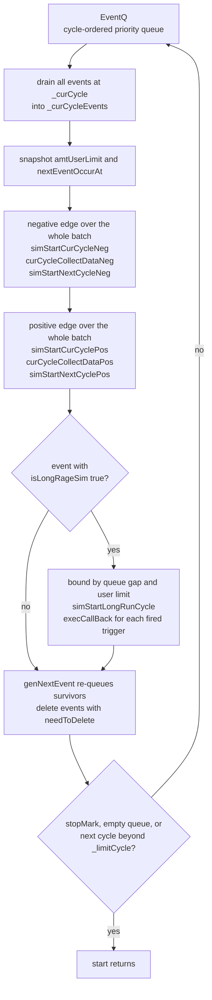

The user view of the Hybrid Simulator — subclass `SimInterface`, call
`simStart()`, read the VCD and ZEP outputs — is covered in
[The Hybrid Simulator](/cppbook/backends/simulator/). This page is the runtime
underneath: what `SimController::start()`
(`src/sim/controller/simController.cpp`) actually executes once the compiled
`.so` is loaded. The controller is small on purpose — a cycle counter, a
priority queue, and a fixed phase schedule — because all heavy lifting lives in
the *events* it dispatches, chiefly the one event that **is** the compiled
model. Like the model and gen controllers, `SimController` implements
`MainControlable` and is a lazily constructed singleton behind
`getSimController()`.

## The queue: EventQ and its ordering

`EventQ` (`src/sim/event/eventQ.h`) wraps a
`std::priority_queue<EventBase*, std::vector<EventBase*>, eventQueueCmp>`.
The comparator delegates to `EventBase::operator<`
(`src/sim/event/eventBase.h`): the top of the queue is the event with the
**smallest `_targetCycle`**, and among events on the same cycle the one with
the **largest `_priority` value**. The priority constants define a fixed
within-cycle order:

| Constant | Value | Used by |
| --- | --- | --- |
| `SIM_CC_TRIGGER_PRIO_FRONT_CYCLE` | 10 | `ConcreteTriggerEvent` |
| `SIM_USER_PRIO_FRONT_CYCLE` | 10 | `UserEvent` (default) |
| `SIM_MODEL_PRIO` | 9 | `ProxySimEventBase` — the model |
| `SIM_USER_PRIO_BACK_CYCLE` | 8 | `UserEvent` after `backCycle()` |

So on any given cycle, front-of-cycle testbench events run before the model,
and `backCycle()` stimulus runs after it — that is the whole mechanism behind
the `incCycle`/`backCycle` macros. `EventQ::addEvent` asserts
`event->getCurCycle() >= lastPopCycle`: nothing may be scheduled into the
past, and `removeEvent` is `assert(false)` — unscheduling is unimplemented.

## The event species

`EventBase` declares six phase virtuals — a negative-edge triplet
`simStartCurCycleNeg` / `curCycleCollectDataNeg` / `simStartNextCycleNeg` and
a positive-edge triplet `simStartCurCyclePos` / `curCycleCollectDataPos` /
`simStartNextCyclePos` — plus `simStartLongRunCycle`, `genNextEvent`, and
`needToDelete`. (`simExitCurCycle` is declared and overridden empty
everywhere but never invoked — a dormant hook.) Three concrete species exist:

- **`ProxySimEventBase`** (`src/sim/modelSimEngine/base/proxyEventBase.h`) —
  the JIT-compiled model itself, one instance, added to the queue by
  `SimInterface::createModelSimEvent()`. Its `genNextEvent()` returns *itself*
  with `_targetCycle` advanced, and `needToDelete()` is `false` — the clock is
  literally one immortal event rescheduling itself every cycle.
- **`UserEvent`** (`src/sim/event/userEvent.h`) — one per `sim{ ... }` block.
  The `sim` macro expands to `simAgent << [&](UserEvent& simAgent)`; each
  `<<` allocates a `UserEvent` at the agent's current orchestration cycle and
  self-registers via `getSimController()->addEvent(this)`. The lambda runs in
  `simStartCurCycleNeg`; all other phases are empty and the event is deleted
  after its cycle.
- **`ConcreteTriggerEvent`** (`src/sim/event/ctTrigEvent.h`) — the bridge to
  the `describeCon()` thread. It carries four mutex/condition-variable
  `SerializeEvent` handshakes: `simStartCurCycleNeg` wakes the testbench
  thread and blocks the simulation until it yields; `simStartNextCyclePos`
  runs the end-of-cycle handshake in which the thread's `conCycle()` /
  `conNextCycle()` calls plant the next wake-up cycle via `setFutureCycle`.
  `genNextEvent()` re-queues it at that cycle until `markStop()`.

## One iteration of `start()`

The outer `while` runs as long as the queue is non-empty and the next event's
cycle is `<= _limitCycle` (set from the `SimInterface` cycle-limit argument).
Each iteration: assert the cycle number was never visited before, set
`_curCycle`, and **drain every event scheduled at that cycle** into a
`_curCycleEvents` batch. The loop therefore visits only *scheduled* cycles —
this is the event-driven claim made on the user page. Two bounds are
snapshotted before dispatch: `amtUserLimit` (from the `_amtLrLimUser`
pointer) and `nextEventOccurAt` (the new queue top), both defaulting to
`INT64_MAX`. Then the six phase passes run, each sweeping the **whole batch**
before the next pass begins — so every event finishes its negative-edge
compute before any event collects data, and so on:

After the phases comes the long-run pass (below), then repopulation: each
event's `genNextEvent()` result is re-added, and events reporting
`needToDelete()` are freed. Finally the loop breaks if `stopMark` was set —
`stopSim()` is what the `trig(opr, EXIT_SIM)` trigger callback invokes.

For the model event, the six phases map onto the generated code
(`src/sim/modelSimEngine/base/proxyEventBase.cpp`): `simStartCurCycle*` calls
`startMainOpEleSimNeg`/`Pos` (compute the CCOs bound to that clock edge),
`curCycleCollectData*` calls `writeVcdSignal()` (and `startPerfCol()` on the
positive edge), and `simStartNextCycle*` calls `startFinalizeEleSimNeg`/`Pos`
(commit register state for the next cycle). What those generated functions
contain is the [simulator JIT](/cppbook/internals/sim-jit/) story.

## The long-run fast path: `isLongRageSim()`

Per-cycle queue round-trips are wasted work when nothing is scheduled between
the model and the horizon. The fast path — enabled by the `requireLRC`
constructor flag or `enableLRC()`, which set `_isLongRangeSim` on the model
event via `setLongRunType` — short-circuits them. Note the spelling: the
predicate is `isLongRageSim()`, "Rage" without the *n*, exactly as in
`eventBase.h`. When it holds, all six single-cycle phase bodies return
immediately, and the controller's long-run pass takes over: it computes
`min(amtUserLimit, nextEventOccurAt - curCycle)` — never overrunning either
the next queued event or the user's `setNextLimitAmtLRC` budget — stores it
with `setLongRangeSim`, and calls `simStartLongRunCycle()`, which invokes the
generated `mainSim()`. That function is a single `do/while` inside the `.so`:
run both edges, collect VCD and performance data, and repeat
`while(!checkCallBack() && (kathryn_longrangeCnt < kathryn_longrangeLim))`.
The generated `checkCallBack()` evaluates every compiled trigger condition
each cycle and records fired indices; back on the host, the controller walks
`getCallBackAmt()` / `getCallBackNo()` and runs each matching
`TraceEvent::execCallBack()` from the `_mdTraceMap` that
`SimInterface::trig()` populated. `genNextEvent()` then jumps
`_targetCycle` forward by the number of cycles actually simulated
(`getAmtLRsim()`). An assert enforces at most one long-range event per batch.

## Around the loop: SimInterface order of operations

`SimInterface::simStart()` (`src/sim/interface/simInterface.cpp`) brackets the
loop, and the ordering of its `describe*` hooks matters:

1. `describeModelTrigger()` runs first, wrapped in the model controller's
   `on_globalModule_init_auxilaryComponent` / `..._final_...` pair — trigger
   conditions are *elaborated into the model* before the JIT generates code
   (the `MODULE_INIT_AUX` state from
   [ModelController and Elaboration](/cppbook/internals/model-controller/)).
2. `createModelSimEvent()` generates/compiles/loads the proxy, warms it up,
   hands it the `VcdWriter`, and queues it.
3. `describeDef()` (default implementation pulses `*rstWire` to 1 for one
   cycle, then 0) and `describe()` queue the `UserEvent` stimulus.
4. If concrete simulation is enabled, `simStartConSim()` spawns the
   `describeCon()` thread with an auto-created `ConcreteTriggerEvent` at
   cycle 2.
5. The trigger map and long-run limit pointers are installed
   (`setTriggerMap`, `setLrLimUser`), and `simCtrl->start()` runs the loop;
   afterwards the con thread is joined and `finalPerfCol()` writes the report.

## Instrumentation on the side

Both writers live in `src/sim/simResWriter/simResWriter.h` and are owned by
`SimInterface`. **`VcdWriter`** receives `addNewTimeStamp` / `addNewValue`
calls from the model event's `writeVcdSignal()` — two timestamps per cycle
(cycle ×10 and ×10+5) toggling the `CLK` signal, with user and internal
signal collection gated by the VCD record policy. **`FlowWriter`** is the ZEP
profiler backend: `initPerfCol()` binds it to the global module before the
loop, `startPerfCol()` feeds it every positive edge, and
`finalPerfCol()` → `startWriteData()` emits the per-flow-block report.
Separately, `SimProbe` (`src/sim/modelSimEngine/flowBlock/flowBlockProber.h`)
lets a testbench interrogate a Hybrid Design Block without touching its
engine — `initProbe(x)` binds it, `isExecuting()` asks the block's sim engine
`isBlockRunning()`, `isIdle()` is its negation — with a pipeline-specific
prober in `modelSimEngine/flowBlock/pipeline/flowBlockPipProber.h`.

## Where next

- [The simulator JIT](/cppbook/internals/sim-jit/) — how `ProxyBuildMng`
  writes `startMainOpEleSim*`, `checkCallBack`, and `mainSim` into the
  generated translation unit.
- [The Hybrid Simulator](/cppbook/backends/simulator/) — the user-facing
  testbench API this runtime serves.
- [Architecture](/cppbook/internals/architecture/) — where the sim controller
  sits among the three layers.
