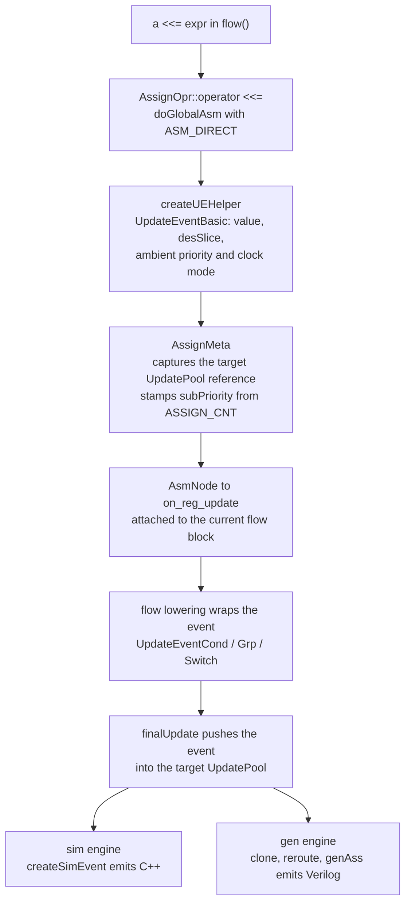

[Decentralized Update](/cppbook/update/decentralized-update/) tells the user
story — every write becomes an event in the target's pool, resolved by
priority — and [Driven Logic Structure](/cppbook/reference/driven-logic-structure/)
lists the structs field by field. This page covers the machinery between the
two: the pipeline that turns a CCO written in `flow()` into an `UpdateEvent`
inside an `UpdatePool`, and the two engines that later read the pools.

## From operator to `AssignMeta`

Both CCOs enter through the `AssignOpr<>` mixin
(`src/model/hwComponent/abstract/assignable.h`): `operator <<=` fetches the
component's `Assignable` face, asks it for `getAssignSlice()`, and calls
`doBlockAsm`; `Reg::operator =` (`src/model/hwComponent/register/register.h`)
forwards to `operatorEq`, which in model mode calls `doNonBlockAsm`. An
integer right-hand side is first wrapped into a `Value` component by
`getMatchAssignOperable`. In `Reg` the two paths converge immediately
(`src/model/hwComponent/register/register.cpp`) — the only trace the operator
leaves is an `ASM_TYPE` tag:

```cpp
void Reg::doBlockAsm(Operable& b, Slice desSlice)   { doGlobalAsm(b, desSlice, ASM_DIRECT);     }
void Reg::doNonBlockAsm(Operable& b, Slice desSlice){ doGlobalAsm(b, desSlice, ASM_EQ_DEPNODE); }
```

So at the record level, the Edge Assignment `<<=` is `ASM_DIRECT` and the
Level Assignment `=` is `ASM_EQ_DEPNODE` — the tag decides *how the flow
context is attached later*, not what is captured now. `doGlobalAsm` shrinks
the destination slice to the source width (`getMatchSizeSubSlice` — the
"shrink the MSB" policy), then calls `generateBasicNode`, which builds the
assignment record in two steps (`assignable.cpp` / `updateEvent.cpp`):

1. `createUEHelper(&srcValue, desSlice, -1, clockMode, true)` mints the leaf
   `UpdateEventBasic` holding the source `Operable*` and destination `Slice`.
   Because `autoPriority` is true, the priority is stamped from the ambient
   `asmMode` context (`GET_ASM_PRI_VAL()` — `DEFAULT_UE_PRI_USER` unless a
   `SET_ASM_PRI_TO_MANUAL` bracket is open), and the clock mode comes from the
   ambient `clockMode` context via `getCurAssignClkMode()` — the two
   [elaboration contexts](/cppbook/internals/model-controller/) in action.
2. The event is wrapped in an `AssignMeta`
   (`src/model/hwComponent/abstract/assMetaMng.h`), which captures a
   **reference to the target's own `UpdatePool`** (`UpdatePool& eventPool` —
   every `Assignable` owns one as `_updatePool`), the leaf as both
   `inputElement` and `preUpdateElement`, the `ASM_TYPE`, and a
   `subPriority` stamped from the global counter `AssignMeta::ASSIGN_CNT++`.

That pool reference is decentralization in code: the record knows from birth
which pool it belongs to, so no later phase ever needs a registry of who
writes what. The `ASSIGN_CNT` stamp is the program-order tie-break that
`sortEvents()` uses between events of equal priority. The meta then rides an
`AsmNode` (`src/model/flowBlock/abstract/nodes/asmNode.h`) into
`ctrl->on_reg_update`, where the [model controller](/cppbook/internals/model-controller/)
attaches it to the innermost flow block — or a `FlowBlockPseudo` if there is
none.

## Wrapping and finalizing: three routes into the pool

Nothing enters a pool except through one gate:

```cpp
void finalUpdate(){
    eventPool.addUpdateEvent(preUpdateElement);
}
```

Until `finalUpdate()` runs, the meta's `preUpdateElement` is progressively
*wrapped* — `addSpecificPreCondition` and `setNewEditingEvent` replace the
current event with an `UpdateEventCond` around it — while `inputElement`
still points at the original leaf. Which wrapper is applied depends on the
flow context the `AsmNode` landed in:

- **Stateful blocks** (`seq`, `cif`, ...): during `buildFlow`,
  `StateNode::assign` (`src/model/flowBlock/abstract/nodes/stateNode.h`)
  calls `assignFromStateNode(holdSignal, resetSignal)` on each attached
  `AsmNode`. For `ASM_DIRECT` it ANDs the node's condition, the negated hold
  and reset signals, and the state register's operand
  (`getStateOperating()`) into one guard, wraps the event in an
  `UpdateEventCond`, and finalizes. For `ASM_EQ_DEPNODE` it instead emits one
  guarded event per predecessor of the depended node, using each source's
  `getExitOpr()` — this is why `=` follows the state that produced its value.
- **Combinational z-blocks**: `FlowBlockZIF::addElementInFlowBlock`
  (`src/model/flowBlock/cond/zif.cpp`) buckets incoming metas into
  `ZifClassAsm` groups (`zifClassAsm.h`, a subclass of `ClassAssignMeta` from
  `assMetaMng.h`). Grouping is by `isJoinable`: same pool, same `ASM_TYPE`,
  same priority and clock mode. On `extract()` each bucket becomes an
  `UpdateEventGrp` (`createEventGrp()`) wrapped in a single
  `UpdateEventCond`, with one `(condition, group)` branch appended per
  chained `zelif`/`zelse` stage — an entire `zif` chain collapses to one
  cond event per target pool. The `zstate` path
  (`src/model/flowBlock/state/ztateClassAsm.cpp`) mints `UpdateEventSwitch`
  the same way, one group per case value.
- **No flow context**: `AsmNode::dryAssign()` wraps the event in a
  single-branch unconditional `UpdateEventCond` (`addSubStmt(nullptr, ...)`)
  and finalizes. `Module::buildFlow` uses it for nodes extracted from
  `FLOW_JO_EXT_FLOW` blocks, and the aggregator internals (`slot`, `mux`,
  `table`, `memTable` under `src/model/hwCollection/dataStructure/`) call it
  directly after attaching their own row-select preconditions with
  `addSpecificPreCondition`.

Framework-internal writers skip `AssignMeta` entirely: `Reg::makeResetEvent`
builds a cond event guarded by `rstWire` at `DEFAULT_UE_PRI_RST` and pushes
it with `addUpdateMeta` straight into the pool; `makeDefEvent` does the same
at `DEFAULT_UE_PRI_MIN`, which is why a default value loses to every real
write.



## Two read-only consumers

Both backends start the same way: `sortUpEventByPriority()` calls
`UpdatePool::sortEvents()`, which orders the pool ascending by
`(priority, subPriority)`. Each engine then walks the pool *in order* into
one sequential code block — so the highest-priority event is emitted last,
and under the last-write-wins semantics of both a C++ function body and a
Verilog `always` block, it wins. The sort *is* the resolution mechanism.
Every model event carries two factory virtuals for this hand-off,
`createSimEvent()` and `createGenEngine()` — the consumers build their own
mirror objects and never mutate the model event.

**Simulation** — `LogicSimEngine`
(`src/sim/modelSimEngine/hwComponent/abstract/logicSimEngine.cpp`) first
calls each event's `getDep()` to collect the source `Operable`s as
scheduling dependencies (`proxyBuildInit`), then in
`createOpWithSoleCondition` asks each sorted event for its mirror
`UpdateEventBaseSimEngine`
(`src/sim/modelSimEngine/hwComponent/abstract/updateEvent.h`/`.cpp`), whose
`createSimOp` prints C++ statements into a `CbBaseCxx` code builder — the
source of the compiled simulator. The deep dive is
[Simulation via JIT](/cppbook/internals/sim-jit/).

**Generation** — `AssignGenBase`
(`src/gen/proxyHwComp/abstract/AssignGen.cpp`) sorts, then takes
`translatedUpdatePool = _asb->getUpdateMeta().clone()` — a deep copy, so
that `reroute(ModuleGen*)` can rewrite cross-module operands to port wires
without touching the model. `getClockSenInfo` reads the pool's
`getClockMode()` (which asserts `isClockModeConsistent()`) to choose the
`always` sensitivity — posedge, negedge, or `@*` — and each cloned event's
`UEBaseGenEngine` (`src/gen/proxyHwComp/abstract/updateEvent.h`) prints the
Verilog via `genAss` into a `CbAlwaysVerilog` builder. The deep dive is
[Verilog emission](/cppbook/internals/gen-emission/).

## Where next

- [Decentralized update and priority](/cppbook/update/decentralized-update/) —
  the user-level priority model these events implement.
- [Driven Logic Structure](/cppbook/reference/driven-logic-structure/) — the
  field-by-field reference for `UpdateEventBase` and its four subtypes.
- [ModelController and Elaboration](/cppbook/internals/model-controller/) —
  the `on_reg_update` hand-off and the `asmMode`/`clockMode` contexts.
