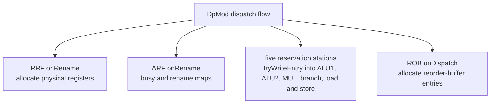
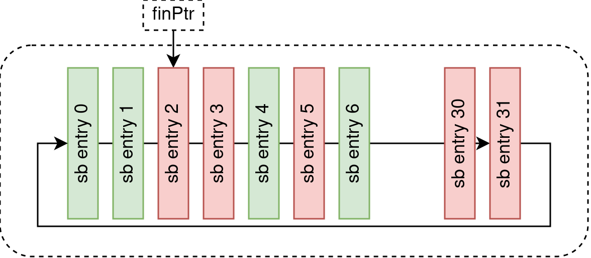

Every structure below lives in `src/example/o3/core/`. This page follows the
same six-stage organization laid out in the [Kride overview](/cppbook/kride/overview/)
and points out where Kathryn's three abstractions show up in real hardware.

## Dispatch fan-out

`DpMod` (`dispatch.h`) is the busiest module: it synchronises with the decoder,
probes the five reservation stations and the RRF for free entries, renames, and
then atomically updates the selected RSV, the ARF, the RRF, and the reorder
buffer. Its `flow()` builds free-index searches for each RSV, forms two
`RenameCmd`s, and — inside a guard on renamability — writes every downstream
structure.



This atomic, multi-target write is exactly the
[Decentralized Update](/cppbook/update/decentralized-update/) story: dispatch,
the broadcast network, and mispredict recovery all write the same
reservation-station and register-file entries, each at its logical origin, and
the framework resolves them by declared priority. The reservation-station base
(`rsv.h`) documents its priority ordering directly in a comment:

```text
|    g1    |    g2                      |          g3
|mispredict|writeEntry > update sort bit| sucPred/bypass/issue
```

## Reorder buffer (ROB)

`Rob` (`rob.h`) is a `Module` wrapping a single `Table`:

```cpp
struct Rob: Module{
    Table _table;
    // ...
    Rob(PipStage& pipStage, RegArch& regArch, StoreBuf& storeBuf):
        _table(smROB, RRF_NUM), /* ... */ {
        _table.makeColResetEvent("wbFin", 0);
        _table.makeColResetEvent("isBranch", 0);
        // ...
    }
    void onDispatch(opr& idx, RegSlot& dpValue, RegSlot& dpShareVal){ /* ... */ }
    void onWriteBack(opr& idx){ _table[idx]("wbFin") <<= 1; }
};
```

The ROB tracks a commit pointer (`comPtr`) and exposes `com1Entry`/`com2Entry`
so it can retire up to two entries per cycle. It is a
[Table](/cppbook/aggregators/tables/) through and through — allocation on
dispatch, `wbFin` set on write-back, and commit driven off the pointer.

## Reservation stations

The five stations live behind one shared base and two variants:

- **`RsvBase`** (`rsv.h`) — the common `Table`-plus-`SlotMeta` machinery: an
  `execSrc` slot, a `SyncPip sync`, `slotReady`, `writeEntry`, and the abstract
  `buildIssue`.
- **`IRsv`** (`irsv.h`) — the in-order variant, used for the branch and
  load/store stations. It keeps an `allocPtr` and uses `searchIdx` to find free
  and ready entries in order.
- **`ORsv`** (`orsv.h`) — the out-of-order variant, used for the two ALU
  stations and the multiplier. It adds a `sortBit` mechanism (`resetSortBit`)
  and `buildFreeIndex`, which can interleave two sibling tables to pick a free
  slot.

`Rsvs` (`rsvs.h`) instantiates them all — `ORsv alu1, alu2, mul;` and
`IRsv br, ls;` — and gathers them into `std::vector<RsvBase*> rsvs`, so
broadcast events (`onMisPred`, `onSucPred`, `buildIssues`) fan out over every
station in a loop. Each station is a [Table](/cppbook/aggregators/tables/) whose
rows are [Slots](/cppbook/aggregators/slots/).

## Register files: ARF and RRF

`RegArch` (`stageStruct.h`) bundles the architectural and rename register files
plus a bypass pool:

```cpp
struct RegArch{
    Arf arf;
    Rrf rrf;
    ByPassPool bpp;
    RegArch(Mpft& mpft): arf(mpft){}
};
```

- **`Arf`** (`arf.h`) — the architectural register file, with rename/commit
  logic driven by `RenameCmd`/`RenamedData` and priority constants
  (`ARF_MIS_PRIORITY` > `ARF_SUC_PRIORITY` > `ARF_REN_PRIORITY` >
  `ARF_COM_PRIORITY`). Those priorities are decentralized-update priorities.
- **`Rrf`** (`rrf.h`) — the rename (physical) register file, a `Table` with a
  free counter (`freenum`), a request pointer (`reqPtr`), and `isRenamable` /
  `onRename` used by dispatch.

## Store buffer

`StoreBuf` (`storeBuf.h`) manages in-flight stores with three pointers —
`finPtr`, `comPtr`, `retPtr` — over a `Table` plus a `daytas` memory. It uses
`searchIdx` for a newest-match lookup and tracks fullness after mispredict kill.



## Broadcast network and tag generation

- **`BroadCast`** (`broadCast.h`) is the bypass/broadcast bus: `mis`/`fixTag`
  for misprediction and `suc`/`sucTag` for correct prediction, with helpers
  `checkIsKill`, `checkIsSuc`, `isBrMissPred`, `isBrSuccPred`. Stations and
  register files subscribe to it, which is how one broadcast reaches many
  writers.
- **`TagGen`** (`tagGen.h`) produces speculative branch tags: a `brdepth`
  counter and a `tagreg`, with `onMisPred`/`onSucPred` shifting the tag and
  `isAllGenble` gating how many new tags can be allocated.
- **`Mpft`** (`mpft.h`), the miss-predict fix table, is a `Table` recording
  which tags need fixing on misprediction (`onPredSuc`, `onMisPred`, `onAddNew`).

`TagMgmt` (`stageStruct.h`) bundles these together:

```cpp
struct TagMgmt{
    BroadCast bc;
    TagGen    tagGen{bc};
    Mpft      mpft;
};
```

## The pipeline itself

The front end runs inside Kathryn [`pip`/`zync`](/cppbook/pipelines/pip-and-zync/)
Hybrid Design Blocks. `FetchMod::flow()` shows the pattern — a `pip` on the
fetch sync wrapping a `zync` on the decode sync:

```cpp
void flow(){
    pip(pm.ft.sync){ autoSync     initProbe(pipProbGrp.fetch);
        zync(pm.dc.sync){          initProbe(zyncProbGrp.fetch);
            selLog();
        }
    }
}
```

`PipStage` (`stageStruct.h`) carries the per-stage sync metas (`sync_dp`,
`sync_rs`, `sync_cm`, and the per-stage `ft`/`dc`/`ldSt` syncs) and the
`onMisPred`/`onSucPred` handlers that kill or hold each stage on a branch
outcome — the in-order front end squashes, the out-of-order back end is left to
drain.

## See also

- [Verification against RIDECORE](/cppbook/kride/verification/)
- [Results and methodology](/cppbook/kride/results/)
- [Tables](/cppbook/aggregators/tables/) and [Slots](/cppbook/aggregators/slots/)
- [Decentralized Update](/cppbook/update/decentralized-update/)
- [pip and zync](/cppbook/pipelines/pip-and-zync/)
