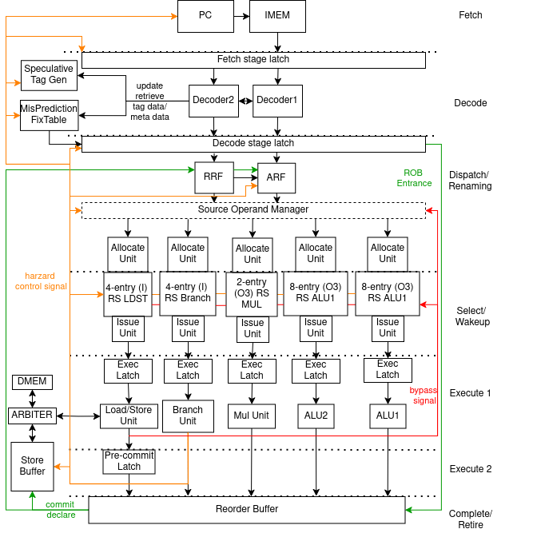
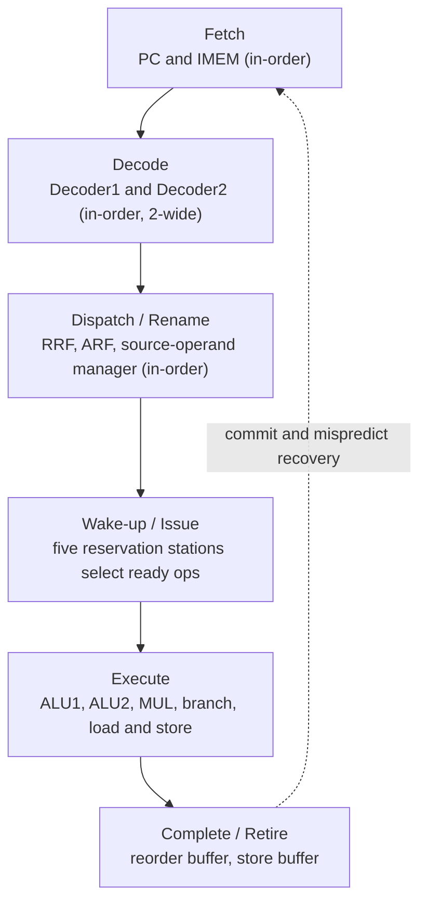

**Kride** (KRIDECORE) is the case study the Kathryn paper builds its evaluation on:
a Kathryn re-implementation of **RIDECORE**, a Verilog out-of-order superscalar
RISC-V processor (<https://github.com/ridecore/ridecore>). RIDECORE was chosen
deliberately for its complex microarchitecture — hazard-aware pipelining,
arbitration across multiple data structures, non-deterministic selection logic,
and intricate semi-FIFO mechanisms. Modeling that complexity in Kathryn shows
the framework can handle advanced designs, and by extension anything with
simpler control flow.

RIDECORE is used largely unmodified — only genuine defects were corrected
(disabling its incorrectly implemented gshare branch predictor and fixing minor
bugs), without altering its intended cycle-accurate microarchitecture. Kride
targets the same RV32 ISA and runs programs compiled with the standard RISC-V
GCC toolchain (excluding system calls).

## Six-stage organization

RIDECORE — and therefore Kride — is an out-of-order superscalar RISC-V CPU with
a **six-stage** pipeline: fetch, decode, dispatch, wake-up, execute, and
complete/retire. The front end (fetch, decode, dispatch) is **in-order** and
issues up to two instructions per cycle; the back end (wake-up, execute,
complete/retire) is **multi-lane**. Branch and load/store instructions execute
in order, while ALU and multiplier instructions execute out of order.





The stage names map directly onto the module tree in `src/example/o3/core/`:
`FetchMod` (`fetch.h`), `DecMod` (`decoder.h`), `DpMod` (`dispatch.h`), the five
reservation stations plus their issue logic (`irsv.h`/`orsv.h`/`rsvs.h`), the
execution units (`execAlu.h`, `execMul.h`, `execLdSt.h`, `execBranch.h`), and
the `Rob` (`rob.h`) with the `StoreBuf` (`storeBuf.h`) at retire.

:::note[Branch prediction]
Branch prediction is **not yet implemented** in Kride. `core/btb.h` and
`core/gshare.h` exist in the tree but are entirely commented out, the
`BTB_ENABLE` macro in `core/parameter.h` is left undefined, and the BTB/gshare
paths in `core/fetch.h` are commented out — the structures are placeholders,
not wired in. The reference RIDECORE runs with its branch predictor disabled
too, so the two cores match in the comparison.
:::

## Repository layout of `src/example/o3/`

The case study lives under one example directory, split by concern:

```text
src/example/o3/
  core/          the microarchitecture — every pipeline stage and data structure
  generation/    O3_gen — drive the model down the Verilog backend
  simulation/    o3_sim, TopSim, slot recorders, sim probes
  simCompare/    cycle-by-cycle co-simulation harness vs. RIDECORE (Verilator)
  countMeasure.py / countCompare.py   the LOC-measurement scripts
```

- **`core/`** holds the microarchitecture itself: the pipeline-stage modules
  and the shared data structures (ROB, reservation stations, register files,
  store buffer, tag generation, broadcast network). `core/core.h` assembles them
  all into one `Core` module.
- **`generation/`** contains `O3_GEN_MNG` (`O3_gen.h`/`.cpp`), which builds the
  model and drives it through Kathryn's
  [Verilog generator](/cppbook/backends/verilog-generation/).
- **`simulation/`** wraps the core in a simulation `TopSim` (`top.h`) with
  instruction/data memory, and adds the slot recorders and sim probes used for
  waveform capture and profiling.
- **`simCompare/`** is the co-simulation harness: a Kathryn-side controller and
  a RIDECORE-side (Verilator) controller run in lockstep and compare
  architectural state each cycle. This backs the 100% cycle-accuracy
  claim.

## Line-count measurement sources

The measurement scripts behind the line-count results live in
[`src/example/o3/count_measure`](https://github.com/Tanawin1701d/Kathryn/tree/phase-8-tcad-major-revised/src/example/o3/count_measure)
on the `phase-8-tcad-major-revised` branch.

## Where to go next

- [Building and running](/cppbook/getting-started/build-and-run/) — how to
  compile and drive a Kathryn design.
