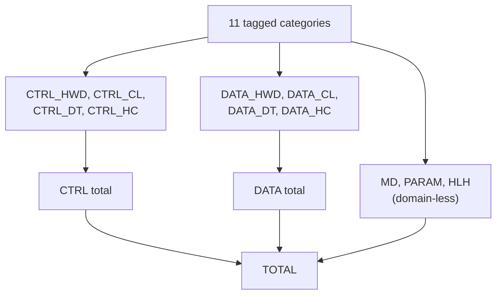
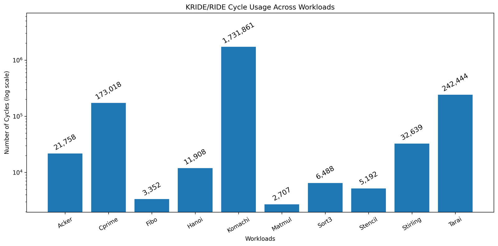

:::note[Provenance]
Every number on this page was **measured on this C++ implementation** of
Kathryn (Kride) against the reference RIDECORE, and is the set of figures
reported in the Kathryn paper (Tables VI and VII). They are reproduced here
verbatim, not recomputed.
:::

## LOC methodology: an 11-category tagging scheme

To quantify manually written RTL objectively, every real code line is classified
into **11 categories** using a language-agnostic rule set applied identically to
the Kathryn C++-embedded HDL and the reference RIDECORE Verilog. The scheme is
the cross-product of two independent axes:

- **Domain** — is the line about a **control** signal or a **data** signal? A
  line's domain is that of its target, decided by looking the identifier up in a
  fixed keyword list of semantic roles rather than by human judgment. (Register
  indices are DATA; rename tags, `rrfIdx`, and pointers are CTRL; op-select
  fields such as `alu_op`/`funct`/`imm_type`/`rsSel` are DATA.)
- **Kind** — declare a hardware primitive (**HWD**), compute a value or express
  control flow (**CL**), move a value without operators (**DT**), or connect an
  interface/port (**HC**).

Crossing two domains with four kinds gives eight categories:
`CTRL_HWD CTRL_CL CTRL_DT CTRL_HC DATA_HWD DATA_CL DATA_DT DATA_HC`. Three
domain-less categories complete the set: module/struct declarations (**MD**),
named constants and parameters (**PARAM**), and host-language scaffolding such
as loops, templates, and generate blocks (**HLH**).

Every physical line in `src/example/o3/core/` carries a trailing `///<CAT>`
tag; there is no first-match priority, so a genuinely mixed line (for example a
port that both connects and computes) is split across categories. Lines marked
`///DC` (debug/instrumentation) are excluded. The measurement scripts live
alongside the code: `countMeasure.py` (per-category counts) and
`countCompare.py` (the side-by-side Kathryn-vs-RIDECORE rollup).

## Lines of code

Table VI of the Kathryn paper — Kride (Kathryn) versus RIDECORE, with the headline
control-flow reduction broken out. `CTRL_HC`, the control hardware-connectivity
category, sees the largest reduction because Hybrid Design Blocks remove the
hand-wired control ports and handshakes.

| Category                      | Kathryn | RIDECORE | Reduction |
| ----------------------------- | ------: | -------: | --------: |
| CTRL_HC (control connectivity)|   290.0 |   1162.5 |    75.05% |
| **CTRL total**                | **736** | **2319** | **68.26%** |
| **DATA total**                | **452** | **1249** | **63.81%** |
| **TOTAL**                     | **1667**| **3894** | **57.19%** |

So Kride uses 68.26%, 63.81%, and 57.19% fewer lines for control, data, and
overall logic respectively. Kathryn does incur overhead in the PARAM category —
Table and Slot fields are accessed through named parameters rather than string
literals, trading a few extra constant definitions for more readable, less
error-prone field access.

## Synthesis (Kria KV260)

Table VII — post-implementation resource utilization from Vivado on the Kria
KV260 platform.

| Resource  | Kride (KRIDE) | RIDECORE (RIDE) | KRIDE vs. RIDE |
| --------- | ------------: | --------------: | -------------: |
| LUT       |         34595 |           39495 |   12.41% fewer |
| LUTRAM    |           265 |             265 |       identical |
| Flip-Flop |         12435 |           12536 |     0.81% diff |
| BRAM      |           6.5 |             6.5 |       identical |

Kride achieves a modest reduction in LUT usage (12.41% fewer). LUTRAM and BRAM
are identical, and flip-flop usage differs by only 0.81%. DSP blocks and BUFGs
are minimally used in both designs and have negligible impact.

## Cycle accuracy

Across all ten workloads, Kride and RIDECORE are **bit-exactly identical** —
100% cycle-accurate — in both simulation and on the FPGA (Kria KV260 + Pynq),
including identical cycle counts. This is produced by the lockstep co-simulation
harness described on the
[Verification](/cppbook/kride/verification/) page.

Per-workload cycle usage (Table VI): Acker 21,758; Cprime 173,018; Fibo 3,352;
Hanoi 11,908; Komachi 1,731,861; Matmul 2,707; Sort3 6,488; Stencil 5,192;
Stirling 32,639; Tarai 242,444.

:::note[Reproducing the decimals]
The per-category counts (and their fractional values, where a mixed line is
split across categories) are recomputable by running `countCompare.py` in the
Kathryn repository — it is the source of truth for the exact decimals, which
drift slightly with edits.
:::

## See also

- [Verification against RIDECORE](/cppbook/kride/verification/)
- [Kride overview](/cppbook/kride/overview/) and
  [Microarchitecture](/cppbook/kride/microarchitecture/)
- [Verilog generation](/cppbook/backends/verilog-generation/)
