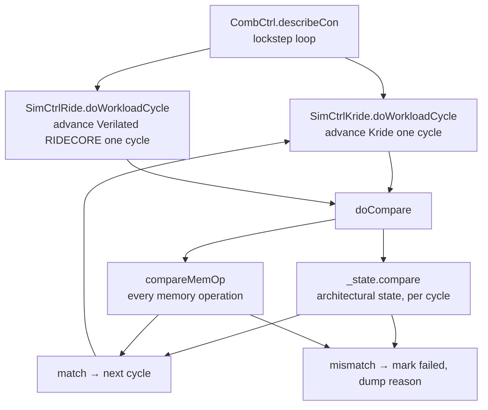

The 100% cycle-accuracy claim is backed by a **co-simulation harness**
in `src/example/o3/simCompare/`. It runs the Kathryn model (Kride) and the
original RIDECORE (via Verilator) in lockstep, advancing both by one cycle at a
time and comparing their architectural state each cycle. Any divergence is
recorded and the test is marked failed.

## The two controllers

Both sides derive from one base class, `O3SimCtrlBase`
(`simCompare/ctrl/simCtrlBase.h`), which owns a `SimState& _state`, the
instruction/data memories, and the per-cycle driver interface
(`doWorkloadInit`, `doWorkloadCycle`, `isExecFin`, `incCycleCnt`):

- **Kathryn side** — `SimCtrlKride` (`simCompare/ctrl/simCtrlKride.h`) drives a
  `TopSim` and its `Core`, i.e. the Kathryn-simulated Kride.
- **RIDECORE side** — `SimCtrlRide`
  (`extSim/ridecore/src/test/ridecoreVer/simCtrlRide.h`) drives a Verilated
  `Vpipeline& _core` (with `Vpipeline_arf`, `Vpipeline_pipeline`, and the
  Verilated 4r2w RAM), i.e. the reference RIDECORE compiled by Verilator.

`CombCtrl` (`simCompare/ctrl/simCtrlComb.h`) is the lockstep driver. It **is** a
`SimCtrlKride` (the master) and holds a `SimCtrlRide& _slaveRide`.



## What is compared

The whole loop lives in `CombCtrl::describeCon`. Each iteration steps both
cores, then calls `doCompare()`:

```cpp
bool CombCtrl::doCompare(){
    bool compareValid = _state.compare(_slaveRide._state);
    compareValid &= compareMemOp(_slaveRide);
    return compareValid;
}
```

Two things are checked every cycle:

1. **Architectural state** — `SimState::compare` (`simCompare/simStateCmp.cpp`)
   walks the pipeline state stage by stage (`Fetch`, `Decode`, `DispInstr`, and
   so on), comparing field by field via `checkAndPrintSimValueUll`. Each side
   populates its own `SimState` from its model; a mismatch prints the offending
   stage, field, and both values to the slot writer.
2. **Memory operations** — `compareMemOp` (declared in `simCtrlBase.h`) checks
   every data-memory operation between the two cores.

When both cores report `isExecFin()`, the workload passed; the loop applies an
optional register test and moves to the next workload. The
`BELAYED_AFTER_MIS_CMP` margin lets the harness capture one extra cycle after a
first mismatch so the divergence is visible in the trace.

:::note[startNode overhead]
Kride incurs a fixed one-cycle overhead per workload due to
Kathryn's `startNode` constraint. The comparison accounts for this; the cores
are otherwise bit-exactly identical.
:::

## Building the harness

The RIDECORE side is behind a CMake option — it is off by default:

```text
option(BUILD_RIDECORE "Enable RideCore integration" OFF)
```

The whole `simCompare/ctrl/simCtrlComb.*` and the `SimCtrlRide` translation unit
are guarded by `#ifdef BUILD_RIDECORE`. To run the co-simulation you need
`BUILD_RIDECORE=ON`, **Verilator** (to Verilate RIDECORE into `Vpipeline`), and
the populated RIDECORE submodule under `extSim/ridecore/`. See
[Building and running](/cppbook/getting-started/build-and-run/).

## The workloads

Both cores are evaluated on **ten workloads** — Fibo, Tarai, Cprime,
Acker, Hanoi, Matmul, Sort3, Stencil, Stirling, and Komachi — compiled with the
standard RISC-V GCC toolchain using a custom linker script. Across all ten, the
two cores are **bit-exactly identical** in simulation, and the same workloads
run on a Kria KV260 + Pynq FPGA deployment produce identical results including
identical cycle counts. The per-workload cycle usage appears on the
[Results](/cppbook/kride/results/) page.

## See also

- [Results and methodology](/cppbook/kride/results/) — the numbers this harness
  produces.
- [Kride overview](/cppbook/kride/overview/) and
  [Microarchitecture](/cppbook/kride/microarchitecture/).
- [Building and running](/cppbook/getting-started/build-and-run/).
