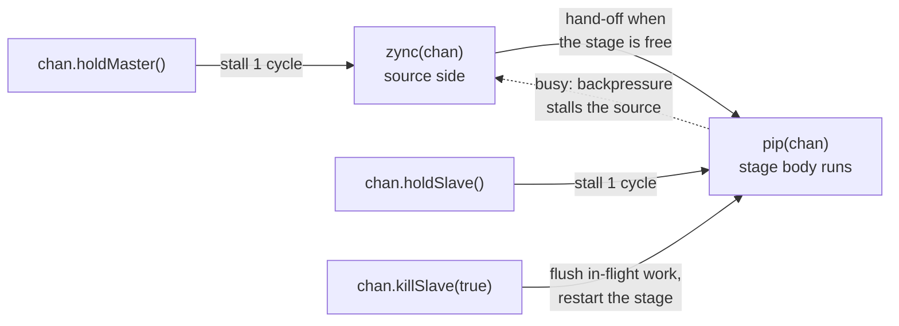

`pip` and `zync` build pipelines. A **`pip`** is a stage: its body — CCOs and
any sub-[HDB](/cppbook/flow/hdb-overview/), taking as many cycles as it needs —
runs when work is handed to it. A **`zync`** is the source side: it hands work
to a `pip` over a shared channel, and the transfer conducts automatically in
the exact cycle the stage can accept it. You never draw valid/ready wires by
hand, and the channel gives you stall and flush commands for hazards.

## Step 1 — declare the channel

Each `zync → pip` connection is one **`SyncMeta`** object, declared as a
module field — directly, or with the `mZync` macro:

```cpp
SyncMeta fetchChan{"fetchChan"};      // as in autoSim simAutoTest50
mZync(decodeChan);                    // same thing: SyncMeta decodeChan{"decodeChan"}
```

:::note
Some repository listings write `PipMeta` / `SyncPip` — `SyncPip` is a small
case-study subclass (`src/example/o3/core/syncMetaPip.h`). The base type is
`SyncMeta`.
:::

## Step 2 — write the stage: `pip(chan)`

```cpp
pip(decodeChan){
   decodeResult <<= fetchResult;   /////// takes  1 cycle
   syWait(10);                     /////// takes 10 cycles
}
```

The body starts when a matching `zync` triggers the channel, runs to
completion (multi-cycle is fine), and the stage is then free to accept the
next hand-off.

## Step 3 — hand work over: `zync(chan)` / `zyncc(chan, cond)`

```cpp
pip(fetchChan){
    seq{
        myFetch <<= do_somthing(src);     ///// takes 1 cycle
        cwhile(x < 10){
            zync(decodeChan){             ///// hand-off to the decode stage
                fetchResult <<= myFetch;
                x <<= x + 1;
            }
        }
    }
}
```

- **`zync(chan){...}`** — conducts when the destination `pip` is free or has
  just completed; the body's assignments happen with the hand-off. If the
  stage is busy, the `zync` waits — backpressure propagates upstream by
  itself.
- **`zyncc(chan, cond){...}`** — conditional hand-off: conducts only when the
  1-bit `cond` holds.

## Stall and flush: the hazard commands

Call these **on the channel**, from wherever the hazard is detected — any
block, including another `pip`'s own body:

```cpp
decodeChan.holdMaster();        // stall the zync (source) side one cycle
decodeChan.holdSlave();         // stall the pip stage one cycle
decodeChan.killSlave();         // flush the stage's in-flight work, same cycle
decodeChan.killSlave(true);     // flush and restart the stage
```

`killSlave(autoRestart, cond)` also takes an optional condition signal, so
the flush can be driven by a computed predicate instead of unconditionally
(`syncMeta.h`).

A complete hazard sequence, from the repository `Readme.md`:

```cpp
seq{
    syWait(10);
    decodeChan.holdMaster();
    decodeChan.killSlave();
}
```

`killSlave` terminates whatever the stage is doing in that same cycle, no
matter how deep or multi-cycle its body is — this is the pipeline flush. With
`autoRestart = true` the stage relaunches immediately after.

## Two-stage picture



## Where to go next

- Orchestrate synchronous stages without hand-written channels:
  [pipStream](/cppbook/pipelines/pipstream/).
- How writes to a shared register resolve when several stages target it:
  [Decentralized update and priority](/cppbook/update/decentralized-update/).
