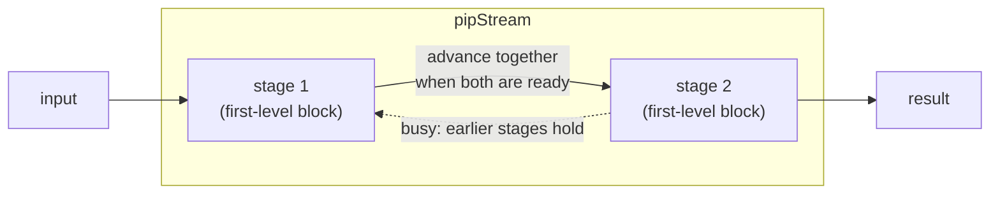

`pipStream` is the highest-level pipeline [HDB](/cppbook/flow/hdb-overview/).
Where [`pip` and `zync`](/cppbook/pipelines/pip-and-zync/) couple stages by
hand through a shared channel, `pipStream` builds the whole pipeline from the
blocks you write inside it: **each first-level block (or CCO) becomes one
pipeline stage**, consecutive stages execute synchronously, and the wait/ready
handshaking between them is generated for you. There is nothing to declare.

## How to use it

Write the stages as first-level blocks, in order. From autoSim
`simAutoTest65`:

```cpp
pipStream{
    seq{                // stage 1
        a <<= a + 1;
        syWait(3);
        b <<= a;
    }

    seq{                // stage 2
        c <<= b;
        syWait(6);
        d <<= c;
    }
}
```

The two `seq` blocks are the two stages. They do **not** need equal latency —
here stage 2 is slower than stage 1 — because stages advance by *readiness*: a
finished stage waits for its neighbour, and a busy stage holds the stages
before it back automatically.

Rule of thumb: only **first-level** blocks count as stages. Anything nested
inside a stage (`par`, loops, waits) is that stage's internal, possibly
multi-cycle, behavior.

## A variable-latency example

Here a two-stage design squares two Newton-Raphson square roots and
multiplies them. The square root is an ordinary C++ helper that stamps HDBs
into whatever stage calls it, and its `cdowhile` runs a data-dependent number
of iterations — the stage still synchronizes correctly:

```cpp
void sqrtInt(Operable& x, Reg& y){
    int bs = x.getOperableSlice().getSize();
    mReg(xc, bs);
    seq{
        par{ xc <<= x; y <<= x;}
        Operable& yNext = (y + xc/y) >> 1;   // = is not a CCO: it drives no resource
        cdowhile(yNext < y){
            y <<= yNext;
        }
    }
}

void pipstream(Reg& instr){
    mReg(result, 32);
    pipStream{
        auto& [d1, d2] = decode(instr);      // stage 1: decode to operands
        seq{                                  // stage 2: two sqrts, then multiply
            mReg(r1, 32); mReg(r2, 32);
            par{
                sqrtInt(d1, r1); sqrtInt(d2, r2);
            }
            result <<= r1 * r2;
        }
    }
}
```

The first-level blocks are the `decode(...)` line and the following `seq` —
one stage each. The `par` and `cdowhile` inside the `seq` are stage 2's
internal behavior, and the `yNext` temporary costs no cycle.

## Stage orchestration



## Where to go next

- The lower-level, channel-coupled form:
  [pip and zync](/cppbook/pipelines/pip-and-zync/).
- How a stage's writes to a shared resource resolve:
  [Decentralized update and priority](/cppbook/update/decentralized-update/).
