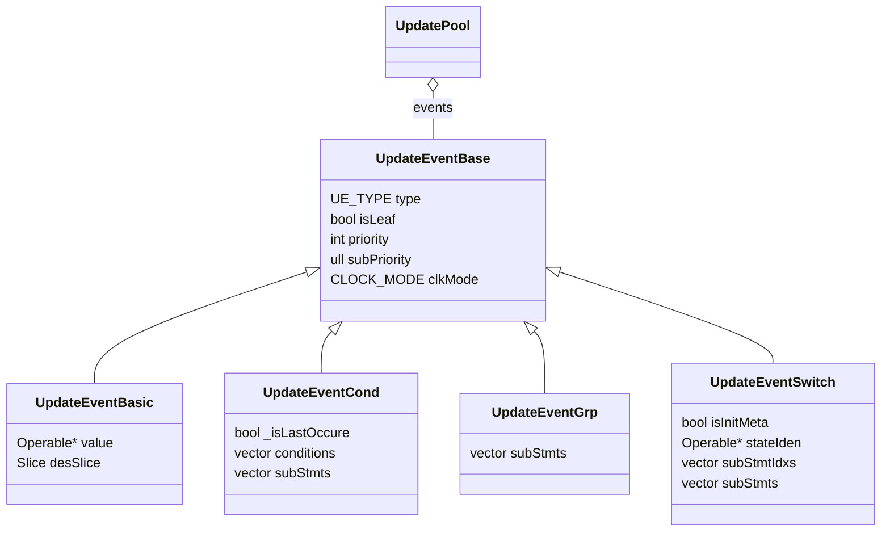

This page gives the complete Driven Logic Structure of the C++ Kathryn — the
struct hierarchy that represents every update a design performs on a hardware
resource. The full listing and per-struct field walk-through live here.

Every assignment a designer writes (`<<=` or `=`) becomes an **update event**
attached to the target resource's **update pool**. Composing `UpdatePool` and
`UpdateEventBase` — with no centralized control logic anywhere — is what
implements [Decentralized Update](/cppbook/update/decentralized-update/).

## Full struct hierarchy

```cpp
enum CLOCK_MODE { CM_POSEDGE, CM_NEGEDGE, CM_CLK_FREE };

struct UpdatePool { vector<UpdateEventBase*> events; };

struct UpdateEventBase {                 // base of all update events
    UE_TYPE    type;
    bool       isLeaf;
    int        priority;
    ull        subPriority;
    CLOCK_MODE clkMode;
};
struct UpdateEventBasic  : UpdateEventBase {   // direct value assignment
    Operable* value;                            //   source expression
    Slice     desSlice;                         //   destination bit range
};
struct UpdateEventCond   : UpdateEventBase {   // conditional guard on a sub-block
    bool _isLastOccure;
    vector<Operable*>        conditions;        //   primary + chained (else-if) conditions
    vector<UpdateEventBase*> subStmts;          //   events in the guarded block
};
struct UpdateEventGrp    : UpdateEventBase {   // group of events in one lexical block
    vector<UpdateEventBase*> subStmts;
};
struct UpdateEventSwitch  : UpdateEventBase {  // multi-branch, single selector
    bool      isInitMeta;
    Operable* stateIden;
    vector<int>              subStmtIdxs;       //   matching case indices
    vector<UpdateEventBase*> subStmts;          //   events per case
};
```



## Field walk-through

**`CLOCK_MODE`** — when the event fires: on the positive clock edge
(`CM_POSEDGE`), the negative edge (`CM_NEGEDGE`), or combinationally with no
clock (`CM_CLK_FREE`, the level-assignment case).

**`UpdatePool`** — one per writable hardware resource; it simply collects
every `UpdateEventBase*` that targets that resource, wherever in the design
the assignment was written.

**`UpdateEventBase`** — the base of all update events:

- `type` — the concrete event kind (`UE_TYPE` discriminator).
- `isLeaf` — whether this event is a leaf (a direct assignment) or an inner
  node that guards or groups sub-events.
- `priority` / `subPriority` — the resolution order when several events in
  the same pool fire in the same cycle; see
  [Decentralized update and priority](/cppbook/update/decentralized-update/).
- `clkMode` — the `CLOCK_MODE` above.

**`UpdateEventBasic`** — a direct value assignment: `value` is the source
expression tree ([`Operable`](/cppbook/reference/operators/)), and `desSlice`
is the destination bit range of the target resource.

**`UpdateEventCond`** — a conditional guard around a sub-block: `conditions`
holds the primary condition plus any chained (else-if) conditions, and
`subStmts` holds the events inside the guarded block. `_isLastOccure` marks
the final branch of the chain.

**`UpdateEventGrp`** — groups the events of one lexical block so they share
structure (and priority context) without any guard of their own.

**`UpdateEventSwitch`** — a multi-branch selector on a single value:
`stateIden` is the selector expression, `subStmtIdxs` the matching case
indices, and `subStmts` the events per case. `isInitMeta` flags metadata
initialization.

## Why this covers synthesizable Verilog

These abstractions cover all block structures of the Verilog-equivalent
control constructs — direct assignment, `if`/`else if` chains, lexical
`begin`/`end` grouping, and `case` selection — i.e., the majority of
synthesizable Verilog control/update constructs. Decentralized update follows
from composing `UpdatePool` and `UpdateEventBase` without centralized control
logic: the [Verilog generator](/cppbook/backends/verilog-generation/) lowers
each pool independently into `always` blocks.
