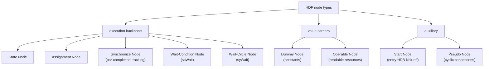

Kathryn elaborates every [Hybrid Design Block](/cppbook/flow/hdb-overview/)
(HDB) into a graph of **nodes**. The three central node types are Assignment,
State, and Synchronize; this page covers the complete mechanism of every
node type, including the State Node's formal execution model.

## The nine node types

Each node type below carries a distinct role in the elaborated graph. Three of
them — Assignment, State, and Synchronize — do the bulk of
the work; the remaining six are structural or value-carrying helpers.

### 1. Assignment Node

A designer-issued assignment (`<<=` or `=`) to a fundamental resource or a
hardware aggregator. It carries metadata such as the target `UpdatePool` and the
associated `UpdateEvent` (see
[Driven Logic Structure](/cppbook/reference/driven-logic-structure/)). An
Assignment Node does not write its target directly: it belongs to a State Node,
and when that state's operation status asserts, the node's update event is
pushed into the target's pool, where
[decentralized priority resolution](/cppbook/update/decentralized-update/)
decides the committed value. This is the graph-level counterpart of every
[Cycle-Considered Operation](/cppbook/core/assignments-and-expressions/) a
design writes.

### 2. State Node

The backbone of most HDBs and the atomic element of the HDF state machine. Each
HDB instantiates its own State Nodes, and a State Node represents a single state
— it orchestrates the internal nodes it owns and defines their execution
conditions and connections. When a state is active it fires its Assignment
Nodes and evaluates its outgoing dependencies to decide the next state. Its
precise behavior is given by the [formal execution model](#formal-execution-model)
below (the `os`/`exit` signals over a dependency set, with hold, interrupt-start,
and interrupt-reset inputs).

### 3. Synchronize Node

Used by [`par`](/cppbook/flow/seq-and-par/) HDBs when the cycle usage of the
parallel sub-blocks cannot be determined statically. It adds auxiliary hardware
to track when each sub-block has completed and synchronizes them **without
spending extra cycles**, so a `par` block advances as soon as its slowest branch
finishes rather than waiting a fixed, pessimistic number of cycles.

### 4. Pseudo Node

A placeholder that supports cyclic node connections. When a connection must be
recorded but its target node has not yet been instantiated — for example a
backward edge that closes a loop — a Pseudo Node stands in for the target and is
resolved to the real node once it exists. It carries no hardware of its own.

### 5. Dummy Node

Represents a constant value inside the node graph, so that literal constants can
participate in conditions and assignment sources like any other operand.

### 6. Operable Node

Represents a readable hardware resource — anything derived from `Operable`, such
as a register, wire, expression, or slot field. It is how a resource's current
value is fed into a condition or an assignment's right-hand side; the
[operator expressions](/cppbook/reference/operators/) a design builds are trees
of Operable Nodes.

### 7. Start Node

Auto-generated to initiate execution of the entry HDB. It provides the initial
trigger that moves the top-level state machine into its first state when the
design starts.

### 8. Wait-Condition Node

Stalls execution until a Boolean condition is satisfied. It is what the
[`scWait(cond)`](/cppbook/flow/waits/) construct elaborates into: the owning
state holds — re-triggering itself through its hold input — until the condition
becomes true, then proceeds.

### 9. Wait-Cycle Node

Stalls for a fixed number of cycles using a counter and its control logic. It is
what [`syWait(N)`](/cppbook/flow/waits/) elaborates into: the state holds for
exactly `N` cycles before continuing.

## The State Node

The State Node is the atomic element of the HDF state machine; each HDB
instantiates its own State Nodes to orchestrate internal nodes and define
their execution conditions and connections.

## Formal execution model

The State Node's behavior is defined over the node graph as follows:

- Node set: <i>G</i> = {<i>n</i>1, <i>n</i>2, …,
  <i>n</i>k}
- Current state node (tuple):
  <i>n</i>sc = (<i>D</i>cs, <i>n</i>h,
  <i>n</i>is, <i>n</i>ir) — dependency set
  <i>D</i>cs; hold <i>n</i>h; interrupt-start
  <i>n</i>is; interrupt-reset <i>n</i>ir.
- Exit(<i>n</i>i, <i>t</i>) ∈ {true, false} — node
  <i>n</i>i finishes at cycle <i>t</i>.
- <i>B</i>(<i>c</i>, <i>t</i>) ∈ {true, false} — Boolean condition <i>c</i> at
  cycle <i>t</i>.
- Dependency set: <i>D</i>cs = {(<i>c</i>, <i>n</i>i) |
  <i>n</i>i ∈ <i>G</i>}.
- Dependency activation:
  Dincs(<i>c</i>, <i>n</i>, <i>t</i>) =
  <i>B</i>(<i>c</i>, <i>t</i>) ∧ Exit(<i>n</i>, <i>t</i>), for
  (<i>c</i>, <i>n</i>) ∈ <i>D</i>cs.
- Operation status:

  <i>os</i><i>n</i>cs(<i>t</i>) = 
  &nbsp;&nbsp;&nbsp;&nbsp;true,&nbsp;&nbsp; if
  ∃ (<i>c</i>, <i>n</i>) ∈ <i>D</i>cs
  [ Din(<i>c</i>, <i>n</i>, <i>t</i>−1) ]
  ∨ Exit(<i>n</i>is, <i>t</i>−1)
  ∨ Exit(<i>n</i>h, <i>t</i>−1) 
  &nbsp;&nbsp;&nbsp;&nbsp;false,&nbsp; otherwise

- Exit status:
  <i>exit</i><i>n</i>cs(<i>t</i>) =
  <i>os</i><i>n</i>cs(<i>t</i>) ∧
  Exit(<i>n</i>ir, <i>t</i>).

**Meaning:** <i>os</i> (operation status) asserts when a preceding node, an
interrupt-start node, or a hold node fired in the previous cycle, and triggers
the state's Assignment Nodes; <i>exit</i> gates <i>os</i> with the
interrupt-reset signal and drives state transitions.

:::note
The hold input (<i>n</i>h) lets a state re-trigger itself — the
mechanism behind stalling constructs — while the interrupt-start /
interrupt-reset pair (<i>n</i>is, <i>n</i>ir) lets
enclosing blocks such as [pipelines](/cppbook/pipelines/pip-and-zync/) start
or squash a state from outside its normal predecessor chain.
:::
