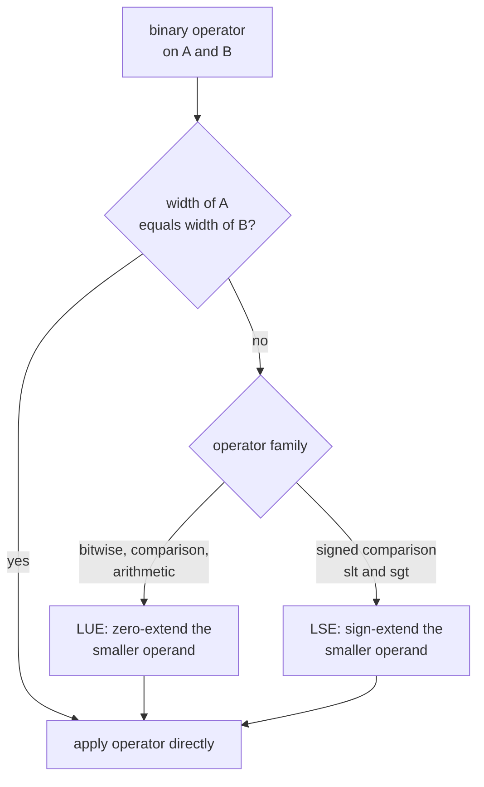

This page is the full operator reference for the original C++ Kathryn.
Every readable hardware resource (register, wire, expression, value, slot
field) derives from `Operable`
(`src/model/hwComponent/abstract/operable.h`), and the operators below
combine `Operable` values into expression trees that elaborate to
combinational logic. Applying an operator computes nothing at elaboration
time — it records an `expression` node in the model.

## Operator table

| Operator | Command | Mismatch handling |
| --- | --- | --- |
| Bitwise AND, OR, XOR | `A & B`, `A \| B`, `A ^ B` | LUE |
| Bitwise NOT, Shifts | `~A`, `A << B`, `A >> B` | — |
| Logical AND, OR, NOT | `A && B`, `A \|\| B`, `!A` | — (1-bit operands) |
| Comparison | `A == B`, `A != B`, `A < B`, `A <= B`, `A > B`, `A >= B` | LUE |
| Signed Cmp. | `A.slt(B)`, `A.sgt(B)` | LSE |
| Arithmetic | `A + B`, `A - B`, `A * B`, `A / B`, `A % B` | LUE |
| Bit Extend | `A.extB(C)`, `A.uext(C)`, `A.sext(C)` | — |

## Operand typing

The three operand kinds in the table follow fixed rules:

- **`A`** — any Kathryn hardware resource (anything derived from `Operable`).
- **`B`** — a hardware resource **or** a plain C++ integer. Every binary
  operator has an integer overload (`operableConOv.cpp`); the integer is
  lifted to a constant sized to the signal operand's width. Because the
  overloads are member operators, the integer form works only on the
  **right-hand side**: `a + 5` builds hardware, `5 + a` does not compile.
- **`C`** — a plain C++ integer only. Extension widths must be known when the
  model is built.

## Width-mismatch handling: LUE and LSE

When the two operands of a binary operator have different bit widths, Kathryn
warns, then extends the *smaller* operand before applying the operator:

- **LUE** — *less-width unsigned extension*: the smaller operand is
  **zero-extended** to the larger width. Used by the bitwise, comparison, and
  arithmetic families.
- **LSE** — *less-width signed extension*: the smaller operand is
  **sign-extended** to the larger width. Used by the signed comparisons
  `slt` / `sgt`.

Operators marked "—" take no automatic extension: shifts and bitwise NOT
operate on `A`'s width directly, the logical family (`&&`, `||`, `!`) expects
**1-bit operands** (the framework warns otherwise) and yields a 1-bit result,
and the bit-extend family (`extB`, `uext`, `sext`) *is* the explicit extension
mechanism.



## Operator by operator

Everything below is verified against the implementations in
`src/model/hwComponent/abstract/operable.cpp`.

### Bitwise `&`, `|`, `^`

```cpp
a & b
a & 0x0C        // integer mask on the right
(a ^ b) | c
```

Bit-by-bit AND, OR, XOR. Mismatched operand widths are LUE-balanced, and the
**result is as wide as the wider operand**.

### Bitwise NOT `~`

```cpp
~a
```

Unary invert. The result keeps `A`'s width.

### Shifts `<<`, `>>`

```cpp
a << 2
a >> shamt      // shift amount can be a signal
```

Logical shift of `A` by `B` bits. There is no width balancing between `A` and
`B` — `B` is a shift *amount*, not a lane — and the **result keeps `A`'s
width**. The framework warns when the shift-amount signal is wider than
6 bits (shift distances of 64 and beyond).

### Logical `&&`, `||`, `!`

```cpp
(a == 1) && (b == 0)
!done
```

Boolean combinators for conditions. Both operands are expected to be
**1 bit** (the framework warns otherwise), and the result is 1 bit. Typically
used to combine comparison results inside HDB conditions such as `cif(...)`
or `cwhile(...)`.

### Comparison `==`, `!=`, `<`, `<=`, `>`, `>=`

```cpp
a == b
a != 0
freenum >= req2.uext(2) + 1
```

Relational comparison producing a **1-bit** result. Mismatched widths are
LUE-balanced, so the plain operators compare **unsigned**. For signed
ordering use `slt` / `sgt` below.

### Signed comparison `slt`, `sgt`

```cpp
a.slt(b)        // signed a <  b
a.sgt(b)        // signed a >  b
```

Signed less-than and greater-than. Mismatched widths are **LSE**-balanced
(the smaller operand is sign-extended), and the result is 1 bit. These two
are the only signed forms — there is no signed `<=`, `>=`, or `==` variant.

### Arithmetic `+`, `-`, `*`, `/`, `%`

```cpp
a <<= a + 1;
d <<= c + d;
r = a % 10;
```

Addition, subtraction, multiplication, integer division, and remainder.
Operands are LUE-balanced, and the **result carries the left operand's
declared width** — values wrap at that width, exactly as the emitted Verilog
does. `/` is integer division; there is no fractional type. There is also no
unary negation operator on `Operable`.

### Bit extension `extB`, `uext`, `sext`

```cpp
req2.uext(2)                    // zero-extend req2 up to 2 bits wide
result = g(instr(25, 32), instr(21, 25), instr(20)).sext(DATA_LEN);
valid.extB(DATA_LEN)            // replicate a 1-bit flag across DATA_LEN bits
```

The explicit width tools; `C` is the **target** width in bits:

- **`A.uext(C)`** — zero-extend `A` to `C` bits. `C` must be strictly greater
  than `A`'s width (asserted).
- **`A.sext(C)`** — sign-extend `A` to `C` bits by replicating its MSB. `C`
  must be strictly greater than `A`'s width (asserted).
- **`A.extB(C)`** — `A` must be exactly **1 bit** (asserted); the bit is
  replicated `C` times. Useful for turning a flag into a full-width mask.

## Where operators are used

Operator expressions appear on the right-hand side of both
[assignment forms](/cppbook/core/assignments-and-expressions/) — the edge
assignment `<<=` and the level assignment `=` — and inside the condition
position of the [flow-control blocks](/cppbook/flow/hdb-overview/) such as
`cwhile(...)`, `cif(...)`, and `scWait(...)`. Operands can also be
[bit slices](/cppbook/core/hardware-resources/) like `instr(25, 32)`, which
are readable operands themselves.
