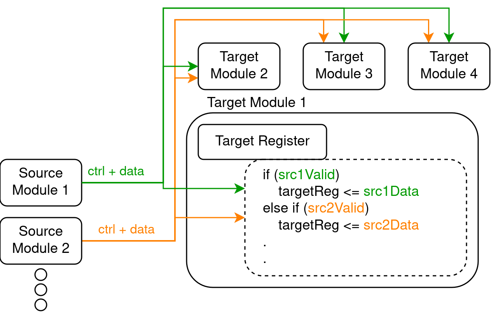
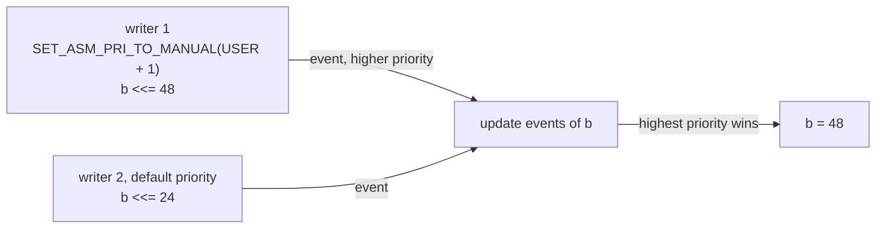

**Decentralized Update** is the second of Kathryn's three abstractions. Its
promise is simple: *any block, anywhere, may update a resource.* An assignment
does not mutate a register directly and it does not have to be funneled into a
single hand-written driver. Instead each `<<=` (Edge Assignment) or `=` (Level
Assignment) records an **update event** on the target resource, and the
framework resolves competing writes by priority.



## How competing writes resolve

- Ordinary user writes all carry the same default priority
  (`DEFAULT_UE_PRI_USER`).
- When several writes hit the same resource in the same cycle, the **highest
  priority wins**.
- A **reset** event outranks every user write — a held reset pins the
  register to its reset value no matter who else is writing.

## Minimal example

To rank one write above another, bracket it with
`SET_ASM_PRI_TO_MANUAL(p)` / `SET_ASM_PRI_TO_AUTO()`. From autoSim
`simAutoTest63`:

```cpp
SET_ASM_PRI_TO_MANUAL(DEFAULT_UE_PRI_USER + 1);  // rank the next write higher
b <<= 48;
SET_ASM_PRI_TO_AUTO();                           // back to the default
b <<= 24;
```

Both writes target `b` in the same cycle; the bracketed one has the higher
priority, so `b` becomes 48.

The two writers do **not** have to sit next to each other — that is the point
of the abstraction. Any two blocks can write the same resource from wherever
they are, each with its own priority, and no central FSM ever owns the
resource's writes.



## Where to go next

- The event structs and pool machinery behind this, for contributors:
  [Driven Logic Structure](/cppbook/reference/driven-logic-structure/).
- Stages that write shared resources like this:
  [pip and zync](/cppbook/pipelines/pip-and-zync/).
