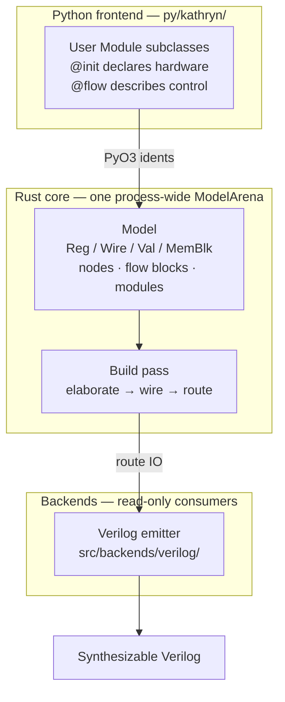

Kathryn2 is a Rust RTL hardware compiler with a Python frontend. The user
describes digital hardware at the register-transfer level through a structured
programmatic API — registers, wires, state machines, update events, modules,
and control-flow graphs — and Kathryn2 compiles that model into clean,
simulatable Verilog.

It is deliberately **not** a high-level synthesis (HLS) tool: it does not infer
micro-architecture from algorithmic code. The user explicitly constructs the
hardware model; the compiler's job is to elaborate, wire, route, and emit it.

:::caution[Rewrite status]
This devbook documents the internals of the **Rust + Python rewrite** of
Kathryn. The rewrite is under active development — some subsystems of the C++
original are not yet ported, and it has not yet been verified to the standard
of the paper's evaluation. The paper-evaluated, verified implementation is the
C++ version — see the
[Kathryn C++ book](/cppbook/getting-started/introduction/).
:::



## Design goals

The Rust port diverges from its C++ ancestor wherever raw-pointer ownership,
virtual inheritance, or unchecked aliasing would be required. Four goals drive
every structural decision in the codebase:

1. **Memory safety without `unsafe`.** Every model object has exactly one
   owner — the central [`ModelArena`](/devbook/core/model-arena/). All
   cross-references are lightweight `Copy` ident handles
   (see [the Ident pattern](/devbook/core/ident-pattern/)), never raw pointers,
   `Rc`, or `RefCell`.
2. **Scalable dispatch without pervasive `match`.** Adding a new hardware
   component or update-event type touches exactly one `match` arm; everything
   above that layer uses trait-object polymorphism
   (see [Dispatch](/devbook/core/dispatch/)).
3. **Deterministic compilation.** The model is built in a deterministic order
   driven by a *module trace stack* and a *flow-block init stack* on the arena.
4. **Backend isolation.** The Verilog emitter lives entirely under
   `src/backends/verilog/` and never mutates the core data model, so
   alternative backends (VHDL, simulation) are straightforward to add.

## Crate layout

All code lives in a single library crate (`src/lib.rs`). The native binary
(`src/main.rs`, bin name `kathryn_cli`) is a thin shell over it, and the PyO3
extension (module `kathryn._kathryn`) is built from the same library via
maturin. PyO3 is an **optional** dependency behind the `python` Cargo feature,
so the default `cargo build` compiles zero PyO3 macros.

```
src/
  common/          ArenaGroup<T>, ArenaHandle, ArenaNode<T> — the generational
                   arena primitive (arena_base.rs)
  model/           the core data model
    common/          IdentBase, Identifiable trait, GLOBAL_MODEL_ID
    controller/      ClockMode policy + the asm-priority thread-local
    hw_component/    Reg / Wire / Val / IoWire / MemBlk / Expression / sp_regs,
                     update events, UpdatePool, Slice, AssignMeta
    nodes/           the nine control-flow node types (AsmNode, StateNode, ...)
    flow_block/      flow-block types (seq / par / cond / loops / wait /
                     pipeline / zync / pick) and their wiring schematics
    module/          Module + ModuleIdent hierarchy
    complex_hardware/ the CCPs — arb/, karray/, dyn_counter/, plus common/
    model_arena.rs   ModelArena — every ArenaGroup field
    arena_impl.rs    ModelArena::new / reset, module CRUD, trace stacks
  backends/        model consumers (read + elaborate, never redesign)
    common/          graph.rs (module DFS + LCA), io_op.rs (IoWire helpers),
                     internal_routing.rs + glob_routing.rs (the two routing passes)
    verilog/         HcpBaseVb / VerilogUpdateEvent traits, per-type emitters
  applications/    the PyO3 binding layer (feature-gated, mirrors src/model/)
    py/
  debug/           debug flag/config system
  params/          compile parameters
  util/            file and math helpers
py/kathryn/        the pure-Python DSL that wraps the binding
```

The per-category `arena_factory_*.rs` / `arena_impl_*.rs` files that extend
`ModelArena` sit next to the types they manage — for example
`src/model/hw_component/arena_impl_hwc.rs` and
`src/model/nodes/arena_factory_node.rs`. See
[Factories & CRUD](/devbook/core/factories-and-crud/) for the full map.

## The three build phases

Every module passes through three initialisation stages, tracked per module on
the arena's `module_trace_stack`. The enum lives in
`src/model/model_arena.rs`:

```rust
#[derive(Clone, Copy, Debug, PartialEq, Eq)]
pub enum ModuleInitStage {
    CompInit,
    FlowBlockInit,
    FlowBlockBuild,
}
```

1. **`CompInit`** — hardware components are created through the factory API
   and registered directly into the module on top of the trace stack.
2. **`FlowBlockInit`** — flow blocks are assembled and nested; finished blocks
   attach either to their parent block or, at the top level, to the module.
3. **`FlowBlockBuild`** — the build pass synthesises the node graph into real
   hardware (state registers, trigger expressions, update events). HCPs
   created during this stage are buffered in `hcp_pending_buffer` and drained
   into the owning module when the pass ends.

Factory methods route new components by the current stage — see
`stamp_hw_to_parent_module` in `src/model/hw_component/arena_factory_hwc.rs`:
during `CompInit`/`FlowBlockInit` the component goes straight into the module,
during `FlowBlockBuild` it is buffered.

## The full pipeline: Python declaration → Verilog

A user design travels through five layers:

```python
# 1. Declare — pure-Python DSL (py/kathryn/)
set_top(Top())    # register the user's top Module (its @init ran eagerly)
gen_flow()        # 2. Construct every module's deferred @flow blocks
build_flow()      # 3. Host build pass over the whole module tree

# 4-5. Route IO and emit Verilog
backend = BackendVerilog(arena)
backend.emit("out_dir", "top")
```

1. **Declaration (Python DSL, `py/kathryn/`).** `Module` subclasses declare
   hardware in `@init` methods (run eagerly at construction, inside a module
   scope on the trace stack) and control flow in `@flow` methods (deferred
   into a process-wide pool). Every DSL wrapper holds only a Rust ident; all
   state lives in one process-wide `ModelArena`.
2. **Flow construction (`gen_flow()`).** Each registered flow method re-opens
   its module's scope at `FlowBlockInit` and builds its flow-block tree via
   `initialize_flow_block` / `finalize_flow_block`
   (`src/model/arena_impl.rs`).
3. **Model build (`build_flow()`).** `ModelArena::build_flow`
   (`src/model/arena_impl.rs`) takes the top module out of the arena and calls
   `Module::build_flow_as_top_module`, which creates the primitive `clk` /
   master-reset input wires and the start node, builds every flow block's
   hardware (`FlowBlockBase::build_common_hw` → `build_hw_component`), and
   recurses into sub-modules. This call is **not re-runnable** — it asserts a
   fresh start node.
4. **Cross-module IO routing.** `route_and_remap_io_model`
   (`src/backends/common/internal_routing.rs`) walks the module tree, finds
   cross-module signal references, threads `IoWire` chains through the
   hierarchy, and rewrites every dependency handle to point at the local IO
   wire. See [IO Routing](/devbook/backend/io-routing/).
5. **Verilog emission.** `BackendVerilog` takes ownership of the arena (the
   Python wrapper `PyBackendVerilog` in
   `src/applications/py/backends/verilog/backend_py.rs` moves it out with
   `std::mem::replace`) and emits the module tree through the `HcpBaseVb` /
   `VerilogUpdateEvent` trait pair. See
   [Verilog Emission](/devbook/backend/verilog-emission/).

:::note
Some subsystems of the original C++ Kathryn are not yet ported: the
controller-driven build orchestration (`src/model/controller/` holds only
`clock_mode.rs` and `asm_mode.rs`), `Nest`/`Box`/`ModelInterface`, and the
simulation/debugger stack (`ModuleSimEngine`, `ModelDebugger`). Do not assume
they exist on the Rust side.
:::

## Where to go next

**Core infrastructure** — the mechanics everything else is built on:

- [The Model Arena](/devbook/core/model-arena/) — generational slots, why
  dangling handles are impossible.
- [The Ident Pattern](/devbook/core/ident-pattern/) — copy-by-value handles,
  `IdentBase`, the `_i` naming convention.
- [Factories & CRUD](/devbook/core/factories-and-crud/) — `make_*`/`mk_*`
  factories and the per-category `arena_impl_*` CRUD surface.
- [Dispatch](/devbook/core/dispatch/) — trait-object dispatch, the
  single-match rule, compile-enforced type lists.
- [Memory Model](/devbook/core/memory-model/) — ownership, take/replace-back,
  reset, global IDs.

**The model** — the hardware description itself:

- [Hardware Components](/devbook/model/hw-components/)
- [Module System](/devbook/model/module-system/)
- [Flow Blocks](/devbook/model/flow-blocks/)
- [Update Events & Priority](/devbook/model/update-events-and-priority/)
- [Complex Hardware (CCPs)](/devbook/model/complex-hardware/)

**Backend and bindings:**

- [Verilog Emission](/devbook/backend/verilog-emission/)
- [IO Routing](/devbook/backend/io-routing/)
- [Python Layer](/devbook/bindings/python-layer/)
- [Debug System](/devbook/tooling/debug-system/)
- [Conventions](/devbook/contributing/conventions/)
