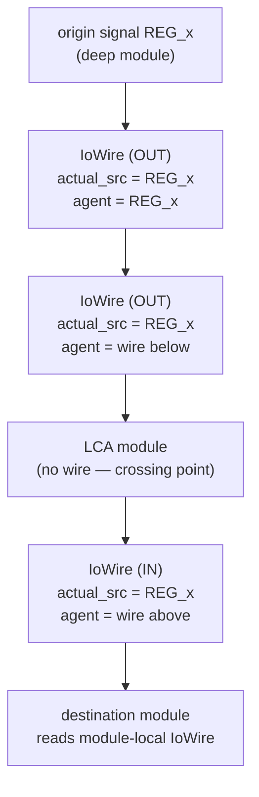
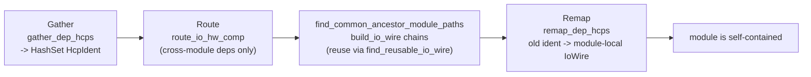

In hand-written Verilog, a signal crossing a module boundary needs an
`input`/`output` port at every level it passes through. Kathryn2 lets the user
reference any signal from any module during construction and defers the port
plumbing to the backend: **Phase 1** of `BackendVerilog::emit` runs two routing
passes that insert `IoWire` chains and rewrite every affected handle.

## IoWire recap

`IoWire` (`src/model/hw_component/io_wire.rs`) is the HCP that models one port
of one module:

```rust
pub struct IoWire {
    assign             : HcpAssign,
    ident              : HcpIdent,
    bit_width          : i32,
    is_input           : bool,
    actual_src_signal_i: Option<HcpIdent>, // the ORIGIN signal — reuse anchor
    agent_src_signal_i : Option<HcpIdent>, // the immediate driver at THIS level
    explicit_name      : Option<String>,   // user-facing port name (None = auto)
}
```

The two source handles are the key idea. In a chain that carries `REG_x` from a
deep module up and across, *every* IoWire in the chain stores `REG_x` as its
`actual_src_signal_i`, while `agent_src_signal_i` points at the previous hop
(the wire one level below on the output side, one level above on the input
side). Reuse detection (`matches_signal(actual, is_input)`) is therefore
anchored to the origin regardless of hop count, and emission can always ask
"who drives this port here?" via the agent.

Construction binds the agent as a normal update event
(`bind_src(agent_src_i, …)` in `new_opt_src`), so an IoWire participates in
dependency gathering and always-block emission like any other combinational
HCP.



Direction marks on ordinary HCPs are separate: `mark_as_io(is_input, io_name)`
stamps an `HcpIoMark { is_input, io_name }` (`hcp_assign.rs`) on a reg/wire the
user wants exposed at the **top level**. Marks are input to the *global*
routing pass below; `Module::gather_io_marked_hcps` collects them.

## io_op.rs — IoWire helpers

`src/backends/common/io_op.rs` provides the three primitives both passes use:

```rust
/// Creates an IoWire in target_module. Pushes the module onto the trace stack
/// at CompInit so the wire registers to the right module, pops on return.
pub fn build_io_wire(arena, target_module: ModuleIdent,
                     actual_src_signal: HcpIdent, agent_src_signal: HcpIdent,
                     is_input: bool) -> HcpIdent

/// Like build_io_wire but sources are optional and bit_width explicit;
/// used for input chains whose top port has no driver yet.
pub fn build_io_wire_opt_src(arena, target_module, bit_width: i32,
                             actual_src_signal: Option<HcpIdent>,
                             agent_src_signal : Option<HcpIdent>,
                             is_input: bool) -> HcpIdent

/// Search target module's registered IoWires (user + internal) for one that
/// already binds actual_src_signal in the requested direction.
pub fn find_reusable_io_wire(arena, module, actual_src_signal, is_input)
    -> Option<HcpIdent>
```

Generated port names follow `IO_IN_<abs_name>` / `IO_OUT_<abs_name>` of the
actual source (or `IO_IN_anon` for source-less input chains).
`find_reusable_io_wire` is consulted before `build_io_wire` at every hop of the
internal pass, so the same `(actual_src, direction)` pair is never routed
twice through a module.

## graph.rs — traversal and ancestor paths

`src/backends/common/graph.rs` supplies the module-tree utilities:

```rust
/// Lazy pre-order DFS over the module subtree. The arena is passed per step,
/// so the borrow is held only inside next_module — callers use it freely
/// between steps.
pub struct DfsModuleIter { stack: Vec<ModuleIdent> }
impl DfsModuleIter {
    pub fn new(root_i: ModuleIdent) -> Self;
    pub fn next_module(&mut self, arena: &mut ModelArena) -> Option<ModuleIdent>;
}

/// (path_a, path_b): each walks from the given module up to the lowest common
/// ancestor (inclusive). depth_level balances the walk. Immutable arena.
pub fn find_common_ancestor_module_paths(arena: &ModelArena, a: ModuleIdent, b: ModuleIdent)
    -> (Vec<ModuleIdent>, Vec<ModuleIdent>)

/// Path from module_i up to the top module (inclusive, own → top).
pub fn find_module_path_to_top(arena: &ModelArena, module_i: ModuleIdent) -> Vec<ModuleIdent>
```

Both have `*_from_hcp` wrappers that resolve `hcp.get_master_module_i()`
first. The LCA finder uses `ModuleIdent::depth_level` to bring the deeper side
level before the joint ascent, and it fails loudly on the two inconsistency
cases: dereferencing a top module's default parent handle, and two modules
that never meet (different trees).

## Pass 1 — internal routing (LCA-based)

`src/backends/common/internal_routing.rs` threads each *referenced* signal from
its owning module to each module that uses it. Per module, three steps
(`route_and_remap_io_module`):

1. **Gather** — `Module::gather_dep_hcps` walks every HCP's full UpdateEvent
   tree (and Expression operands) into a `HashSet<HcpIdent>`.
2. **Route** — any dep whose `master_module_i` differs from the current module
   is cross-module. `route_io_hw_comp` computes the two LCA paths and calls
   `route_io_base`, which builds the chain:

   ```rust
   // Output side (source → LCA): export actual_src_i upward.
   let mut output_agent_wire_i = actual_src_i;
   for &module_i in &output_paths[..output_paths.len() - 1] {   // LCA skipped
       output_agent_wire_i =
           find_reusable_io_wire(arena, module_i, actual_src_i, false)
               .unwrap_or_else(|| build_io_wire(arena, module_i, actual_src_i,
                                                output_agent_wire_i, false));
   }
   // Input side (LCA → destination): import downward, seeded from the
   // output chain's top wire, iterating just-below-LCA toward the destination.
   ```

   Each hop's agent is the wire built one hop earlier, so the chain reads
   source → `OUT` ports up to just below the LCA → `IN` ports down to the
   destination module. The LCA itself gets no wire — it is the crossing point
   where the child's exported port is visible as a parent-scope net. If source
   and destination already share a module, the original ident is returned
   unchanged.
3. **Remap** — `Module::remap_dep_hcps(&remap, arena)` rewrites every handle in
   the module's UE trees (recursively through `UeGrp`/`UeCond`/`UeSwitch`,
   including `clk_src_i` via `remap_clk_src`) from the old ident to the
   module-local IoWire. After this, the module is self-contained: every signal
   it reads exists in its own scope.



`route_and_remap_io_model` is just the `DfsModuleIter` loop over the whole
tree.

## Pass 2 — global routing (IO-marked ports)

`src/backends/common/glob_routing.rs` handles user-marked top-level ports —
signals that must reach the top module regardless of who references them.
`route_glob_io_hw_comp` reads the direction off the `HcpIoMark` and builds a
chain along `find_module_path_to_top`:

- **Output marks** (`mark_output`): built bottom-up (own module → top); every
  level's IoWire carries the actual source, driven by the wire one level below.
- **Input marks**: the marked HCP is a *destination*, so the chain has no
  actual source. It is built top-down with `build_io_wire_opt_src` — the top
  port is a primitive unbound input, each lower wire is driven by the one
  above, and finally the marked HCP itself is driven from the nearest IoWire
  via `bind_src`. This is how the top-level `clk`/`mrst` wires created by
  `build_flow_as_top_module` become real input ports.

The returned top IoWire gets `set_explicit_name(io_mark.io_name())`, which is
why emitted top ports read `my_x`/`clk` instead of `IO_OUT_REG_x_1` —
`IoWire::gen_var_name_vb` prefers the explicit name.

## Port remapping at emission time

The routing passes leave everything the emitter needs in place
(`src/backends/verilog/module/module_vb.rs`):

- A module's own IoWires become its **Phase 1 port list**
  (`gen_io_line_vb`: `input wire` / `output reg`).
- Output IoWires emit a combinational always block routing their
  `agent_src_signal`; input IoWires emit nothing (driven externally).
- In the **parent**, each child's output ports are declared as plain wires
  (Phase 2.5), and the Phase 4 instantiation connects ports by name:
  inputs to `IoWire::gen_agent_input_vb(arena)` (the agent driver's Verilog
  name, already in parent scope thanks to routing), outputs to the port-named
  wire itself.

:::note
CLAUDE.md §5.6 describes this machinery as a single `routing.rs`; the file has
since split into `internal_routing.rs` (LCA pass) and `glob_routing.rs`
(top-level pass), both under `src/backends/common/`. The internal pass reuses
wires via `find_reusable_io_wire`; the global pass currently builds its chains
fresh (no reuse lookup) — one mark, one chain.
:::
