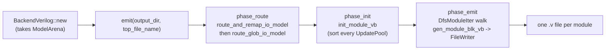
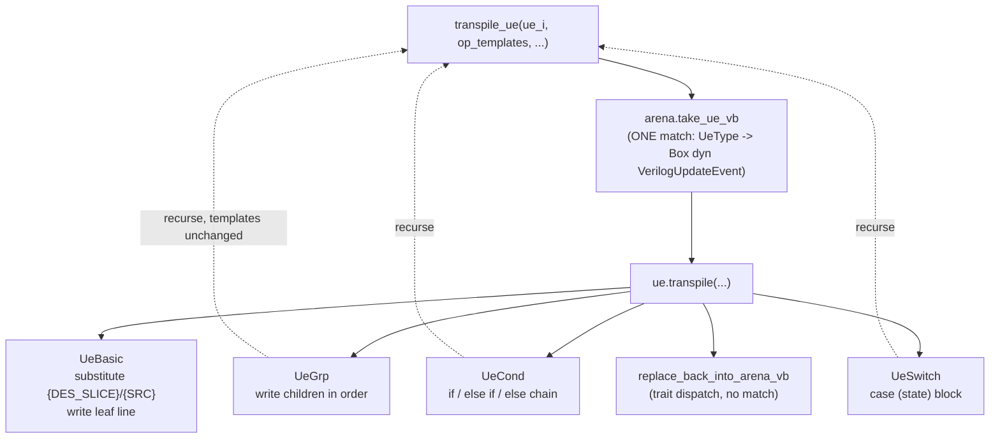

The Verilog backend (`src/backends/verilog/`) consumes a fully built
`ModelArena` and writes one `.v` file per module. It follows the same
architectural rules as the core model — arena ownership, take/replace_back,
and single-match dispatch — so adding a component or event type never touches
the emitter's control flow.

## Backend entry point and phases

`BackendVerilog` (`src/backends/verilog/backend.rs`) owns the arena outright:

```rust
pub struct BackendVerilog { model_arena: ModelArena }

impl BackendVerilog {
    // Takes ownership of the arena — the backend is the final consumer.
    pub fn new(model_arena: ModelArena) -> Self { ... }
    pub fn emit(&mut self, output_dir: &str, top_file_name: &str) {
        self.phase_route();                       // IO routing passes
        self.phase_init();                        // sort every UpdatePool
        self.phase_emit(output_dir, top_file_name); // write .v files
    }
}
```

- **Phase 1 — route**: `route_and_remap_io_model` (LCA-based cross-module
  routing) then `route_glob_io_model` (IO-marked signals to the top) — see
  [I/O Routing](/devbook/backend/io-routing/).
- **Phase 2 — init**: `Module::init_module_vb`
  (`src/backends/verilog/module/module_vb.rs`) sorts every HCP's `UpdatePool`
  by `(priority, sub_priority)` and recurses into sub-modules.
- **Phase 3 — emit**: a `DfsModuleIter` walk over the module tree; each module
  is taken from the arena and `gen_module_blk_vb` writes it through a
  `FileWriter` (`src/util/file/file_writer.rs`). The top module's file is
  named by the caller; every other module uses its global module name.



The ownership move is real and one-way: the Python wrapper
(`src/applications/py/backends/verilog/backend_py.rs`) constructs the backend
with `std::mem::replace(&mut arena.arena, ModelArena::new())`, leaving the
`PyModelArena` **empty**. Combined with routing mutating the model and
`build_flow` not being re-runnable, emission is effectively a destructive,
single-shot operation — build a fresh model if you need to emit again.

## The module tree mirror

The backend's file layout mirrors `src/model/`: one `*_vb.rs` file per HCP
type, `common/` for the traits, `module/` for the module-level emitter, and
`arena_ext_vb.rs` for dispatch. Backend code adds methods to core types via
extra `impl` blocks (e.g. `impl Module` in `module_vb.rs`,
`impl ModelArena` in `arena_ext_vb.rs`) but only through the public
`take_*`/`replace_back_*` surface — never the `pub(super)` arena fields.

## The HcpBaseVb trait

Every emittable HCP implements `HcpBaseVb`
(`src/backends/verilog/hw_component/common/hcp_base_vb.rs`):

```rust
pub trait HcpBaseVb {
    // ---- atomic queries ----
    fn gen_type_vb    (&self) -> String;   // e.g. "reg  [7:0] " or "wire"
    fn gen_var_name_vb(&self) -> String;   // signal name in emitted Verilog

    // ---- count queries — default 0; override only when non-zero ----
    fn amt_io_line_vb      (&self) -> u32 { 0 }   // IO port declaration lines
    fn amt_init_line_vb    (&self) -> u32 { 0 }   // declaration / initial lines
    fn amt_precedure_blk_vb(&self) -> u32 { 0 }   // always-block count

    // ---- write-through generation — default panics; implement when count > 0 ----
    fn gen_io_line_vb      (&self, idx: u32, arena: &mut ModelArena, fw: &mut FileWriter);
    fn gen_init_line_vb    (&self, idx: u32, arena: &mut ModelArena, fw: &mut FileWriter);
    fn gen_procedure_blk_vb(&self, idx: u32, arena: &mut ModelArena, fw: &mut FileWriter);

    // ---- arena round-trip — each type knows its own slot ----
    fn replace_back_into_arena_vb(self: Box<Self>, arena: &mut ModelArena);
}
```

Generation methods write directly into the `FileWriter` rather than returning
`String`s, so the emitter never allocates a full-module buffer. The
count/generate split lets the module emitter loop generically
(`for idx in 0..vb.amt_init_line_vb() { vb.gen_init_line_vb(idx, ...) }`)
without knowing what each type contributes.

Representative impls:

- All six register-family types (`Reg`, `StateReg`, `SyncReg`, `CntReg`,
  `CondWaitStateReg`, `CycleWaitStateReg`) share one shape via the
  `impl_reg_vb!` macro in `reg_vb.rs` — 1 declaration line, 1 clocked always
  block, and a per-type `replace_back_*` call injected by the macro.
- `Wire` (`wire_vb.rs`) declares as `reg` and emits one combinational always
  block (its pool is always `ClkFree`).
- `IoWire` (`io_wire_vb.rs`) is the only type with `amt_io_line_vb() == 1`; it
  prefers its `explicit_name` over the auto name, inputs emit no procedure
  block, and outputs route their `agent_src_signal`.
- `Expression` emits a continuous `assign`; `Val` a `wire ... = literal;`.

## util_vb.rs helpers

Shared string helpers live in
`src/backends/verilog/hw_component/util_vb.rs`:

| Function | Returns |
|----------|---------|
| `signal_width(size: i32)` | `"[N-1:0] "` |
| `slice_to_verilog(&Slice)` | `"[stop-1:start]"`, or `""` for the `{-1,-1}` full-width sentinel |
| `logic_op_to_verilog(op)` | Verilog operator token; panics on `Assign`/`ExtendBit`/`SliceBit`/`Dummy` so unsupported ops fail at the backend boundary |
| `fmt_init_var(type, name)` | `"reg [7:0] name;"` |
| `fmt_operand(opr, slice, arena, active_i, active_name)` | `"var_name[slice]"`, with a **self-reference guard** |
| `sensitivity_list(clk_mode, clk_name)` | `"posedge <clk>"`, `"negedge <clk>"`, or `"*"` — panics on an edge mode with no clock name |
| `gen_procedure_blk(hcp, active_i, arena, fw)` | the whole `always @(…) begin … end` block from the HCP's UpdatePool |

The self-reference guard in `fmt_operand` matters: the HCP being emitted is
already *taken out* of the arena, so if one of its own events references it
(e.g. `cnt <= cnt + 1`), re-taking would double-take. The caller passes
`active_i`/`active_name` and `fmt_operand` short-circuits on a global-id match.

`gen_procedure_blk` builds the destination template and drives the UE layer:

```rust
let sens = sensitivity_list(clk_mode, clk_name.as_deref());
let tmpl = format!("{active_name}{{DES_SLICE}} <= {{SRC}};");
fw.write(&format!("always @({sens}) begin\n"));
for &ue_i in pool.get_update_events() {
    transpile_ue(ue_i, vec![tmpl.clone()], 4, arena, active_i, &active_name, fw);
}
fw.write("end\n");
```

The **op_templates contract**: the template carries the destination lvalue
with `{DES_SLICE}` and `{SRC}` placeholders. Only the leaf `UeBasic` performs
the substitution (via `slice_to_verilog` + `fmt_operand`); container UEs pass
the templates through unchanged to recursive `transpile_ue` calls.

## Scalable UE dispatch — arena_ext_vb.rs

`src/backends/verilog/arena_ext_vb.rs` holds the backend's only two `match`
expressions, one per trait:

```rust
impl ModelArena {
    /// ONE match: HwComponentType → Box<dyn HcpBaseVb>.
    pub fn take_hcp_vb(&mut self, ident: HcpIdent) -> Box<dyn HcpBaseVb> {
        match ident.get_hw_type() { /* one arm per variant; Nest panics (unported) */ }
    }
    /// Zero match — each type's replace_back_into_arena_vb knows its own slot.
    pub fn replace_back_hcp_vb(&mut self, v: Box<dyn HcpBaseVb>) { v.replace_back_into_arena_vb(self); }

    /// ONE match: UeType → Box<dyn VerilogUpdateEvent>.
    pub fn take_ue_vb(&mut self, ident: UpdateEventIdent) -> Box<dyn VerilogUpdateEvent> {
        match ident.get_ue_type() { /* Basic / Grp / Cond / Switch; Untype panics */ }
    }
}
```

`transpile_ue` (`common/update_event_vb.rs`) is match-free:

```rust
pub fn transpile_ue(ue_i, op_templates, front_space, arena, active_i, active_name, fw) {
    let ue = arena.take_ue_vb(ue_i);
    ue.transpile(op_templates, front_space, arena, active_i, active_name, fw);
    ue.replace_back_into_arena_vb(arena);   // trait dispatch, no match
}
```

`VerilogUpdateEvent` impls (all four in `update_event_vb.rs`): `UeBasic`
substitutes and writes the line; `UeGrp` writes children in order; `UeCond`
writes an `if / else if / else` chain (non-terminal `end`s omit the newline so
`" else"` continues the same line); `UeSwitch` writes a `case (state)` block.



**Extension recipes.** New HCP type: (1) `HwComponentType` variant, (2) one
arm in `take_hcp_vb`, (3) `impl HcpBaseVb` in a new `*_vb.rs`. New UE type:
(1) `UeType` variant, (2) one arm in `take_ue` (`arena_impl_ue.rs`), (3) one
arm in `take_ue_vb`, (4) `impl VerilogUpdateEvent`. In both cases
`transpile_ue`, `gen_procedure_blk`, and every existing impl stay untouched.

## The five-phase emitted file

`Module::gen_module_blk_vb` (`src/backends/verilog/module/module_vb.rs`) glues
the phases; each is bannered in the output:

1. **Phase 1** — `module name(…);` header; ports from each IoWire's
   `gen_io_line_vb` (comma placement handled by a `need_comma` gate since
   Verilog forbids a trailing comma).
2. **Phase 2** — signal declarations for every HW type *except* IoWire (those
   are already ports). **Phase 2.5** declares each sub-module's *output* ports
   as plain wires in the parent scope.
3. **Phase 3** — always blocks and continuous assigns via
   `gen_procedure_blk_vb`.
4. **Phase 4** — named-port sub-module instantiations
   (`gen_inst_sub_module_declaration_vb`): input ports connect to their agent
   drivers, output ports to the wires declared in Phase 2.5.
5. **Phase 5** — `endmodule`.

Real output (`test/.model_output/tc1_seq_simple/top.v`, abridged):

```verilog
// Phase 1 : module header & IO ports
module MODULE_tc1_seq_simple0_0(
    output reg  [7:0] my_x,
    output reg  [7:0] my_y,
    input wire clk,
    input wire mrst
);
    // ---- Phase 2 : signal declarations (reg / wire / localparam / mem) ----
reg  [7:0]  REG_x_1;
reg   SR_ST_seq_state_4_0_ST_36;
wire [7:0]  VAL_simple_val_3 = 8'h30;
    // ---- Phase 3 : always blocks & continuous assignments ----
always @(posedge WIRE_clk_12) begin
    if (SR_ST_seq_state_4_0_ST_36) begin
        REG_x_1[7:0] <= VAL_simple_val_3[7:0];
    end
end
    // ---- Phase 4 : sub-module instantiations ----
    // ---- Phase 5 : endmodule ----
endmodule
```

:::note
Older docs (tech report §6, parts of CLAUDE.md) show `gen_type`/`gen_io_line`
returning `String` and a `{SRC_VAL}{SRC_SLICE}` template. The code has since
moved to `*_vb`-suffixed, write-through methods and a single `{SRC}`
placeholder — the signatures on this page are the current ones.
:::
