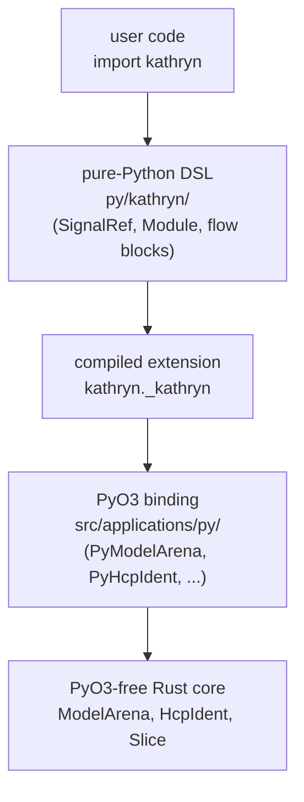
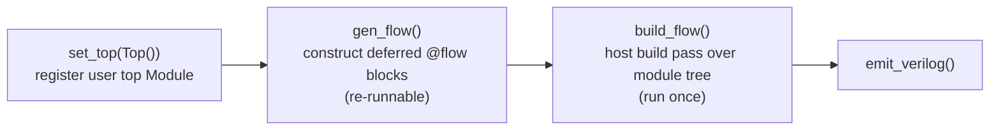

The Python frontend is split into **two layers**:

1. **Low-level PyO3 binding** — `src/applications/py/` in the Rust crate.
   Thin `#[pyclass]` wrappers (`PyModelArena`, `PyHcpIdent`, `PySlice`, …)
   that expose the arena and its ident handles to Python, one method per host
   operation.
2. **Pure-Python DSL** — `py/kathryn/`. A plain Python package that wraps the
   binding into an HDL-like language: operator overloading on signals, context
   managers for flow blocks, a `Module` base class with `@init` / `@flow`
   phase decorators.

Users only ever `import kathryn`; the compiled extension is an implementation
detail named `kathryn._kathryn`.



## The golden rule — the core stays PyO3-free

Core model types (`HcpIdent`, `Slice`, `FlowBlockIdent`, `ModelArena`, …)
carry **no** PyO3 macros. All bindings are gated behind the `python` Cargo
feature, so the default `cargo build` compiles **zero** PyO3 code:

```rust
// src/lib.rs
pub mod model;
pub mod common;
pub mod util;
pub mod params;
pub mod backends;
pub mod debug;

// Python bindings layer — the ONLY place in the crate that contains PyO3
// macros. Gated behind the `python` feature so the default build stays clean.
#[cfg(feature = "python")]
pub mod applications;
```

```toml
# Cargo.toml
[dependencies]
pyo3       = { version = "0.28", optional = true, features = ["extension-module", "multiple-pymethods", "num-bigint"] }
num-bigint = { version = "0.4",  optional = true }

[features]
python = ["dep:pyo3", "dep:num-bigint"]
```

Both dependencies are optional, so the 0-error baseline build (see
[Conventions](/devbook/contributing/conventions/)) never touches PyO3 or
bigint. When you add anything Python-facing, it goes under
`src/applications/py/` — nowhere else in the crate may reference `pyo3`.

### The wrapper newtype pattern

For each core type exposed to Python there is a thin newtype wrapper that is
the *only* Python-visible face. It holds the core value in a
`pub(crate) inner` field and converts in both directions with `From`:

```rust
// src/applications/py/model/hw_component/common/hcp_ident_py.rs
#[pyclass(name = "HcpIdent", from_py_object)]
#[derive(Clone, Copy)]
pub struct PyHcpIdent {
    pub(crate) inner: HcpIdent,
}

impl From<HcpIdent> for PyHcpIdent {
    fn from(inner: HcpIdent) -> Self { Self { inner } }
}

impl From<PyHcpIdent> for HcpIdent {
    fn from(py: PyHcpIdent) -> Self { py.inner }
}
```

The two `From` impls let factory bodies read
`self.arena.make_x(...).into()` on the way out and `arg.into()` on the way
in. Ident/value wrappers are `#[pyclass(..., from_py_object)]` +
`#[derive(Clone, Copy)]` so Python passes them by value as arguments, exactly
like the core [ident pattern](/devbook/core/ident-pattern/).

The arena wrapper is deliberately **`unsendable`** — single-threaded by
design, mirroring the arena being the sole Rust-side owner:

```rust
// src/applications/py/model/model_arena.rs
#[pyclass(name = "ModelArena", unsendable)]
pub struct PyModelArena {
    pub(crate) arena: ModelArena,
}

#[pymethods]
impl PyModelArena {
    // Empty arena; the caller creates and registers the top module explicitly
    // via mk_module + set_top_module.
    #[new]
    fn new() -> Self {
        Self { arena: ModelArena::new() }
    }
}
```

## Module tree mirrors `src/model/`

The binding directory reproduces the host tree, with a `_py` suffix on each
file so the mirror is obvious:

```
src/applications/py/
  mod.rs                          — #[pymodule] _kathryn(); registers classes + enums
  model/
    model_arena.rs                — #[pyclass(unsendable)] PyModelArena
    arena_impl_py.rs
    hw_component/
      arena_factory_hwc_py.rs         — mk_reg / mk_wire / mk_val / mk_mem_blk / mk_mem_ele
      arena_factory_hwc_expr_py.rs    — mk_expression / mk_expression_single / mk_extend_bit
      arena_impl_hwc_py.rs            — gen_basic_assign and higher-level HWC ops
      common/{hcp_ident_py.rs, slice_py.rs, operand_py.rs}
    flow_block/
      arena_factory_flow_block_py.rs  — mk_flow_block_* (seq/par/cond/zero/while/…)
      arena_impl_flow_block_py.rs     — initialize_flow_block / finalize_flow_block
      flow_block_ident_py.rs
    module/
      arena_factory_module_py.rs      — mk_module
      arena_impl_module_py.rs         — track/untrack module scopes
      module_ident_py.rs
    complex_hardware/
      arena_factory_ccp_py.rs         — mk_arb / mk_karray / mk_dyn_counter
      ccp_ident_py.rs                 — PyCcpIdent
      arb/arena_impl_ccp_arp_py.rs    — leaves, master ack / hold / reset
      karray/arena_impl_ccp_karray_py.rs — read / assign / k2k + layout queries
      karray/kidx_py.rs               — decodes the (kind, ints, sigs) selector
                                        triples into KIdx; maps KarrayErr onto
                                        TypeError vs ValueError, and skipped-field
                                        reports onto warnings.warn
      dyn_counter/arena_impl_ccp_dyn_counter_py.rs — add / update / reg / now
    controller/asm_mode_py.rs         — priority mode + DEFAULT_UE_PRI_* consts
    validate_py.rs                    — check_flow_block_prefinalize
  backends/verilog/backend_py.rs      — PyBackendVerilog
```

The file split mirrors the host `arena_factory_*` / `arena_impl_*` split
(see [Factories and CRUD](/devbook/core/factories-and-crud/)). PyO3's
`multiple-pymethods` feature lets every file contribute its own
`#[pymethods] impl PyModelArena` block, so a new binding file goes under the
mirror path matching the host file it wraps — do not pile everything into
one block.

Binding conventions at a glance:

| Convention | Rule |
| --- | --- |
| File names | host file + `_py` suffix, same directory shape |
| Method names | host `make_x` → Python `mk_x` (Python is always the user surface) |
| User flag | every wrapper factory passes `is_user_com = true` |
| Arguments | wrappers accept/return `Py*` newtypes; convert with `.into()` |
| Threading | `PyModelArena` is `unsendable`; one arena per process |

## Enums — single source of truth

Rust enums that cross the boundary are exposed **once**, built at module init
by walking the core enum's `from_index` / `variant_name` pair. Python never
hardcodes variant ints, and the decoding side goes back through the *same*
`from_index`, so the two sides cannot drift:

```rust
// src/applications/py/mod.rs
fn add_logic_op_enum(m: &Bound<'_, PyModule>) -> PyResult<()> {
    let py      = m.py();
    let members = PyDict::new(py);
    let mut idx = 0u32;
    // Walk every LogicOp by index until from_index runs out, mirroring each
    // variant name → int into the dict that backs the Python IntEnum.
    while let Some(op) = LogicOp::from_index(idx) {
        members.set_item(op.variant_name(), idx)?;  // enum member: name = idx
        idx += 1;
    }
    let int_enum = py.import("enum")?.getattr("IntEnum")?;
    m.add("LogicOp", int_enum.call1(("LogicOp", &members))?)?;
    Ok(())
}
```

Five enums follow this pattern today — `LogicOp`, `ArbSamePriPolicy`,
`ArbLockedChannel`, `HwComponentType` (member name = `global_prefix`, value =
discriminant), and `FlowBlockType` — all registered in the `#[pymodule]`
entry point:

```rust
#[pymodule]
fn _kathryn(m: &Bound<'_, PyModule>) -> PyResult<()> {
    m.add_class::<PyModelArena>()?;
    m.add_class::<PyHcpIdent>()?;
    m.add_class::<PySlice>()?;
    m.add_class::<PyCcpIdent>()?;
    m.add_class::<PyFlowBlockIdent>()?;
    m.add_class::<PyModuleIdent>()?;
    m.add_class::<PyBackendVerilog>()?;
    add_logic_op_enum(m)?;
    add_arb_same_pri_policy_enum(m)?;
    add_arb_locked_channel_enum(m)?;
    add_hw_component_type_enum(m)?;
    add_flow_block_type_enum(m)?;
    add_asm_priority_consts(m)?;
    Ok(())
}
```

:::note
Follow this pattern for any new enum crossing the boundary — never duplicate
a variant list on the Python side.
:::

### Priority constants use the same discipline

The `DEFAULT_UE_PRI_*` update-event priority constants are registered by
walking the host table, and the authoritative **name list** is published as
`_ASM_PRIORITY_CONST_NAMES`:

```rust
// src/applications/py/model/controller/asm_mode_py.rs
pub fn add_asm_priority_consts(m: &Bound<'_, PyModule>) -> PyResult<()> {
    let mut names: Vec<&str> = Vec::new();
    for (name, val) in asm_priority_consts() {
        m.add(*name, *val)?;
        names.push(name);
    }
    m.add("_ASM_PRIORITY_CONST_NAMES", names)?;
    Ok(())
}
```

The DSL side (`py/kathryn/priority.py`) then re-exports every constant driven
by that list, with **no name hardcoded in Python**:

```python
# py/kathryn/priority.py
PRIORITY_CONST_NAMES = list(_kathryn._ASM_PRIORITY_CONST_NAMES)
globals().update({n: getattr(_kathryn, n) for n in PRIORITY_CONST_NAMES})
```

`py/kathryn/__init__.py` does the same trick again to publish them in
`__all__` (`*_priority.PRIORITY_CONST_NAMES`), so adding one row to the host
macro flows all the way to `from kathryn import DEFAULT_UE_...` with zero
Python edits. See
[Update Events and Priority](/devbook/model/update-events-and-priority/) for
what the constants mean.

## The pure-Python DSL (`py/kathryn/`)

Every DSL wrapper holds **only** a Rust ident — ownership of all model
objects stays in Rust — and every operation routes through one process-wide
arena.

- **`_session.py`** builds the singleton **empty** `ModelArena` at import
  (Python's module cache makes repeated `import kathryn` reuse it). The top
  module is explicit: the user builds a `Module` subclass and registers it
  with `set_top(module)`; nothing opens a module scope at import time. The
  session also owns `arena()`, `reset()`, the per-prefix auto-name counter,
  the deferred-flow pool, `gen_flow()`, `build_flow()`, and `emit_verilog()`.
- **`signal.py`** — `SignalRef` (ident + optional `Slice`) with operator
  overloading. Binary operators build expressions through the binding:

  ```python
  # py/kathryn/signal.py
  def _binop(self, other: Union[SignalRef, int], op: LogicOp) -> expr:
      # An int is passed straight through; the Rust connector wraps it into a
      # val sized to self's width. Otherwise resolve to a signal handle.
      if isinstance(other, int):
          b, b_slice = other, None
      else:
          other      = to_ref(other)
          b, b_slice = other._ident, other._slice
      out = _session.arena().mk_expression(
          _session.auto_name("expr"), int(op),
          self._ident, b, self._slice, b_slice,
      )
      return expr(out)
  ```

  Assignment uses augmented operators — `|=` for clocked destinations
  (reg/mem), `*=` for combinational ones (wire/io_wire) — both routed to
  `gen_basic_assign`. Slicing is inclusive: `sig[hi, lo]` maps to the
  half-open Rust `Slice(lo, hi+1)`.
- **`flow_block.py`** — flow blocks are context managers. `__enter__` calls
  `initialize_flow_block` (push onto the init stack); `__exit__` calls
  `finalize_flow_block` (pop + attach to the parent). There is no
  Python-side build hook — the build runs later at model level.
- **`module.py`** — modules are always classes. `@init` methods run
  **eagerly** in `__init__` inside a `track_module_at_com_init` /
  `untrack_module_at_com_init` scope; `@flow` methods are **deferred**,
  registered into the process-wide `_session` flow pool and executed for all
  modules by one top-level `gen_flow()` call. The decorators only tag the
  function with a `_kathryn_phase` attribute; `Module._phase_methods` walks
  the reversed MRO so inherited phases run before derived ones.
- **`priority.py`** — raw `set_priority` / `set_priority_auto` setters plus a
  `priority(p)` context manager that restores the previous mode on exit.
- **`complex_hardware/`** — the CCP surfaces, each a handle over a `CcpIdent`:
  `arb.py` (`Arb`, `ArbLeaf`), `pip_con.py` (`PipCon`, a thin `Arb` subclass),
  `counter.py` (`counter`), and the Karray trio `karray.py` /
  `karray_field.py` / `karray_ref.py`. `karray_field.py` is pure Python — the
  `kaf()` descriptors, `KBundle`, and the field-resolution walk all run before
  anything crosses the boundary, so the Rust core only ever receives a flat
  `(name, width)` list.
- **`combinational.py`** — `mux`, `any_of`, `sum_cnt`, `rotate_left`. Each one
  calls straight into the Rust core (`_session.arena().gen_mux(...)`, and so
  on for the other three) — the topology, width-checking, and node-assembly
  logic all live in `src/model/arena_impl_comb.rs`, not here. See
  [Combinational Primitives](/devbook/model/combinational/) for what each
  generator builds.

The full user pipeline is *construct then build*:



```python
set_top(Top())   # register the user's top Module
gen_flow()       # construct every module's deferred @flow blocks (re-runnable)
build_flow()     # host build pass over the whole module tree (run once)
```

`build_model(Top())` is the one-shot equivalent of all three.

:::tip
Python `int` literals are auto-wrapped: `signal.py` passes the raw int
through, and the Rust connector (`operand_py.rs` + `make_const_val` in
`arena_factory_hwc_expr_py.rs`) builds a `val` sized to the other operand.
The literal crosses the boundary as a `num_bigint::BigInt`, so any width or
magnitude works, including negatives (two's-complement masking).
:::

## Build — maturin mixed project

Packaging is a maturin **mixed Rust/Python project**:

```toml
# pyproject.toml
[tool.maturin]
# Build the PyO3 layer; the binding is gated behind this Cargo feature.
features    = ["python"]
# Mixed Rust/Python project: pure-Python package lives under py/, the compiled
# native extension is placed inside it as kathryn._kathryn, and py/kathryn/__init__.py
# re-exports it as the public DSL.
python-source = "py"
module-name   = "kathryn._kathryn"
```

The native extension is built as `kathryn._kathryn` and dropped inside the
pure-Python package `py/kathryn/`. The `#[pymodule]` function is therefore
named `_kathryn` — its name must match the last `module-name` component.

Without maturin, a manual dev loop also works: `cargo build --features
python`, then copy `target/debug/libkathryn.so` into the package. **Copy to
the ABI-tagged name, not just `_kathryn.so`** — if a previous install left
`_kathryn.cpython-313-x86_64-linux-gnu.so` in the package, CPython loads
*that* in preference to the bare name and you silently run a stale build:

```sh
cargo build --features python
cp target/debug/libkathryn.so py/kathryn/_kathryn.cpython-313-x86_64-linux-gnu.so
cp target/debug/libkathryn.so py/kathryn/_kathryn.so
```

Tests live in `py/tests/`; run `PYTHONPATH=py pytest py/tests` after the
extension is built.
