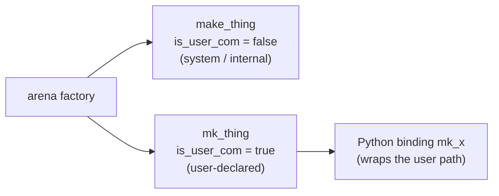

This page collects the rules every contribution to Kathryn2 is expected to
follow. The source of truth is `CLAUDE.md` at the repository root (sections 3,
4, and 6); this page restates it for the web.

## Naming conventions

### Files and modules

- `snake_case.rs` for files, matching the primary type they define
  (`module.rs` defines `Module`).
- **One primary type per file**; small companion types (enums, helper
  structs) may live alongside.
- Submodule directories use a `mod.rs` that only re-exports — no logic.

### Types

- `PascalCase` for structs, enums, traits.
- Ident types end with `Ident` (`HcpIdent`, `ModuleIdent`).
- Trait-object-suitable traits end with `-able` (`HcpAssignable`,
  `HcpReadable`, `HcpAccessible`).
- Enum variants: `PascalCase`. Avoid C-style `SCREAMING_PREFIX_VARIANT`.

### Ident variables — the `_i` suffix

Any **variable or field** whose type is an `*Ident` handle (`NcpIdent`,
`HcpIdent`, `FlowBlockIdent`, `ModuleIdent`, …) must carry an `_i` suffix so
it is immediately clear it is a lightweight handle, not the object itself:

```rust
let state_i    = arena.make_state_node(...);   // NcpIdent
let asm_node_i = ...;                          // NcpIdent
self.sync_reg_i: HcpIdent;                     // struct field
```

Some older files still use bare names (`state`, `asm`, `syn`, …). Fix them as
you touch those files; do **not** do a mass rename in a single PR.

**No single-letter handle names.** Even for a short-lived local inside a
take/replace_back block, do not name an ident `h` / `r` / `s`. Give it the
same descriptive `_i` name it would have at the use site (e.g. `user_hold_i`,
`user_reset_i`). Single letters are only acceptable for the taken *object*
itself (e.g. `let arb = arena.take_arb(...)`), never for the handles read off
it.

### Functions

| Pattern | Meaning |
| --- | --- |
| `new(is_user_com, name, ...)` | Full constructor |
| `mk(name, ...)` | User-declared shorthand (`is_user_com = true`) |
| `make_<thing>` | Arena factory, system/internal (`is_user_com = false`) |
| `mk_<thing>` | Arena factory, user-declared (`is_user_com = true`) |
| `get_<field>` / `get_<field>_mut` | Getters — no bare-field getters |
| `add_<thing>` | Push into a `Vec` or arena |
| `get_<things>` | Plural collection getter returning `&Vec<…>` |
| `take_<thing>` / `replace_back_<thing>` | The only arena read/write surface (see [Factories and CRUD](/devbook/core/factories-and-crud/)) |

All functions are `snake_case`. The `make_` / `mk_` split matters: the Python
bindings always wrap the *user* path, which is why every host `make_x`
surfaces as `mk_x` in Python (see the
[Python Layer](/devbook/bindings/python-layer/)).



### Constants

- `SCREAMING_SNAKE_CASE`.
- Update-event priorities live as `DEFAULT_UE_PRI_*` consts at module top
  (exposed to Python via the single-source-of-truth constant table).

### Identifier prefixes

`HwComponentType::global_prefix` defines the canonical short prefix for each
HW type (`REG`, `WIRE`, `SR_ST`, `MODULE`, ...). Use those when constructing
unique names in `build_unique_name` — do not invent new ones.

## Code style

All generated and edited code follows the project owner's formatting style.
Key rules:

- **Column-align `:`** in struct fields and function parameters so types form
  a vertical column.
- **Collapse trivial getters** to a single line; align return types across
  the group.
- **`---- Section ----` separator comments** to divide logical groups inside
  `impl` blocks or files.
- **Align match/switch arms** so `=>` or `:` lines up vertically.
- **Multi-line signatures** when there are 3+ parameters: one parameter per
  line, closing delimiter on its own line, trailing comma.
- **`_i` suffix** on any variable or field whose type is a `*Ident` handle.
- **Brief comments** — one sentence, explain *why* not *what*; no
  multi-paragraph docstrings.

A real excerpt showing several of these at once
(`src/debug/config.rs`):

```rust
pub struct DebugSink {
    pub(super) mode        : OutputMode,
    pub(super) file_writer : Option<FileWriter>,
}

impl DebugBuilder {

    // ---- flag selection ----

    /// Enable a single debug category.
    pub fn flag(mut self, f: DebugFlag) -> Self { self.flags.push(f); self }

    /// Enable a slice of debug categories at once.
    pub fn flags(mut self, fs: &[DebugFlag]) -> Self { self.flags.extend_from_slice(fs); self }
```

## Architectural ground rules

These are covered in depth elsewhere in the Devbook, but they are also
conventions in the sense that violating them will fail review:

- **One owner per object: the arena.** Never store `Box<dyn Trait>` or owning
  `Rc`/`Arc` of model objects; insert into the arena and pass `*Ident`
  handles ([ModelArena](/devbook/core/model-arena/)).
- **No typed `get_<thing>` / `get_<thing>_mut` on `ModelArena`.** Read and
  mutate through `take_*` / `replace_back_*`
  ([Factories and CRUD](/devbook/core/factories-and-crud/)).
- **One match per polymorphic family.** New HCP/UE/flow-block variants add
  one arm to the single dispatch match, plus a trait impl — nothing else
  ([Dispatch](/devbook/core/dispatch/)).
- **Anything added to the arena goes in both `ModelArena::new` and `reset`**
  ([Memory Model](/devbook/core/memory-model/)).
- **PyO3 stays behind the `python` feature.** No PyO3 macro outside
  `src/applications/py/`
  ([Python Layer](/devbook/bindings/python-layer/)).

## Contributor workflow expectations

- **The baseline is 0 errors.** `cargo build` must complete cleanly
  (warnings are acceptable), and `cargo build --features python` must also
  stay at 0 errors. Any new error you introduce is yours to fix.
- **Run `cargo build` after non-trivial changes** — do not batch up a day of
  edits and hope.
- **Do not mutate remote state without explicit approval.** No `git push`,
  `cargo publish`, or anything similar without the owner asking for it.
- **Default to editing existing files.** Do not add documentation files to
  the repository unless asked; `CLAUDE.md` is the exception.
- **New patterns go into `CLAUDE.md`.** When you introduce a pattern that
  future contributors must follow, document it there — project-scoped facts
  belong in the repo, not in any agent's session memory.

:::tip
When debugging a change, prefer the built-in tracing system over ad-hoc
`println!` calls — see the [Debug System](/devbook/tooling/debug-system/).
Enabled flags cost nothing when off, so `dprint!` lines can stay in the code.
:::

## Known gaps / roadmap

The Rust port is not feature-complete relative to the original Kathryn. Do
**not** assume the following exist on the Rust side; if you need them, check
first:

| Missing piece | Notes |
| --- | --- |
| Full controller-driven flow-block construction | `buildAll` / `buildFlow` orchestration; the Python DSL currently drives lifecycle explicitly |
| `Box`, `nest`, `PmVal`, `ModelInterface` | Not ported |
| `ModuleSimEngine`, `ModuleGen`, `ModelDebugger` | No simulation/codegen engine yet |
| `controller` hooks | `ctrl->on_module_init_components` etc. — only `clock_mode.rs` and `asm_mode.rs` are ported |

When porting a struct that depends on one of these, scope the new struct to
fields whose dependencies *do* exist rather than stubbing the missing ones.

The Python layer works around the missing controller by driving the stages
itself: `Module.__init__` opens a `CompInit` scope for the `@init` methods, and
`gen_flow()` opens a `FlowBlockInit` scope per module for the `@flow` methods.
The two-phase split is therefore live — it is enforced by the trace-stack
asserts and by convention rather than by a controller object.
