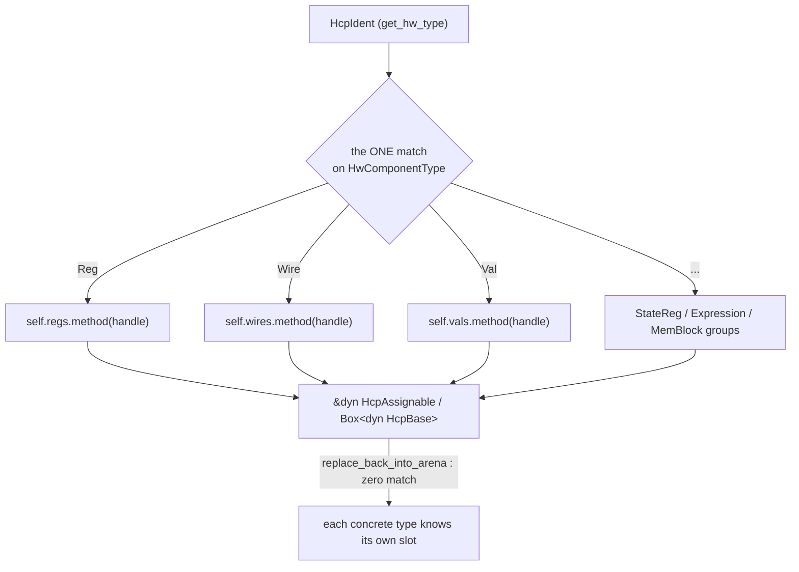

`ModelArena` stores each concrete type in its own typed group, but most of
the compiler operates on *categories*: "any hardware component", "any update
event", "any flow block". Something has to bridge an ident's type
discriminant to the right typed group. That bridge is the dispatch layer, and
it obeys one iron rule:

> **For each (discriminant, trait) pair there is exactly ONE `match`.**
> Everything above it is trait-object polymorphism — zero `match`, zero
> per-variant knowledge.

Per-variant matches sprinkled through higher-level code are banned because
they rot: every new hardware type would mean auditing the whole codebase for
switches to extend, and a missed arm fails at runtime (or worse, silently
does the wrong thing). With single-match dispatch, adding a variant touches
one arm plus one `impl` block, and the compiler finds everything else.

## The dispatch macros

Each `arena_impl_*` file owns the single match for its category, wrapped in a
macro so the borrow flavour (`get` / `get_mut` / `take`) can be reused.

### `dispatch_hcp!` — hardware components

`src/model/hw_component/arena_impl_hwc.rs` (abridged — the real macro has one
arm per `HwComponentType` variant):

```rust
// dispatch_hcp!: two forms.
//   dispatch_hcp!(self, ident, method) — returns &dyn / &mut dyn HcpAssignable.
//   dispatch_hcp!(take self, ident)    — returns Box<dyn HcpBase> (owned).
macro_rules! dispatch_hcp {
    ($self:expr, $hcpIdent:expr, $method:ident) => {{
        let handle = *$hcpIdent.get_arena_handle();
        match $hcpIdent.get_hw_type() {
            HwComponentType::Reg      => $self.regs       .$method(handle),
            HwComponentType::Wire     => $self.wires      .$method(handle),
            HwComponentType::IoWire   => $self.io_wires   .$method(handle),
            HwComponentType::Val      => $self.vals       .$method(handle),
            // ... StateReg, SyncReg, CntReg, wait regs, Expression, MemBlock
            t => panic!("HwComponentType {:?} is not HCP-assignable", t),
        }
    }};
    (take $self:expr, $hcpIdent:expr) => {{ /* same arms, Box::new(...take(handle)) as Box<dyn HcpBase> */ }};
}
```

It powers both the borrowing accessor and the owned polymorphic pair:

```rust
pub fn get_hcp_assign(&self, ident: &HcpIdent) -> &dyn HcpAssignable { dispatch_hcp!(self, ident, get) }

pub fn take_hcp        (&mut self, hcp_i: HcpIdent) -> Box<dyn HcpBase> { dispatch_hcp!(take self, hcp_i) }
pub fn replace_back_hcp(&mut self, v: Box<dyn HcpBase>)                 { v.replace_back_into_arena(self); }
```

The one `match` on `HwComponentType` is the only place that knows the variant
list; above it callers hold a single trait object, below it each variant routes
itself back with zero match:



Note the asymmetry: `take_hcp` needs the ONE match, but `replace_back_hcp`
needs **none** — `HcpBase` (`src/model/hw_component/common/hcp_base.rs`)
requires every concrete type to know its own slot:

```rust
pub trait HcpBase: HcpAssignable + HcpIdentifiable {
    // Each concrete HCP type routes itself back to the correct typed arena
    // slot — callers use zero match.
    fn replace_back_into_arena(self: Box<Self>, arena: &mut ModelArena);
    // gather_dep_hcps / remap_dep_hcps with pool-walking defaults ...
}
```

### `dispatch_ncp!` — flow nodes

`src/model/nodes/arena_impl_node.rs` matches on `NodeType` and backs the
`&dyn NcpNode` accessors, which in turn power narrow public queries so
callers never see the trait object directly:

```rust
fn get_ncp_node    (&self,     ident: &NcpIdent) -> &    dyn NcpNode { dispatch_ncp!(self, ident, get    ) }
fn get_ncp_node_mut(&mut self, ident: &NcpIdent) -> &mut dyn NcpNode { dispatch_ncp!(self, ident, get_mut) }

pub fn get_node_exit_opr(&self, ident: &NcpIdent) -> HcpIdent { self.get_ncp_node(ident).get_exit_opr() }
```

The owned pair `take_ncp_node` (one match over `NodeType`) /
`replace_back_ncp_node` (zero match, via `NcpNode::replace_back_into_arena`)
lives in the same file.

### `dispatch_ue_common!` — update events

`src/model/hw_component/common/arena_impl_ue.rs`:

```rust
macro_rules! dispatch_ue_common {
    ($self:expr, $ident:expr) => {{
        let h = *$ident.get_arena_handle();
        match $ident.get_ue_type() {
            UeType::Basic  => $self.ue_basics  .get(h).ue_common(),
            UeType::Grp    => $self.ue_grps    .get(h).ue_common(),
            UeType::Cond   => $self.ue_conds   .get(h).ue_common(),
            UeType::Switch => $self.ue_switches.get(h).ue_common(),
            UeType::Untype => panic!("UpdateEventIdent has UeType::Untype"),
        }
    }};
}
```

The same file holds the polymorphic `take_ue(ident) -> Box<dyn UpdatingEvent>`
(ONE match) and `replace_back_ue` (zero match). A typical zero-match consumer:

```rust
pub fn is_ue_joinable(&mut self, ue_1: UpdateEventIdent, ue_2: UpdateEventIdent) -> bool {
    let v1 = self.take_ue(ue_1);
    let v2 = self.take_ue(ue_2);
    let result = v1.is_joinable(v2.as_ref());
    self.replace_back_ue(v1);
    self.replace_back_ue(v2);
    result
}
```

### Flow blocks — the fully match-free upper layer

`src/model/flow_block/arena_impl_flow_block.rs` holds the ONE permitted match
in `take_flow_block` (one arm per `FlowBlockType` variant — currently 16,
from `Sequential` to `Zync`):

```rust
pub fn take_flow_block(&mut self, ident: FlowBlockIdent) -> Box<dyn FlowBlock> {
    match ident.get_block_type() {
        FlowBlockType::Sequential => Box::new(self.take_flow_block_seq (ident)),
        FlowBlockType::Parallel   => Box::new(self.take_flow_block_par (ident)),
        // ... CondIf, CondElif, ZeroCondIf/Elif, ZeroSwitch(Case),
        //     Pick, PickIf, WhileLoop, DoWhile, CounterLoop, Wait, Pipeline, Zync
    }
}

pub fn replace_back_flow_block(&mut self, block: Box<dyn FlowBlock>) {
    block.replace_back_into_arena(self);   // each type knows its own slot
}
```

Every higher-level operation (`add_node_to_flow_block`,
`add_sub_flow_block_to_flow_block`, `build_flow_block`, ...) uses this pair —
**zero match, zero macro**. Adding a new block type requires exactly: (1) a
new `FlowBlockType` variant, (2) a new `ArenaGroup` field + typed CRUD,
(3) one arm in `take_flow_block`, (4) `impl FlowBlock` for the new type.
Nothing else changes.

### Why `get_hcp_assign` is allowed to exist

The [CRUD rules](/devbook/core/factories-and-crud/) ban typed
`get`/`get_mut` on `ModelArena` — yet `get_hcp_assign`, `get_ue_common`, and
the `get_ncp_node`-backed queries return borrows. These are the sanctioned
"get-style exception": the borrow targets a **trait object**, which cannot be
expressed with take/replace_back (you cannot `take` into a `dyn` value and
you would lose the cheap read-only path). They are few, live only in the
dispatch files, and grow by exactly one arm per new variant.

### The backend mirrors the pattern

`src/backends/verilog/arena_ext_vb.rs` adds two more single-match functions
in its own `impl ModelArena` block — `take_hcp_vb(HcpIdent) -> Box<dyn
HcpBaseVb>` and `take_ue_vb(UpdateEventIdent) -> Box<dyn VerilogUpdateEvent>`
— with zero-match `replace_back_*` counterparts. The emitter's recursive
`transpile_ue` is entirely match-free. See
[Verilog Emission](/devbook/backend/verilog-emission/).

## Compile-enforced hardware type lists

Dispatch tells you *where* an object lives; the type lists make sure no
variant is ever forgotten. `HwComponentType`
(`src/model/hw_component/common/hcp_ident.rs`) derives its `COUNT` from
per-group counts, and each group has a `const` array whose **length is part
of its type**:

```rust
impl HwComponentType {
    pub const UE_BOUNDARY   : usize = 10;  // bump when adding a UE-supported type
    pub const MAN_DEP_COUNT : usize = 1;
    pub const IO_WIRE_COUNT : usize = 1;
    pub const MEM_BLK_COUNT : usize = 1;
    // Derived — never edit directly; bump the group count above instead.
    pub const COUNT         : usize = Self::UE_BOUNDARY
                                    + Self::MAN_DEP_COUNT
                                    + Self::IO_WIRE_COUNT
                                    + Self::MEM_BLK_COUNT;
}

// Length is enforced to equal UE_BOUNDARY at compile time — a mismatch won't compile.
pub const HW_TYPES_WITH_UE: [HwComponentType; HwComponentType::UE_BOUNDARY] = [
    HwComponentType::Reg, HwComponentType::StateReg, /* ... */
];

// Every variant in discriminant order; length == COUNT is enforced at compile time.
pub const ALL_HW_TYPES: [HwComponentType; HwComponentType::COUNT] = [ /* ... */ ];
```

Add a UE-supporting variant without bumping `UE_BOUNDARY` and appending it to
`HW_TYPES_WITH_UE`, and the build fails with a length mismatch — a compile
error instead of a silent runtime omission. `ALL_HW_TYPES` also fixes the
discriminant order, so `from_index` is a plain array lookup.

## Grouped index arrays

The same enum drives storage layout in consumers. When a struct holds several
categorised lists of the same handle type, the house pattern is one array
indexed by the discriminant — not one field per type:

```rust
// Module (src/model/module/module.rs) — canonical example
user_hws     : [Vec<HcpIdent>; HwComponentType::COUNT],
internal_hws : [Vec<HcpIdent>; HwComponentType::COUNT],
```

A single `add_*` reads the type off the ident and pushes into the right
bucket; iteration over "all regs in this module" is one index lookup. Because
the array length is `COUNT`, a new `HwComponentType` variant automatically
grows every grouped array — again, no forgotten field.

## Checklist: adding a new HCP variant

1. Add the `HwComponentType` variant (before `Expression` if UE-supported)
   and bump the matching group count.
2. Append it to the matching `HW_TYPES_*` list and to `ALL_HW_TYPES` — the
   compiler enforces both.
3. Add the `ArenaGroup` field to `ModelArena` (+ `new` **and** `reset`).
4. Add the typed `add_/take_/replace_back_` triad and **one arm** in
   `dispatch_hcp!`.
5. `impl HcpBase` (and friends) for the new type.
6. One arm in the backend's `take_hcp_vb` + an `impl HcpBaseVb` in a new
   `*_vb.rs` file.

Everything else — assignment generation, routing, `transpile_ue`, all other
HCP impls — stays untouched. That is the payoff of the single-match rule.
