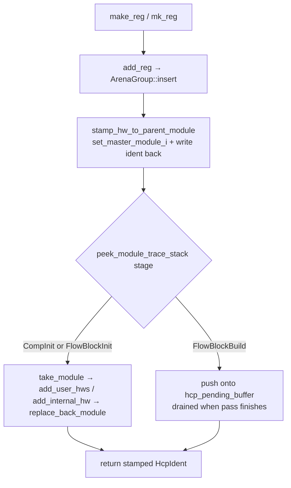
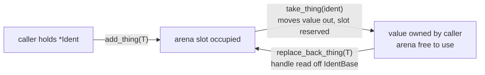

All object construction and access in Kathryn2 goes through methods on
`ModelArena`. Those methods are split across many files — one
`arena_factory_*.rs` / `arena_impl_*.rs` pair per object category — each
contributing its own `impl ModelArena` block next to the types it manages.
This page maps that surface and the conventions it follows.

## `make_*` vs `mk_*` — the factory split

Every factory file opens with the same two-line contract
(e.g. `src/model/hw_component/arena_factory_hwc.rs`):

```rust
// make_* → is_user_com = false (internal/system)
// mk_*   → is_user_com = true  (user-defined)
```

- **`make_*`** creates *system/internal* objects — routing wires, trigger
  expressions, flow-node scaffolding. Most take `is_user_com` explicitly:

  ```rust
  pub fn make_reg(&mut self, is_user_com: bool, name: &str, bit_width: i32) -> HcpIdent {
      let i = self.add_reg(Reg::new(is_user_com, name, bit_width));
      self.stamp_hw_to_parent_module(i, is_user_com)
  }
  ```

- **`mk_*`** is the *user-declared* shorthand (`is_user_com = true`). The
  Python binding layer wraps exactly this path — host `make_x` becomes Python
  `mk_x`, because Python is always the user surface.

The distinction matters downstream: `Module` keeps user HCPs and internal
HCPs in separate grouped index arrays (`user_hws` / `internal_hws`), and the
Verilog emitter and debug tooling treat them differently.

### Factories also register the object

HCP factories do more than insert. `stamp_hw_to_parent_module`
(`src/model/hw_component/arena_factory_hwc.rs`) stamps the owning module onto
the ident, writes the ident back into the stored object, and registers the
component with the module on top of the trace stack — routing by the current
[build stage](/devbook/architecture/overview/):

```rust
pub(super) fn stamp_hw_to_parent_module(&mut self, mut i: HcpIdent, is_user: bool) -> HcpIdent {
    let (module_i, stage) = self.peek_module_trace_stack();
    i.set_master_module_i(module_i);
    let mut hcp = self.take_hcp(i);
    *hcp.get_ident_mut() = i;             // ident must be written back to the object
    self.replace_back_hcp(hcp);
    match stage {
        ModuleInitStage::CompInit | ModuleInitStage::FlowBlockInit => {
            let mut m = self.take_module(module_i);
            if is_user { m.add_user_hws(i); } else { m.add_internal_hw(i); }
            self.replace_back_module(module_i, m);
        }
        ModuleInitStage::FlowBlockBuild => {
            self.hcp_pending_buffer.push((i, is_user));
        }
    }
    i
}
```

The registration path forks on the build `stage` read off the trace-stack top:



Module factories manage the trace stack instead. `mk_module`
(`src/model/module/arena_factory_module.rs`) creates the module and stamps
its parent linkage from the stack:

```rust
pub fn mk_module(&mut self, name: &str) -> ModuleIdent {
    let i = self.add_module(Module::new(true, name));
    let i = self.stamp_module_to_parent_module(i);
    i
}
```

`stamp_module_to_parent_module` sets `master_module_handle` and
`depth_level` (= current trace-stack length) on the ident, then writes the
stamped ident back into the stored `Module` so `module.get_ident()` stays
consistent. The top module is registered separately via
`ModelArena::set_top_module` (`src/model/arena_impl.rs`), and pushing/popping
module scopes is the caller's job (the Python layer does it in
`initialize_module` / `finalize_module`).

### The factory file map

| File | Covers |
| ---- | ------ |
| `src/model/hw_component/arena_factory_hwc.rs` | basic HCPs: `make_reg`, `make_wire`, `make_io_wire`, `make_val`, `make_mem_blk`, `make_mem_ele`, `make_expression*` |
| `src/model/hw_component/sp_reg/arena_factory_sp.rs` | special registers: `make_state_reg`, `make_sync_reg`, `make_cnt_reg`, `make_cond_wait_state_reg`, `make_cycle_wait_state_reg*` |
| `src/model/hw_component/common/arena_factory_ue.rs` | update events |
| `src/model/nodes/arena_factory_node.rs` | flow nodes: `make_asm_node`, `make_state_node`, `make_syn_node`, `make_wait_*_node`, ... |
| `src/model/flow_block/arena_factory_flow_block.rs` | flow blocks: `make_flow_block_seq`, `..._par_auto`, `..._cif`/`_sif`, `..._zif`, loop/pick/wait variants |
| `src/model/module/arena_factory_module.rs` | modules: `mk_module` |
| `src/model/complex_hardware/arena_factory_ccp.rs` | complex components (Arb, Karray, DynCounter) |

## The post-insert ident read — a critical rule

Factory and `add_*` methods must read the ident **back from the arena after
insertion**, because `ArenaGroup::insert` stamps the `arena_handle` into the
stored object — not into any copy made beforehand:

```rust
// src/model/arena_impl.rs
pub fn add_module(&mut self, m: Module) -> ModuleIdent {
    let h = self.modules.insert(m);
    self.modules.get(h).get_ident()   // <- read AFTER insert
}
```

An ident copied *before* `insert` carries the default (sentinel) handle and
will panic on first use. If you find that shape anywhere, treat it as a bug.

## arena_impl files — per-category CRUD

CRUD is split the same way as the factories:

| File | Owns |
| ---- | ---- |
| `src/model/arena_impl.rs` | `ModelArena::new` / `reset`, module CRUD, top module, trace stacks, flow-block init/finalize |
| `src/model/hw_component/arena_impl_hwc.rs` | hardware components (Reg/Wire/.../sp_regs) + `dispatch_hcp!` |
| `src/model/hw_component/common/arena_impl_ue.rs` | update events + `dispatch_ue_common!` |
| `src/model/nodes/arena_impl_node.rs` | flow nodes + `dispatch_ncp!` |
| `src/model/flow_block/arena_impl_flow_block.rs` | flow-block primitive CRUD + the ONE polymorphic match; a second `impl ModelArena` block holds the higher-level, zero-match operations |
| `src/model/complex_hardware/arena_impl_ccp.rs` (+ `arb/arena_impl_ccp_arp.rs`, `karray/arena_impl_ccp_karray.rs`, `dyn_counter/arena_impl_ccp_dyn_counter.rs`) | complex-hardware CRUD and higher-level ops |
| `src/model/arena_impl_comb.rs` | the combinational primitives (`gen_mux`, `gen_rotate_left`, `gen_any_of`, `gen_sum_cnt`) — see [Combinational Primitives](/devbook/model/combinational/) |

### The three-method public surface

For each arena-stored type, the public CRUD surface is **only**:

- `add_<thing>(&mut self, T) -> <Thing>Ident` — insert, return the
  handle-stamped ident;
- `take_<thing>(&mut self, ident) -> T` — move the value out (the slot stays
  reserved; `T: Default` required);
- `replace_back_<thing>(&mut self, T)` — put it back (the handle is read off
  the value's own `IdentBase`).



Real examples from `src/model/hw_component/arena_impl_hwc.rs`:

```rust
pub fn add_reg (&mut self, r: Reg) -> HcpIdent { let h = self.regs.insert(r); self.regs.get(h).get_ident() }
pub fn take_reg(&mut self, h: HcpIdent) -> Reg { self.regs.take(*h.get_arena_handle()) }
pub fn replace_back_reg(&mut self, v: Reg)     { let h = *v.get_arena_handle(); self.regs.replace_back(h, v) }
```

### No typed `get` / `get_mut` — deliberately

**Do not add `get_<thing>(&self) -> &T` or
`get_<thing>_mut(&mut self) -> &mut T` methods on `ModelArena`.** They were
deliberately removed. To read or mutate a stored value, use take/replace_back:

```rust
let mut expr = arena.take_expression(expr_i);
expr.assign_operand(src_i, slice);
arena.replace_back_expression(expr_i, expr);
```

Two reasons:

1. take/replace_back leaves `&mut ModelArena` free for the inner call — a
   typed `get_mut` would pin the arena borrow for the whole edit (see
   [Memory Model](/devbook/core/memory-model/));
2. it forces one uniform access pattern across every object type.

There are exactly two narrow carve-outs:

- **Internal post-insert ident reads** inside `add_*`/`make_*`/`mk_*` factory
  bodies (e.g. `self.regs.get(h).get_ident()`) — pure bookkeeping, not a
  public reading API.
- **`pub(crate)` read-only accessors** needed by `src/backends/` to read an
  ident without taking ownership. The current example is
  `get_module_ident_by_handle(h: ArenaHandle) -> ModuleIdent` in
  `src/model/arena_impl.rs`. Keep these `pub(crate)`, read-only, and few.

Polymorphic accessors that return `&dyn Trait` (such as `get_hcp_assign`)
are a separate, sanctioned exception — they are the subject of the
[Dispatch](/devbook/core/dispatch/) chapter.

## Higher-level operations compose the primitives

Anything above the three-method surface is written in terms of it, never in
terms of raw `ArenaGroup` fields. Example from
`src/model/flow_block/arena_impl_flow_block.rs`:

```rust
pub fn add_node_to_flow_block(&mut self, block_ident: FlowBlockIdent, node: NcpIdent) {
    let mut block = self.take_flow_block(block_ident);
    block.add_element_in_flow_block(node);
    self.replace_back_flow_block(block);
}
```

This is the pattern to copy when adding new operations: take, mutate (with
the arena freely usable), replace back — zero `match`, zero direct field
access.

:::note
The contributor guide (`CLAUDE.md` in the Kathryn2 repo) describes a
`mk_top_module` factory and a `stage` parameter on `mk_module`; the current
code has neither — `mk_module(name)` is the only module factory, and top
registration goes through `set_top_module`. When the guide and the code
disagree, the code wins; this page documents the code.
:::
