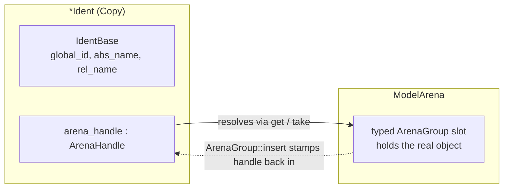
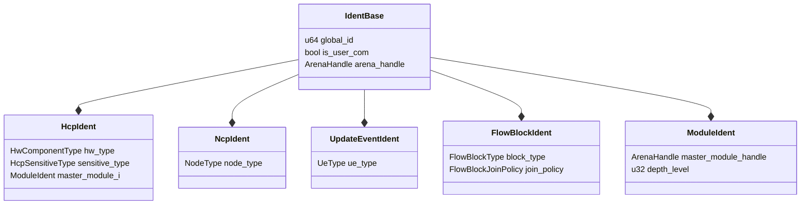

Kathryn2 never passes references to model objects around. Instead, every
arena-stored type has a small `Copy` *ident* type that callers hold, store in
`Vec`s, put in `HashMap`s, and pass by value. An ident is the object's
identity card: its global ID, its name, and the
[arena slot](/devbook/core/model-arena/) where the real object lives.

## IdentBase

Every ident (and every stored object) embeds an `IdentBase`
(`src/model/common/identifier.rs`):

```rust
#[derive(Clone, Copy, Debug, Eq)]
pub struct IdentBase {
    global_id   : u64,
    is_user_com : bool,
    abs_name_buf: [u8; MAX_NAME_LEN],   // MAX_NAME_LEN = 256
    abs_name_len: u8,
    rel_name_buf: [u8; MAX_NAME_LEN],
    rel_name_len: u8,
    arena_handle: ArenaHandle,
}
```

Field by field:

- **`global_id`** — drawn from a process-wide `AtomicU64`
  (`GLOBAL_MODEL_ID` in the same file) at construction:

  ```rust
  pub fn new(is_user_com: bool) -> Self {
      Self {
          global_id: GLOBAL_MODEL_ID.fetch_add(1, Ordering::Relaxed),
          // ...
      }
  }
  ```

  It uniquely identifies every object ever created in the process — it never
  resets, even across `ModelArena::reset()`. Treat it as opaque; equality and
  hashing use it, nothing should depend on its absolute value.
- **`is_user_com`** — whether the object was declared by the user (`mk_*`
  factory) or generated internally (`make_*`). See
  [Factories & CRUD](/devbook/core/factories-and-crud/).
- **`abs_name_buf` / `rel_name_buf`** — fixed-size inline UTF-8 buffers. The
  *relative* name is what the user wrote; the *absolute* name is the globally
  unique name built from a type prefix, the relative name, and the global ID
  (e.g. `REG_counter_42`).
- **`arena_handle`** — the slot stamped in by `ArenaGroup::insert`, so the
  ident can be resolved back to the object.

An ident is a `Copy` identity card whose `arena_handle` resolves the real
object out of the arena:



### Zero-allocation identity

Names live in `[u8; 256]` inline buffers, not `String`s. That makes
`IdentBase` — and therefore every `*Ident` type — a plain `Copy` value with
**no heap allocation and no destructor**. This matters because ident copies
are pervasive: every push into a `Vec<HcpIdent>`, every closure capture, every
return value is a bitwise copy. Equality is cheap too:

```rust
impl PartialEq for IdentBase {
    fn eq(&self, other: &Self) -> bool {
        self.global_id == other.global_id && self.get_abs_name() == other.get_abs_name()
    }
}
```

The trade-off is a hard cap: `set_abs_name` asserts
`name.len() <= MAX_NAME_LEN`.

## The Identifiable trait

Everything stored in an arena — objects and idents alike — implements
`Identifiable` (`src/model/common/identifier.rs`):

```rust
pub trait Identifiable {
    fn get_ident_base    (&self)     -> &IdentBase;
    fn get_ident_base_mut(&mut self) -> &mut IdentBase;

    fn get_global_id   (&self) -> u64  { self.get_ident_base().global_id }
    fn get_global_name (&self) -> &str { self.get_ident_base().get_abs_name() }
    fn get_rel_name    (&self) -> &str { self.get_ident_base().get_rel_name() }
    fn get_is_user_com (&self) -> bool { self.get_ident_base().is_user_com }
    fn get_arena_handle(&self) -> &ArenaHandle { &self.get_ident_base().arena_handle }
    fn set_arena_handle(&mut self, arena_handle: ArenaHandle) {
        self.get_ident_base_mut().arena_handle = arena_handle;
    }
}
```

Only the two `get_ident_base*` accessors are required; everything else is a
default method. `ArenaGroup::insert` calls `set_arena_handle` through this
trait, which is how objects learn their own slot. Unique-name construction is
per-type rather than part of the trait — e.g.
`HcpIdent::build_unique_hcp_name` and `ModuleIdent::build_unique_module_name`
format `"{PREFIX}_{rel_name}_{global_id}"` using the type's canonical prefix.

## The ident family

Each category pairs its ident with a type discriminant used by the
[dispatch layer](/devbook/core/dispatch/):

| Ident type         | Extra payload beyond `IdentBase`                        | Defined in |
| ------------------ | ------------------------------------------------------- | ---------- |
| `HcpIdent`         | `HwComponentType`, `HcpSensitiveType`, `master_module_i` | `src/model/hw_component/common/hcp_ident.rs` |
| `NcpIdent`         | `NodeType`                                               | `src/model/nodes/ncp_ident.rs` |
| `UpdateEventIdent` | `UeType`                                                 | `src/model/hw_component/common/update_event_ident.rs` |
| `FlowBlockIdent`   | `FlowBlockType`, `FlowBlockJoinPolicy`, chain-master flag | `src/model/flow_block/flow_block_ident.rs` |
| `ModuleIdent`      | `master_module_handle`, `depth_level`                    | `src/model/module/module_ident.rs` |

Every ident embeds one `IdentBase` and adds its own type discriminant plus
extra payload:



All are `Clone + Copy + Default + PartialEq + Eq` and implement
`Identifiable`. The real `HcpIdent`:

```rust
// src/model/hw_component/common/hcp_ident.rs
#[derive(Clone, Copy, Debug, PartialEq, Eq, Default)]
pub struct HcpIdent {
    ident_base       : IdentBase,
    hw_type          : HwComponentType,
    sensitive_type   : HcpSensitiveType,
    master_module_i  : ModuleIdent,
}

impl HcpIdent {
    pub fn new(hw_type       : HwComponentType,
               sensitive_type: HcpSensitiveType,
               is_user_com   : bool,
               name          : &str) -> Self { /* ... */ }
}
```

`HcpSensitiveType` (`Clocked` / `Combinational` / `ReadOnly`) illustrates a
house rule: **each type declares its own intrinsic properties at its
constructor call site** — `Reg` passes `Clocked`, `Wire` passes
`Combinational`, `Val`/`Expression` pass `ReadOnly`. There is deliberately no
central `match hw_type { ... }` deriving it, because a central switch is a
maintenance trap: a new component type silently lands in the wrong arm.

`ModuleIdent` adds hierarchy information:

```rust
// src/model/module/module_ident.rs
#[derive(Clone, Copy, Debug, PartialEq, Eq, Default)]
pub struct ModuleIdent {
    ident_base           : IdentBase,
    // ArenaHandle of the parent module; default() means "no parent" (top module).
    master_module_handle : ArenaHandle,
    // Nesting depth: 0 = top module, +1 per level of sub-module.
    depth_level          : u32,
}
```

The default `ArenaHandle` (generation `u32::MAX`) doubles as the "no parent"
sentinel — it can never resolve, so misuse panics rather than aliasing.
`depth_level` is stamped by `stamp_module_to_parent_module`
(`src/model/module/arena_factory_module.rs`) from the module-trace-stack
length, and is later used by the common-ancestor walk in cross-module IO
routing.

## Why idents instead of references or Rc

- **References (`&T` / `&mut T`)** would tie every data structure to the
  arena's lifetime and make any two-object operation a borrow-checker fight.
  An ident is `'static`: it can sit in a struct field for the whole program.
- **`Rc<RefCell<T>>`** would give shared ownership with runtime borrow panics
  and reference cycles (flow graphs are full of cycles). The arena keeps a
  single owner and turns "is this alive?" into a generation check.
- **Raw pointers** (the C++ original) are exactly what the port set out to
  eliminate. Any `T*`-style reference in ported code becomes a `TIdent`.

The cost is one level of indirection — resolving an ident requires the arena
— which is precisely what the take/replace-back discipline in the
[Memory Model](/devbook/core/memory-model/) manages.

## The `_i` naming convention

Any variable or field whose type is an `*Ident` handle carries an `_i`
suffix, so a reader can always tell a handle from the object itself:

```rust
let state_i    = arena.make_state_node(...);   // NcpIdent
self.sync_reg_i: HcpIdent;                     // struct field
```

Two extra rules from the house style:

- **No single-letter handle names** (`h`, `r`, `s`) — even for short-lived
  locals inside a take/replace-back block, use the descriptive `_i` name it
  would have at the use site (`user_hold_i`, `user_reset_i`).
- Single letters are acceptable only for the *taken object* itself
  (`let arb = arena.take_arb(...)`), never for handles read off it.

:::note
Older files still use bare names (`state`, `asm`, `syn`, ...). The convention
is applied as files are touched — fix names you encounter, but do not do a
mass rename in a single PR.
:::
