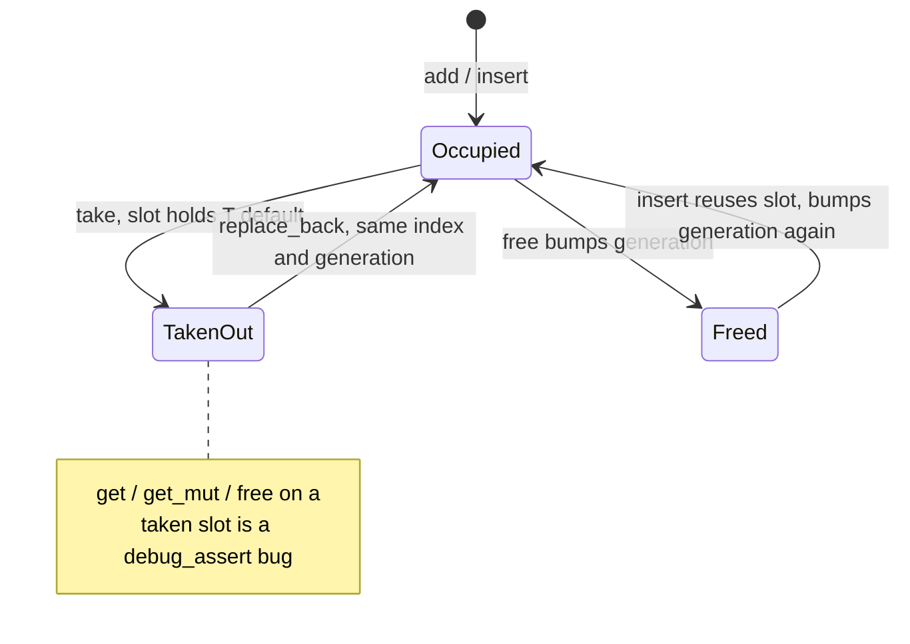
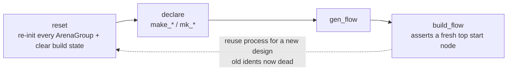

Kathryn2's memory model can be stated in one sentence: **the arena owns
everything, everyone else holds `Copy` handles**. This page spells out the
rules that follow from it, and the one idiom — take/replace-back — that makes
the borrow checker happy without `Rc`, `RefCell`, or `unsafe`.

## Ownership rules

- **One owner per object: the arena.** No model object stores another model
  object by value or by `Box`. Cross-references are always `*Ident` handles
  (`Copy`). See [the Ident pattern](/devbook/core/ident-pattern/).
- **No `Rc` / `Arc` / `RefCell` for model state.** All mutability is mediated
  by `&mut ModelArena`. There is exactly one road to any object, so there is
  never a second borrow to fight.
- **No raw pointers.** When porting C++ code, translate any `T*`-style
  reference into a `TIdent` handle.

Because ownership is centralised, "who frees this?" and "is this still
alive?" have mechanical answers: the arena frees it, and the generation check
tells you (see below).

## The lifetime / re-borrow problem

The single-owner design creates one recurring borrow conflict. A method that
mutates an object *and* needs the arena to do its work would require two
overlapping mutable borrows:

```rust
// ✗ does not compile: reg borrows arena mutably, then we pass arena again
let reg = arena.get_reg_mut(reg_i);
reg.build_update_event(arena);
```

The codebase's answer is the **take/replace-back** idiom:

```rust
let mut reg = arena.take_reg(reg_i);
reg.build_update_event(arena);          // arena is freely usable here
arena.replace_back_reg(reg);
```

A slot moves through these states — a take reserves it (not a free), while
free/reuse bumps the generation:



`take_reg` *moves* the value out of its slot, ending the borrow of the arena
entirely. While the value is out, `&mut ModelArena` is available to any inner
call. `replace_back_reg` moves it back. This replaces both the C++
raw-pointer anti-pattern and the `Rc<RefCell<T>>` workaround while keeping
the single-owner invariant and full borrow-checker visibility.

A production example — `gen_asm_node` in
`src/model/hw_component/arena_impl_hwc.rs`, which lets a destination HCP
build its own assignment node while the arena stays usable:

```rust
pub fn gen_asm_node(&mut self, des_i    : HcpIdent     , src_i    : HcpIdent,
                               des_slice: Option<Slice>, src_slice: Slice   ,
) -> (NcpIdent, AsmResize) {
    let (src_i, src_slice, resize) = self.sanitize_asm_src(des_i, src_i, des_slice, src_slice);
    let des    = self.take_hcp(des_i);                       // move out
    let node_i = des.do_asm(src_i, des_slice, src_slice, self); // arena free
    self.replace_back_hcp(des);                              // move back
    (node_i, resize)
}
```

## How take/replace-back works underneath

`ArenaNode<T>` (`src/common/arena_base.rs`) implements the checked-out state:

```rust
pub fn temp_take(&mut self) -> T where T: Default {
    debug_assert!(!self.is_temp_taken, "ArenaNode::temp_take called on already taken slot");
    self.is_temp_taken = true;
    std::mem::take(&mut self.value)          // slot holds T::default() meanwhile
}

pub fn temp_replace_back(&mut self, value: T) {
    debug_assert!(self.is_temp_taken, "ArenaNode::temp_replace_back called on a slot that was not taken");
    self.is_temp_taken = false;
    self.value = value;
}
```

Consequences you must respect:

- **Every arena-stored type needs `Default`** — the slot holds `T::default()`
  while the value is out.
- **The slot stays reserved.** A take is not a free; the handle remains
  valid, and `replace_back` restores the original value at the same index and
  generation.
- **Double-take is a bug**, caught by `debug_assert!` via `is_temp_taken`, as
  is calling `get`/`get_mut`/`free` on a taken slot. If code re-enters the
  arena for an object that is currently taken, restructure the call so the
  object is passed down or replaced back first.
- **Always replace back on every path.** Take/replace-back pairs should
  bracket a short, panic-free region; an early `return` between them leaves a
  default value in the slot.

### Why typed `get_mut` was removed

`ModelArena` deliberately has **no** `get_<thing>` /
`get_<thing>_mut` methods (a policy set in the
[CRUD conventions](/devbook/core/factories-and-crud/)):

1. a typed `get_mut` pins `&mut ModelArena` for as long as the reference
   lives, so the very common "mutate X using the arena" shape cannot be
   written — take/replace-back can express everything `get_mut` can, but not
   vice versa;
2. one uniform access pattern across all object types keeps call sites
   predictable and greppable.

The read-only trait-object accessors (`get_hcp_assign`, `get_ue_common`, ...)
are the narrow exception, covered in [Dispatch](/devbook/core/dispatch/).

## Generation safety

`ArenaHandle` carries a `generation: u32`. `ArenaGroup::free` bumps the
slot's generation before pushing the index onto the free list, so every
handle taken earlier fails the generation assert in `get`/`get_mut`/`take`:

```rust
assert_eq!(node.generation(), handle.generation, "ArenaHandle generation mismatch");
```

Slot reuse via `free_slots` is automatic, and the recycling insert bumps the
generation again — a stale handle can never alias a slot's new occupant. The
default handle (`generation = u32::MAX`) never matches anything, so
uninitialised idents fail fast too. Details in
[The Model Arena](/devbook/core/model-arena/).

## Reset — reusing the process for a new design

`ModelArena::reset` (`src/model/arena_impl.rs`) re-initialises **every**
`ArenaGroup` and clears all build state (`top_module`, `module_trace_stack`,
`hcp_pending_buffer`, `flow_block_init_stack`). After a reset, every
previously issued ident is dead — its handle points into a rebuilt group and
will panic on use.

:::note
Anything added to `ModelArena` must be added to **both** `ModelArena::new`
and `reset`. There is no macro deriving one from the other; a field missed in
`reset` silently leaks the previous design into the next one.
:::

The Python session layer builds one process-wide arena at import and exposes
`reset()` for rebuilding from scratch; `build_flow()` itself is *not*
re-runnable on the same arena (it asserts a fresh top start node), so the
cycle is always `reset → declare → gen_flow → build_flow`.



## Global ID allocation

Identity is decoupled from storage. `IdentBase::global_id` comes from a
process-wide atomic counter in `src/model/common/identifier.rs`:

```rust
static GLOBAL_MODEL_ID: AtomicU64 = AtomicU64::new(0);
// in IdentBase::new
global_id: GLOBAL_MODEL_ID.fetch_add(1, Ordering::Relaxed),
```

It increments forever and **never resets across `reset()`** — so objects from
different designs in one process can never collide in name or identity
(unique names embed the ID, e.g. `REG_counter_42`). Treat the value as
opaque: it is fine for equality, hashing, and debugging, but nothing may
depend on its absolute value or density.

## Ownership at the boundaries

The same single-owner discipline extends past the core:

- **Python bindings** — `PyModelArena` is `#[pyclass(unsendable)]`:
  single-threaded by design, mirroring the arena being the sole owner. Python
  wrappers hold only idents; the arena never crosses into Python object
  graphs. See [Python Layer](/devbook/bindings/python-layer/).
- **Verilog backend** — `BackendVerilog` takes the whole arena by value; the
  Python wrapper moves it out with
  `std::mem::replace(&mut arena.arena, ModelArena::new())`, leaving the
  session arena empty. The backend is the model's final consumer, so
  transferring ownership (rather than borrowing) makes that explicit.
- **Backend `impl ModelArena` extensions** (e.g.
  `src/backends/verilog/arena_ext_vb.rs`) must compose the public `take_*` /
  `replace_back_*` methods — the `pub(super)` groups are out of reach outside
  `src/model/`, by design.
