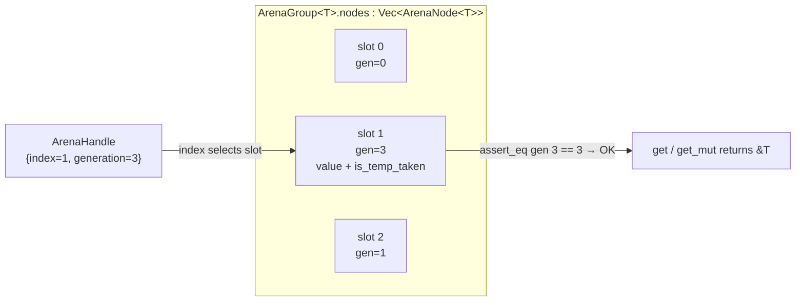
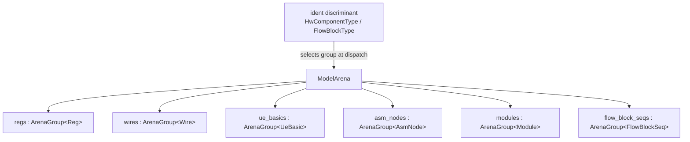

Every long-lived model object in Kathryn2 — every register, wire, update
event, flow node, flow block, and module — lives inside one struct:
`ModelArena` (`src/model/model_arena.rs`). Nothing in the model owns another
model object by value, `Box`, or `Rc`; all cross-references are `Copy`
[ident handles](/devbook/core/ident-pattern/) that resolve back into the
arena.

This page covers the storage primitive (`ArenaGroup<T>`) and the central
store built on top of it.

## ArenaGroup — a generational arena

`ArenaGroup<T>` (`src/common/arena_base.rs`) is the storage primitive for
every object category. A handle into it carries both a slot index and a
*generation* counter:

```rust
#[derive(Clone, Copy, PartialEq, Eq, Debug)]
pub struct ArenaHandle {
    index      : usize,
    generation : u32,
}

pub struct ArenaGroup<T : Identifiable> {
    nodes      : Vec<ArenaNode<T>>,
    free_slots : Vec<usize>,
}

pub struct ArenaNode<T> {
    value         : T,
    generation    : u32,
    is_temp_taken : bool,
}
```

Each slot's generation starts at 0 and is bumped whenever the slot's identity
changes: `ArenaNode::free` increments it, and `ArenaNode::replace` (used when
a freed slot is recycled by a later insert) increments it again. A handle is
only valid while its `generation` equals the slot's current generation.

A handle resolves only when its `generation` matches the slot it indexes:



### Insert stamps the handle into the object

`insert` either reuses a freed slot from `free_slots` or appends a new one,
then writes the resulting handle back **into the inserted object** through the
`Identifiable` trait:

```rust
// src/common/arena_base.rs
pub fn insert(&mut self, value: T) -> ArenaHandle {
    let index = if let Some(i) = self.free_slots.pop() {
        self.nodes[i].replace(value);
        i
    } else {
        let i = self.nodes.len();
        self.nodes.push(ArenaNode::new(value));
        i
    };
    let h = ArenaHandle { index, generation: self.nodes[index].generation() };
    self.nodes[index].get_mut().set_arena_handle(h);
    h
}
```

After insertion the object knows its own slot (`get_arena_handle`), which is
what lets factory methods return fully-stamped idents and lets trait objects
put themselves back into the right slot with zero `match` (see
[Dispatch](/devbook/core/dispatch/)).

### Access validates the generation

`get` / `get_mut` assert the generation before handing out a borrow:

```rust
// src/common/arena_base.rs
pub fn get(&self, handle: ArenaHandle) -> &T {
    assert!(handle.index < self.nodes.len(), "ArenaHandle index out of range");
    let node = &self.nodes[handle.index];
    assert_eq!(node.generation(), handle.generation, "ArenaHandle generation mismatch");
    node.get()
}
```

## Why dangling handles are impossible

Freeing a slot bumps its generation and recycles the index:

```rust
pub fn free(&mut self, handle: ArenaHandle) {
    self.nodes[handle.index].free();        // generation += 1
    self.free_slots.push(handle.index);
}
```

Any handle taken *before* the free now carries a stale generation. If a later
insert reuses the same index, the slot's generation has moved on again — so a
stale handle can never silently alias the new occupant. It fails the
`assert_eq!` and panics immediately, turning what would be a use-after-free in
C++ into a loud, debuggable crash.

The default handle is a deliberate sentinel:

```rust
impl Default for ArenaHandle {
    fn default() -> Self {
        Self { index: 0, generation: u32::MAX }
    }
}
```

`generation = u32::MAX` can never match a live slot (generations start at 0
and only increment on free/reuse), so an uninitialised or cleared ident also
panics on first access instead of reading arbitrary data. This same sentinel
doubles as a semantic "none" — e.g. `ModuleIdent`'s default
`master_module_handle` means "no parent / top module".

### take / replace_back

`ArenaGroup` also offers a checked-out access mode used pervasively by the
model: `take` moves the value out (leaving `T::default()` in the slot and
setting `is_temp_taken`), and `replace_back` restores it. Double-take and
get-while-taken are caught by `debug_assert!`s on `ArenaNode`. The rationale
and usage rules are covered in the
[Memory Model](/devbook/core/memory-model/) chapter.

## ModelArena — one typed group per object type

`ModelArena` owns one `ArenaGroup<T>` field per concrete type. Excerpt from
`src/model/model_arena.rs`:

```rust
pub struct ModelArena {
    // basic hardware components
    pub(super) regs       : ArenaGroup<Reg>,
    pub(super) wires      : ArenaGroup<Wire>,
    pub(super) io_wires   : ArenaGroup<IoWire>,
    pub(super) vals       : ArenaGroup<Val>,
    pub(super) expressions: ArenaGroup<Expression>,
    pub(super) state_regs : ArenaGroup<StateReg>,
    // ... sync/cnt/wait regs, mem_blks, mem_eles

    // basic update-event components
    pub(super) ue_basics  : ArenaGroup<UeBasic>,
    pub(super) ue_grps    : ArenaGroup<UeGrp>,
    pub(super) ue_conds   : ArenaGroup<UeCond>,
    pub(super) ue_switches: ArenaGroup<UeSwitch>,

    // node arenas (AsmNode, StartNode, StateNode, SynNode, ...)
    pub(super) asm_nodes  : ArenaGroup<AsmNode>,
    // ...

    // complex-hardware (CCP) arenas
    pub(super) arbs         : ArenaGroup<Arb>,
    pub(super) karrays      : ArenaGroup<Karray>,
    pub(super) dyn_counters : ArenaGroup<DynCounter>,

    // module arena
    pub(super) modules    : ArenaGroup<Module>,

    pub(super) top_module           : Option<ModuleIdent>,
    pub(super) module_trace_stack   : Vec<(ModuleIdent, ModuleInitStage)>,
    pub(super) hcp_pending_buffer   : Vec<(HcpIdent, bool)>,
    pub(super) flow_block_init_stack: Vec<(FlowBlockIdent, BlockTrackStatus)>,

    // flow-block arenas — one group per FlowBlockType variant
    pub(super) flow_block_seqs : ArenaGroup<FlowBlockSeq>,
    pub(super) flow_block_pars : ArenaGroup<FlowBlockPar>,
    // ... conds, elifs, zero-cond/switch, pick, loops, wait, pipeline, zync
}
```

The fields are `pub(super)` on purpose: only the `arena_impl_*` /
`arena_factory_*` files inside `src/model/` may touch the groups directly.
Everything else goes through the typed
[CRUD surface](/devbook/core/factories-and-crud/) or the
[dispatch layer](/devbook/core/dispatch/).

Storing each type in its own typed group (instead of one
`ArenaGroup<Box<dyn Anything>>`) keeps objects unboxed and monomorphic; the
type discriminant carried by each ident (e.g. `HwComponentType`,
`FlowBlockType`) selects the right group at dispatch time.



### Build-state fields

Besides the groups, `ModelArena` carries the mutable state that drives a
deterministic build (all managed in `src/model/arena_impl.rs`):

- `top_module` — the registered top `ModuleIdent`; set once via
  `set_top_module`.
- `module_trace_stack` — `(ModuleIdent, ModuleInitStage)` pairs recording
  which module is being initialised and at which
  [build phase](/devbook/architecture/overview/). Factories register new
  components against the stack top.
- `hcp_pending_buffer` — HCPs created during the `FlowBlockBuild` stage,
  drained into the owning module when the pass finishes.
- `flow_block_init_stack` — the nesting stack of flow blocks under
  construction, with a `BlockTrackStatus` used for conditional-chain
  bookkeeping.

## Rules of the arena

- **Never store `Box<dyn Trait>`, `Rc`, or `Arc` of a model object.** Insert
  into the arena and pass `*Ident` handles around.
- **Adding a new object type** means: a new `ArenaGroup` field, plus entries
  in **both** `ModelArena::new` and `ModelArena::reset`
  (`src/model/arena_impl.rs`) — forgetting `reset` leaks state across
  designs.
- **Do not access `pub(super)` groups from outside `src/model/`.** Backend
  code that extends `ModelArena` (extra `impl ModelArena` blocks such as
  `src/backends/verilog/arena_ext_vb.rs`) must compose the already-public
  `take_*` / `replace_back_*` methods.

:::tip
If you hit an `ArenaHandle generation mismatch` panic, the handle you are
holding was captured before its object was freed or before insertion stamped
the real handle. The most common bug shape is copying an ident *before*
`insert` — always read the ident back from the arena after insertion, as
every `add_*` method does.
:::
