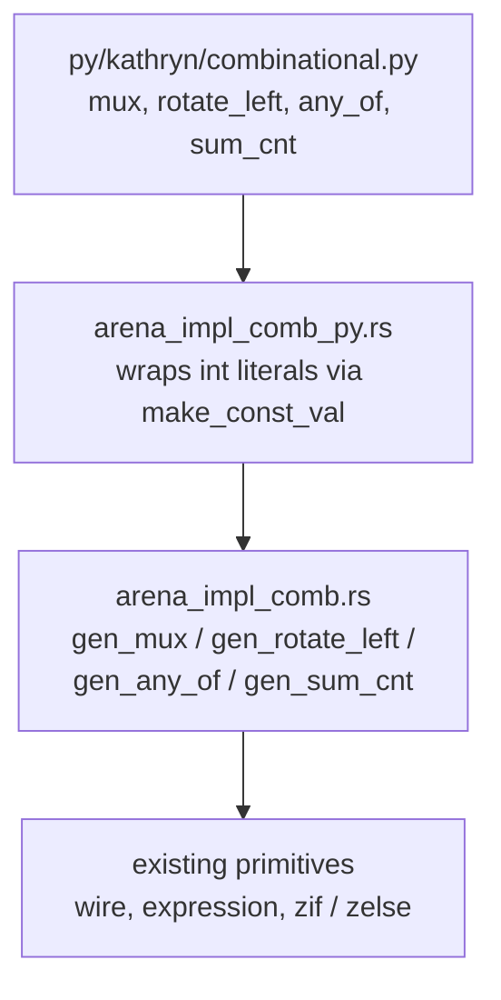

`mux`, `rotate_left`, `any_of`, and `sum_cnt` are Kathryn's combinational
combinators — the user-facing surface is the
[Helpers chapter](/userbook/lib/combinational/). All four are implemented as
methods directly on `ModelArena`, in `src/model/arena_impl_comb.rs`: the
topology, default widths, and validation live in the core, not in any
binding, so every frontend that ever calls `ModelArena` gets identical
hardware. No new node type exists for any of them — each one assembles the
existing wire, expression, and flow-block primitives that `signal.py`,
`hw_component.py`, and `flow_block.py` already build on.



The connector's job is narrow, by design: an int-literal operand has no width
of its own, so `arena_impl_comb_py.rs` wraps each one into a width-matched
`val` (the same `make_const_val` path the assignment operators use) before
calling the core method, and turns each core `AsmResize` report back into a
Python warning — exactly what a direct `*=` would surface for an implicit
width change.

## `gen_mux` — select

```rust
pub fn gen_mux(&mut self, name: &str,
    cond_i: HcpIdent, cond_slice: Option<Slice>,
    true_i: HcpIdent, true_slice: Option<Slice>,
    false_i: HcpIdent, false_slice: Option<Slice>,
    width: Option<i32>,
) -> Result<(HcpIdent, [AsmResize; 2]), String>
```

A mux **declares hardware**, so it needs an open flow scope: it is a fresh
combinational wire assigned from a `zif`/`zelse` pair, not a ternary
expression — there is no ternary `LogicOp`, and `ExtendBit` only fills with
`1'b0` (it never replicates a bit), so a mask-and-OR encoding of select simply
cannot be built. The wire is declared **before** either branch opens, so it
belongs to the enclosing scope; only its two guarded assignments live inside
the `zif`/`zelse` arms:

```rust
let out_i = self.make_wire(true, name, width);
let zif_i = self.make_flow_block_zif(&format!("{name}_zif"), cond_i, cond_slice);
// ... assign out_i <- true arm inside zif, false arm inside zelse ...
```

`width` defaults to the true arm's read width. The condition must be exactly
1 bit — the same rule and message as the DSL's own `check_cond_slice_match`,
but owned by the core so every frontend gets it. The two `AsmResize` values in
the return let a frontend warn on either arm's implicit width change, the
same way a direct assignment would.

## `gen_rotate_left` — rotation

```rust
pub fn gen_rotate_left(&mut self, name: &str,
    sig_i: HcpIdent, sig_slice: Option<Slice>,
    amount: i64, width: Option<i32>,
) -> Result<Option<HcpIdent>, String>
```

A pure expression, legal anywhere — no flow scope needed. It lowers to
`(x << k) | (x >> (w-k))`, not slice-and-concat: a Kathryn expression takes
its width from its **left** operand, so sizing both the shift-left and
shift-right the same `width` guarantees the bits one shift drops off the top
are exactly what the other shift supplies at the bottom.

`width` defaults to the signal's own read width and **may not exceed it** — a
rotate is only ever a rotate over bits that are actually there. `amount` is
taken `mod width`; a full turn (`amount == 0` after reduction) returns `Ok(None)`,
which the DSL treats as an identity: the caller keeps using the original
signal reference, slice view intact, rather than getting a redundant
expression node.

## `gen_any_of` and `gen_sum_cnt` — balanced reduction trees

```rust
pub fn gen_any_of(&mut self, name: &str, terms: Vec<(HcpIdent, Slice)>) -> Option<HcpIdent>
pub fn gen_sum_cnt(&mut self, name: &str, bits: Vec<(HcpIdent, Slice)>, width: Option<i32>) -> Result<HcpIdent, String>
```

Both are pure expressions built by the same private `fold_balanced` helper: a
level of terms is paired up, each pair combined with one `LogicOp` (`LogicalOr`
for `any_of`, `ArithPlus` for `sum_cnt`), and the process repeats on the
combined level — **log2(n) depth, not n** — until one node remains. An odd
term at any level rides up to the next level unchanged rather than being
combined with a dummy.

The two differ in their edge cases and default width, because "any of nothing"
and "the sum of nothing" are not the same kind of question:

| | empty input | single input | default width |
| --- | --- | --- | --- |
| `gen_any_of` | `Some(const 0)` — an empty disjunction has a defined value and width | `None` — identity, caller keeps the term unchanged | n/a (1-bit terms only) |
| `gen_sum_cnt` | `Err(...)` — a sum with no operands has no meaningful width | (no special case — a 1-element tree is just that element, zero-extended) | `natural_sum_width(n, max_bit_width)`: the exact bit length of `n × (2^m - 1)`, the largest sum `n` terms of `m` bits can produce, so the default width **can never overflow** |

Before folding, `gen_sum_cnt` zero-extends every term to the output width
with `ExtendBit` — so no intermediate addition in the tree can truncate — then
folds a plain adder tree over the extended terms.

## Adding a fifth combinator

The shape is small and repeats across all four: one method on `ModelArena` in
`arena_impl_comb.rs` (topology, defaults, validation), one `#[pymethods]`
wrapper in `arena_impl_comb_py.rs` (wraps any int-literal operand, surfaces
`AsmResize` warnings), and one function in `py/kathryn/combinational.py` that
resolves refs and auto-names before calling the connector. Nothing outside
this three-file chain needs to change — the module build, routing, and
Verilog backend never see anything but the wires and expressions these
primitives assemble.
